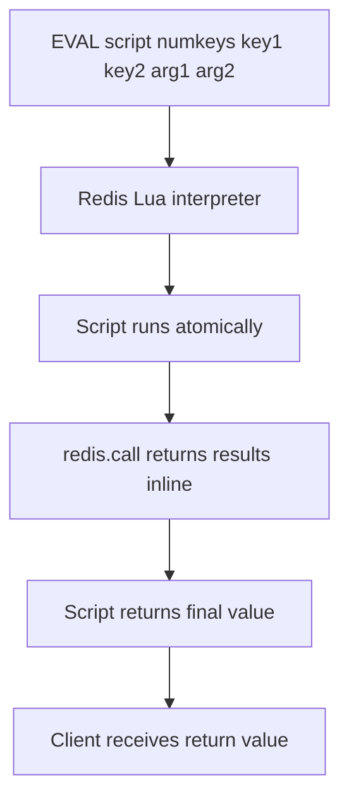

# How to Use EVAL in Redis to Execute Lua Scripts

Author: [nawazdhandala](https://www.github.com/nawazdhandala)

Tags: Redis, EVAL, Lua, Scripting, Atomic, Transaction

Description: Learn how to use EVAL in Redis to execute Lua scripts atomically, access Redis commands from Lua, and implement complex atomic operations not possible with transactions alone.

---

## How EVAL Works

EVAL executes a Lua script on the Redis server. The script runs atomically - no other Redis commands can execute while the script is running. This makes EVAL more powerful than MULTI/EXEC for complex conditional logic, because the script can read values and make branching decisions within the atomic block.

Redis embeds a Lua interpreter. Scripts access Redis commands through the `redis.call()` and `redis.pcall()` functions.



## Syntax

```redis
EVAL script numkeys [key [key ...]] [arg [arg ...]]
```

- `script` - the Lua script as a string
- `numkeys` - number of key names that follow
- `key [key ...]` - key names accessible as `KEYS[1]`, `KEYS[2]`, etc.
- `arg [arg ...]` - additional arguments accessible as `ARGV[1]`, `ARGV[2]`, etc.

## Examples

### Hello World from Lua

```redis
EVAL "return 'hello from lua'" 0
```

```text
"hello from lua"
```

### Set and get a value within a script

```redis
EVAL "redis.call('SET', KEYS[1], ARGV[1]); return redis.call('GET', KEYS[1])" 1 mykey "hello"
```

```text
"hello"
```

### Atomic increment with a floor check

Set a counter but never let it go below zero:

```redis
SET credits:user:1 5

EVAL "
  local current = tonumber(redis.call('GET', KEYS[1]))
  if current >= tonumber(ARGV[1]) then
    redis.call('DECRBY', KEYS[1], ARGV[1])
    return 1
  else
    return 0
  end
" 1 credits:user:1 3
```

```text
(integer) 1
```

Credits went from 5 to 2.

Try to deduct more than available:

```redis
EVAL "
  local current = tonumber(redis.call('GET', KEYS[1]))
  if current >= tonumber(ARGV[1]) then
    redis.call('DECRBY', KEYS[1], ARGV[1])
    return 1
  else
    return 0
  end
" 1 credits:user:1 10
```

```text
(integer) 0
```

Returns 0 because 2 < 10. The credits key is unchanged.

### Rate limiter in Lua

```redis
EVAL "
  local key = KEYS[1]
  local limit = tonumber(ARGV[1])
  local window = tonumber(ARGV[2])
  local current = redis.call('INCR', key)
  if current == 1 then
    redis.call('EXPIRE', key, window)
  end
  if current > limit then
    return 0
  end
  return 1
" 1 rate:user:42 10 60
```

```text
(integer) 1
```

This atomically increments a counter, sets its TTL on first increment, and returns whether the request is within the rate limit.

### Error handling with pcall

```redis
EVAL "
  local ok, err = pcall(function()
    return redis.call('INCR', KEYS[1])
  end)
  if not ok then
    return redis.error_reply('Script error: ' .. err)
  end
  return 'incremented'
" 1 mystring
```

`redis.call()` raises an error on failure; `redis.pcall()` returns an error value instead of raising, allowing Lua-level error handling.

### Return multiple values as a table

```redis
EVAL "
  return {redis.call('GET', KEYS[1]), redis.call('TTL', KEYS[1])}
" 1 session:user:42
```

```text
1) "active"
2) (integer) 3542
```

## Type Conversion

| Lua type | Redis reply type |
|---|---|
| `true` | Integer 1 |
| `false` | nil |
| Number | Integer (truncated) |
| String | Bulk string |
| Table (array) | Multi-bulk reply |

## Use Cases

**Atomic check-and-set** - Read a value, validate it, and write a new value atomically without a race condition.

**Rate limiting** - Implement token bucket or sliding window rate limiters where increment and TTL-setting must be atomic.

**Distributed locks** - Implement `GETSET`-style lock acquisition or Redlock patterns with complex conditional logic.

**Conditional expiry** - Read multiple keys and set TTLs based on their values, all in a single atomic operation.

**Inventory reservation** - Check stock, reserve units, and update multiple keys atomically to prevent overselling.

## Summary

EVAL executes Lua scripts atomically on the Redis server, making it the most powerful tool for complex atomic operations. Scripts access Redis via `redis.call()` (raises on error) or `redis.pcall()` (returns error value). Keys and arguments are passed as `KEYS[N]` and `ARGV[N]`. For frequently executed scripts, use EVALSHA to run cached script versions by SHA1 hash, avoiding repeated script transfer. EVAL is ideal when MULTI/EXEC is insufficient because you need conditional logic based on data read within the transaction.
