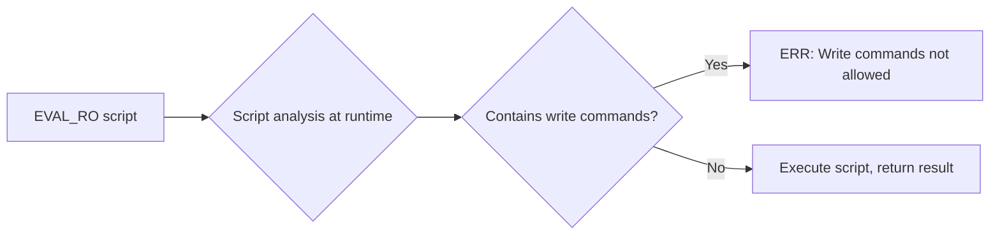
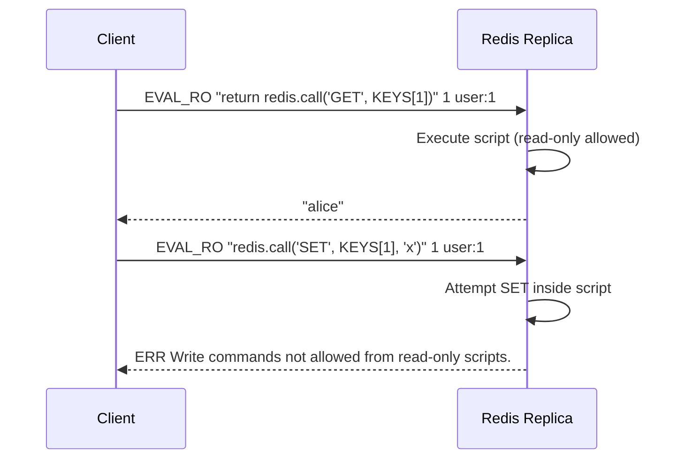

# How to Use EVAL_RO in Redis for Read-Only Lua Scripts

Author: [nawazdhandala](https://www.github.com/nawazdhandala)

Tags: Redis, EVAL_RO, Lua, Script, Read-only

Description: Learn how to use EVAL_RO in Redis to execute Lua scripts in read-only mode, enabling safe script execution on replicas and read-only connections.

---

## What is EVAL_RO

EVAL_RO executes a Lua script against Redis, but restricts the script to read-only commands. Any attempt to call a write command from inside the script causes an error. This makes EVAL_RO safe to run on replica nodes and on connections that have been restricted to read-only operations.

```redis
EVAL_RO script numkeys [key [key ...]] [arg [arg ...]]
```

The signature is identical to EVAL. The only difference is the enforcement of a read-only constraint inside the script.



## When to Use EVAL_RO

### Executing scripts on replicas

Replica nodes reject write commands by default. If you run EVAL on a replica, any write inside the script will fail. EVAL_RO explicitly declares read-only intent, making it suitable for replica offloading:

```redis
-- On a replica node
EVAL_RO "return redis.call('GET', KEYS[1])" 1 user:42
```

### Enforcing safety in application layers

Some application layers pass Lua scripts from user input or untrusted configuration. EVAL_RO ensures those scripts cannot accidentally or maliciously modify data.

### Read-only Redis connections

When a client authenticates with an ACL user that has no write permissions, EVAL might still attempt writes. EVAL_RO adds a second layer of defense.

## Basic Usage

### Simple read-only script

```redis
EVAL_RO "return redis.call('GET', KEYS[1])" 1 session:abc123
```

### Multiple reads in one script

```redis
EVAL_RO "
local name = redis.call('HGET', KEYS[1], 'name')
local score = redis.call('ZSCORE', KEYS[2], KEYS[1])
return {name, score}
" 2 user:7 leaderboard
```

### Conditional logic with reads

```redis
EVAL_RO "
local ttl = redis.call('TTL', KEYS[1])
if ttl == -2 then
  return 'expired'
elseif ttl == -1 then
  return 'persistent'
else
  return ttl
end
" 1 cache:item:55
```

## Write Commands Are Rejected

```redis
EVAL_RO "redis.call('SET', KEYS[1], ARGV[1])" 1 mykey myvalue
-- ERR: ERR Write commands not allowed from read-only scripts.
```

This applies to all write commands including SET, DEL, INCR, LPUSH, ZADD, and any other command that modifies state.



## Allowed Commands Inside EVAL_RO

EVAL_RO permits any command that does not modify state:

```redis
-- All of these work inside EVAL_RO
GET, MGET, GETRANGE, STRLEN
HGET, HMGET, HGETALL, HKEYS, HVALS, HLEN, HEXISTS
LLEN, LRANGE, LINDEX, LPOS
SMEMBERS, SCARD, SISMEMBER, SMISMEMBER, SRANDMEMBER, SDIFF, SINTER, SUNION
ZRANGE, ZRANK, ZSCORE, ZCOUNT, ZLEXCOUNT, ZRANGEBYSCORE, ZRANDMEMBER
XRANGE, XREVRANGE, XREAD, XLEN, XINFO, XPENDING
GEODIST, GEOPOS, GEOSEARCH
PFCOUNT
TTL, PTTL, EXPIRETIME, TYPE, EXISTS, OBJECT
```

## EVAL_RO vs EVAL

| Feature | EVAL | EVAL_RO |
|---|---|---|
| Write commands | Allowed | Blocked |
| Runs on replicas | No (unless `replica-read-only no`) | Yes |
| Read-only ACL users | May fail | Safe |
| Performance | Same | Same |
| Caching | No (use EVALSHA) | No (use EVALSHA_RO) |

## Caching Scripts with EVALSHA_RO

For frequently called scripts, load the script once with SCRIPT LOAD and call it with EVALSHA_RO:

```redis
-- Load script and get SHA
SCRIPT LOAD "return redis.call('GET', KEYS[1])"
-- Returns: "e0e1f9fabfa9d353e2b857b4db0b5189d19b7f9c"

-- Call using SHA in read-only mode
EVALSHA_RO e0e1f9fabfa9d353e2b857b4db0b5189d19b7f9c 1 mykey
```

## Summary

EVAL_RO runs a Lua script in Redis with a read-only constraint that blocks any write commands inside the script. It is the correct choice when running scripts on replica nodes, enforcing safety on untrusted script inputs, or working with read-only ACL users. The syntax is identical to EVAL, making it a straightforward drop-in for read-only use cases. Pair it with EVALSHA_RO and SCRIPT LOAD for efficient cached execution.
