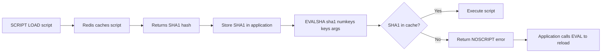

# How to Use EVALSHA in Redis to Run Cached Lua Scripts

Author: [nawazdhandala](https://www.github.com/nawazdhandala)

Tags: Redis, EVALSHA, Lua, Script Cache, Performance

Description: Learn how to use EVALSHA in Redis to execute pre-loaded Lua scripts by SHA1 hash, reducing bandwidth overhead compared to sending the full script on every call.

---

## How EVALSHA Works

EVALSHA executes a Lua script that has been previously loaded into Redis's script cache. Instead of sending the full script text on every call, you load the script once with SCRIPT LOAD and then call it by its SHA1 hash using EVALSHA. This reduces bandwidth usage and parsing overhead for frequently called scripts.

The script cache is per-server and is cleared when Redis is restarted or when SCRIPT FLUSH is called. The cache is not replicated to replicas.



## Syntax

```redis
EVALSHA sha1 numkeys [key [key ...]] [arg [arg ...]]
```

- `sha1` - the 40-character SHA1 hex digest of the script
- `numkeys` - number of key names that follow
- `key [key ...]` - key names accessible as `KEYS[1]`, `KEYS[2]`, etc.
- `arg [arg ...]` - additional arguments accessible as `ARGV[1]`, `ARGV[2]`, etc.

## Examples

### Step 1 - load a script and get its SHA1

```redis
SCRIPT LOAD "return redis.call('SET', KEYS[1], ARGV[1])"
```

```text
"2fa2b029f72572e803ff55a6a2a3f4a5b44060d6"
```

### Step 2 - call the script using EVALSHA

```redis
EVALSHA 2fa2b029f72572e803ff55a6a2a3f4a5b44060d6 1 mykey "hello"
```

```text
OK
```

```redis
GET mykey
```

```text
"hello"
```

### Load and call a rate limiter script

Load the script:

```redis
SCRIPT LOAD "
  local key = KEYS[1]
  local limit = tonumber(ARGV[1])
  local window = tonumber(ARGV[2])
  local current = redis.call('INCR', key)
  if current == 1 then
    redis.call('EXPIRE', key, window)
  end
  if current > limit then
    return 0
  end
  return 1
"
```

```text
"abc123def456abc123def456abc123def456abc1"
```

Call via EVALSHA on subsequent requests:

```redis
EVALSHA abc123def456abc123def456abc123def456abc1 1 rate:user:42 10 60
```

```text
(integer) 1
```

### NOSCRIPT error - script not in cache

If the server was restarted or SCRIPT FLUSH was called:

```redis
EVALSHA 2fa2b029f72572e803ff55a6a2a3f4a5b44060d6 1 mykey "value"
```

```text
(error) NOSCRIPT No matching script. Please use EVAL.
```

### Handling NOSCRIPT in application code

The recommended pattern is to catch NOSCRIPT and fall back to EVAL:

```bash
# Try EVALSHA first
result=$(redis-cli EVALSHA $SHA1 1 mykey myarg 2>&1)

if echo "$result" | grep -q "NOSCRIPT"; then
  # Fall back to EVAL to reload into cache
  result=$(redis-cli EVAL "$SCRIPT_TEXT" 1 mykey myarg)
fi

echo "$result"
```

### Verify a script is loaded with SCRIPT EXISTS

```redis
SCRIPT EXISTS 2fa2b029f72572e803ff55a6a2a3f4a5b44060d6
```

```text
1) (integer) 1
```

Returns 1 if cached, 0 if not.

## EVAL vs EVALSHA Performance

| Aspect | EVAL | EVALSHA |
|---|---|---|
| Network bandwidth | Full script text each call | 40-char SHA1 hash |
| First call overhead | Parse + execute | Load once, then lookup |
| Server restart behavior | Script always sent fresh | NOSCRIPT error, must reload |
| Redis Cluster | Each node caches independently | Must load on all nodes |

For a 500-byte Lua script called 10,000 times per second, EVALSHA saves ~5MB/sec of bandwidth over EVAL.

## Use Cases

**High-frequency atomic operations** - Rate limiters, distributed locks, and inventory reservations that run thousands of times per second benefit most from EVALSHA's lower overhead.

**Microservice-level script management** - Each service loads its scripts at startup and uses EVALSHA for all subsequent calls, with NOSCRIPT fallback for cache misses after restarts.

**Script versioning** - SHA1 hashes naturally version scripts. A changed script has a different SHA1, allowing controlled rollouts.

## Summary

EVALSHA executes a Lua script by its SHA1 hash, avoiding the overhead of sending the full script text on every call. Load scripts with SCRIPT LOAD and cache the returned SHA1 in your application. Always implement a NOSCRIPT fallback that calls EVAL to reload the script if the cache was cleared. EVALSHA is the preferred way to call Lua scripts in production for any frequently executed script.
