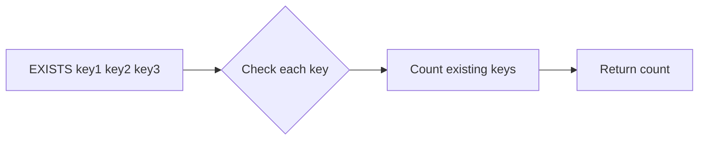

# How to Use EXISTS in Redis to Check if a Key Exists

Author: [nawazdhandala](https://www.github.com/nawazdhandala)

Tags: Redis, EXISTS, Key Management, Cache

Description: Learn how to use the EXISTS command in Redis to check whether one or more keys exist, understand its return values, and apply it to caching and session validation patterns.

---

## How EXISTS Works

EXISTS checks whether one or more keys exist in Redis. It returns the number of keys from the provided list that currently exist. If a key appears multiple times in the argument list, it is counted multiple times. This means passing the same key twice returns 2 if it exists.



## Syntax

```redis
EXISTS key [key ...]
```

Returns an integer: the number of keys from the list that exist.

## Examples

### Check if a single key exists

```redis
SET user:100 "alice"
EXISTS user:100
```

```text
(integer) 1
```

```redis
EXISTS user:999
```

```text
(integer) 0
```

### Check multiple keys at once

```redis
SET user:1 "alice"
SET user:2 "bob"

EXISTS user:1 user:2 user:3
```

```text
(integer) 2
```

`user:3` does not exist, so 2 out of 3 keys were found.

### Passing the same key multiple times

Passing the same key multiple times counts it once per occurrence:

```redis
SET mykey "value"
EXISTS mykey mykey mykey
```

```text
(integer) 3
```

This behavior is unusual - it is a design choice in Redis. In practice, always use unique keys in the argument list.

### EXISTS after a key expires

```redis
SET session:abc "active"
EXPIRE session:abc 1
```

Wait 2 seconds, then check:

```redis
EXISTS session:abc
```

```text
(integer) 0
```

Expired keys behave as if they do not exist.

### Use EXISTS as a guard before operations

Before writing to a key that should only be set once:

```redis
EXISTS config:initialized
```

```text
(integer) 0
```

Since it does not exist, proceed with initialization:

```redis
SET config:initialized "true"
HSET config:settings theme "dark" lang "en"
```

## Use Cases

**Cache-aside pattern** - Check if a cache entry exists before deciding whether to query the database.

**Idempotency checks** - Before processing a request, check if a deduplication key already exists to avoid double-processing.

**Session validation** - Verify a session key is still present (not yet expired or deleted) before allowing access.

**Feature flag presence** - Check if a feature flag key exists without needing to read its value.

**Lock detection** - Check if a distributed lock key is present before attempting to acquire it.

## EXISTS vs GET for Existence Checks

For a simple existence check, EXISTS is better than GET because:

- EXISTS returns just 0 or 1 - no data transfer
- EXISTS is semantically clearer
- GET returns the value (unnecessary data) and nil for missing keys

```redis
# Less efficient - transfers value just to check existence
GET user:100

# Better - only checks existence
EXISTS user:100
```

## Handling Race Conditions

EXISTS followed by a SET is not atomic. Another client can delete or create the key between the two commands. For atomic "set if not exists" behavior, use SET with NX:

```redis
SET mylock "1" NX EX 30
```

This atomically sets the key only if it does not exist, avoiding race conditions.

## Summary

EXISTS is a lightweight command that returns a count of how many of the specified keys exist in Redis. It supports multiple keys in one call and works consistently with TTL-based expiry (expired keys return 0). Use EXISTS for presence checks in caching, session validation, and idempotency logic - but remember it is not atomic with subsequent operations, so use SET NX when you need atomicity.
