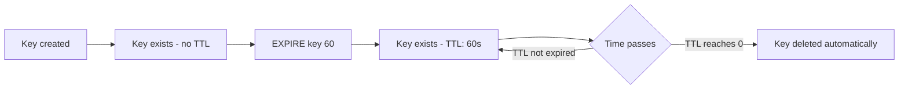

# How to Use EXPIRE and PEXPIRE in Redis to Set Key TTL

Author: [nawazdhandala](https://www.github.com/nawazdhandala)

Tags: Redis, EXPIRE, PEXPIRE, TTL, Key Expiration

Description: Learn how to use EXPIRE and PEXPIRE in Redis to set time-to-live on keys in seconds or milliseconds, with examples of session management and cache invalidation.

---

## How EXPIRE and PEXPIRE Work

EXPIRE sets a timeout on a key in seconds. After the timeout elapses, the key is automatically deleted by Redis. PEXPIRE does the same thing but accepts the timeout in milliseconds, giving you finer control over expiration.

Both commands apply to any existing key regardless of its data type. Setting a new expiration on a key that already has one replaces the old timeout.



## Syntax

```redis
EXPIRE key seconds [NX | XX | GT | LT]
PEXPIRE key milliseconds [NX | XX | GT | LT]
```

- `key` - the key to set the expiration on
- `seconds` / `milliseconds` - the timeout duration
- `NX` - set expiry only if the key has no expiry (Redis 7.0+)
- `XX` - set expiry only if the key already has an expiry (Redis 7.0+)
- `GT` - set expiry only if new TTL is greater than the current one (Redis 7.0+)
- `LT` - set expiry only if new TTL is less than the current one (Redis 7.0+)

## Examples

### Basic EXPIRE - set 60-second TTL

```redis
SET session:user123 "active"
EXPIRE session:user123 60
```

```text
(integer) 1
```

Returns 1 if the timeout was set successfully, 0 if the key does not exist.

### Check remaining TTL with TTL command

```redis
TTL session:user123
```

```text
(integer) 57
```

### PEXPIRE - set TTL in milliseconds

```redis
SET cache:price:BTC "42000"
PEXPIRE cache:price:BTC 5000
```

```text
(integer) 1
```

This key will expire after exactly 5000 milliseconds (5 seconds).

### EXPIRE on a non-existent key

```redis
EXPIRE ghost:key 30
```

```text
(integer) 0
```

Returns 0 because the key does not exist.

### Overwriting an existing TTL

```redis
SET token:abc123 "jwt-payload"
EXPIRE token:abc123 3600
TTL token:abc123
```

```text
(integer) 3598
```

Reset the TTL to a longer duration:

```redis
EXPIRE token:abc123 7200
TTL token:abc123
```

```text
(integer) 7199
```

### Using the GT option (Redis 7.0+)

Only extend the TTL, never shorten it:

```redis
SET lock:resource1 "worker-1"
EXPIRE lock:resource1 30
EXPIRE lock:resource1 10 GT
TTL lock:resource1
```

```text
(integer) 30
```

The TTL stays at 30 because 10 is not greater than 30.

### Using the NX option (Redis 7.0+)

Only set TTL if the key has no existing expiry:

```redis
SET permanent:data "value"
EXPIRE permanent:data 3600 NX
```

```text
(integer) 1
```

Trying again does nothing since an expiry is now set:

```redis
EXPIRE permanent:data 100 NX
```

```text
(integer) 0
```

### Combine SET with EX option (shorthand)

Redis also lets you set value and TTL in one command:

```redis
SET session:user456 "active" EX 1800
```

This is equivalent to SET followed by EXPIRE.

## Use Cases

**Session management** - Automatically expire user sessions after a period of inactivity.

**Cache invalidation** - Set TTL on cached query results, API responses, or computed values to ensure freshness.

**Distributed locks** - Set a TTL on lock keys to prevent deadlocks when a lock holder crashes.

**Rate limiting** - Create counter keys with a TTL equal to the rate window (e.g., 60 seconds for a per-minute limit).

**OTP and verification tokens** - Expire one-time passwords or email verification links after a fixed duration.

## Summary

EXPIRE and PEXPIRE are the core commands for managing key lifetimes in Redis. EXPIRE works in seconds and is suitable for most use cases; PEXPIRE provides millisecond precision for time-sensitive workloads. Redis 7.0 added NX, XX, GT, and LT options to give conditional control over when TTLs are updated. Use these commands alongside TTL and PTTL to build expiration-aware caching, session, and locking systems.
