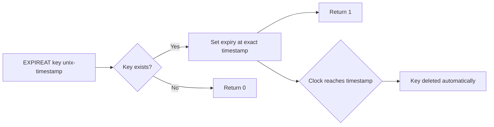

# How to Use EXPIREAT and PEXPIREAT in Redis for Absolute Expiry

Author: [nawazdhandala](https://www.github.com/nawazdhandala)

Tags: Redis, EXPIREAT, PEXPIREAT, TTL, Unix Timestamp

Description: Learn how to use EXPIREAT and PEXPIREAT in Redis to set key expiration at an absolute Unix timestamp in seconds or milliseconds, with practical examples.

---

## How EXPIREAT and PEXPIREAT Work

While EXPIRE and PEXPIRE set a TTL relative to the current time (e.g., "expire in 60 seconds"), EXPIREAT and PEXPIREAT set expiration at an absolute point in time using a Unix timestamp. EXPIREAT takes a timestamp in seconds since the Unix epoch; PEXPIREAT takes a timestamp in milliseconds.

This is essential when you need to expire keys at a specific wall-clock time regardless of when they were created, such as at midnight, at the end of a billing period, or when a subscription ends.



## Syntax

```redis
EXPIREAT key unix-time-seconds [NX | XX | GT | LT]
PEXPIREAT key unix-time-milliseconds [NX | XX | GT | LT]
```

- `unix-time-seconds` - Unix timestamp in seconds (e.g., 1735689600)
- `unix-time-milliseconds` - Unix timestamp in milliseconds (e.g., 1735689600000)
- `NX` - only set if key has no existing expiry (Redis 7.0+)
- `XX` - only set if key already has an expiry (Redis 7.0+)
- `GT` - only set if new timestamp is greater (later) than current expiry (Redis 7.0+)
- `LT` - only set if new timestamp is less (earlier) than current expiry (Redis 7.0+)

## Examples

### Set expiration at a specific Unix timestamp

```redis
SET promo:summer2026 "SUMMER20"
EXPIREAT promo:summer2026 1751328000
```

```text
(integer) 1
```

The key `promo:summer2026` will expire at Unix timestamp 1751328000 (2025-07-01 00:00:00 UTC).

### Verify the expiry was set

```redis
TTL promo:summer2026
```

```text
(integer) 86337
```

This shows about 86337 seconds (roughly 24 hours) remain until the promo code expires.

### Use EXPIRETIME to read the absolute timestamp back

```redis
EXPIRETIME promo:summer2026
```

```text
(integer) 1751328000
```

### PEXPIREAT with millisecond timestamp

```redis
SET flash:sale "50pct-off"
PEXPIREAT flash:sale 1751328000000
```

```text
(integer) 1
```

### Expire at midnight tonight

Get tomorrow's midnight timestamp and apply it:

```bash
# In bash, calculate midnight tonight UTC
MIDNIGHT=$(date -u -d "tomorrow 00:00:00" +%s)
redis-cli EXPIREAT daily:report "$MIDNIGHT"
```

### Using GT to only push expiry forward

Ensure a key's expiry is never moved backward:

```redis
SET subscription:user42 "premium"
EXPIREAT subscription:user42 1780000000

# Try to set an earlier expiry - should fail
EXPIREAT subscription:user42 1760000000 GT
```

```text
(integer) 0
```

The expiry remains at the later timestamp.

### EXPIREAT with a timestamp in the past

If the Unix timestamp is in the past, the key is deleted immediately:

```redis
SET stale:key "value"
EXPIREAT stale:key 1000000000
```

```text
(integer) 1
```

```redis
EXISTS stale:key
```

```text
(integer) 0
```

The key is immediately deleted because the timestamp is in the past.

## Use Cases

**Subscription and license expiry** - Set the key expiry to match a user's subscription end date stored in your database, so Redis automatically cleans up when the subscription lapses.

**Promotional code validity** - Expire promo codes at a specific campaign end datetime rather than after a relative duration.

**Daily or weekly cache invalidation** - Expire aggregated report caches at midnight or end-of-week, so they regenerate fresh for the next day.

**Event-based data cleanup** - Expire event-related data (e.g., session data, event tickets) at the exact time the event ends.

**Synchronized expiry across services** - When multiple services need to expire related keys at the same absolute time, EXPIREAT ensures consistency regardless of when each service applied the expiry.

## Difference Between EXPIRE and EXPIREAT

| Command | Time Type | Example |
|---------|-----------|---------|
| EXPIRE key 3600 | Relative (seconds from now) | Expire in 1 hour |
| PEXPIRE key 3600000 | Relative (milliseconds from now) | Expire in 1 hour |
| EXPIREAT key 1751328000 | Absolute (Unix seconds) | Expire at specific date/time |
| PEXPIREAT key 1751328000000 | Absolute (Unix milliseconds) | Expire at specific date/time |

## Summary

EXPIREAT and PEXPIREAT let you tie key expiration to specific points in calendar time rather than relative durations. This is the right choice when expiration is driven by business events like subscription end dates, campaign deadlines, or daily reset cycles. Both commands return 1 on success and 0 if the key doesn't exist. A timestamp in the past causes immediate deletion. The Redis 7.0 conditional flags (NX, XX, GT, LT) give you fine-grained control over when the expiry is updated.
