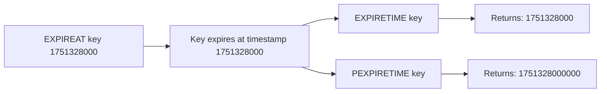

# How to Use EXPIRETIME and PEXPIRETIME in Redis

Author: [nawazdhandala](https://www.github.com/nawazdhandala)

Tags: Redis, EXPIRETIME, PEXPIRETIME, TTL, Unix Timestamp

Description: Learn how to use EXPIRETIME and PEXPIRETIME in Redis to retrieve the absolute Unix timestamp at which a key will expire, in seconds or milliseconds.

---

## How EXPIRETIME and PEXPIRETIME Work

EXPIRETIME returns the absolute Unix timestamp (in seconds) at which a key will expire. PEXPIRETIME returns the same information but in milliseconds. These commands were introduced in Redis 7.0 and complement EXPIREAT and PEXPIREAT by letting you read back the exact expiry time.

Before Redis 7.0, you could only check a relative TTL using TTL or PTTL. EXPIRETIME gives you the actual calendar timestamp, which is more useful when you need to store, compare, or display exact expiry datetimes.



## Syntax

```redis
EXPIRETIME key
PEXPIRETIME key
```

## Return Values

| Return Value | Meaning |
|---|---|
| Positive integer | Absolute Unix timestamp of expiry (seconds or ms) |
| -1 | Key exists but has no expiry |
| -2 | Key does not exist |

## Examples

### Set an absolute expiry and read it back

```redis
SET promo:code "SUMMER25"
EXPIREAT promo:code 1751328000

EXPIRETIME promo:code
```

```text
(integer) 1751328000
```

### PEXPIRETIME for millisecond precision

```redis
PEXPIRETIME promo:code
```

```text
(integer) 1751328000000
```

### Key set with EXPIRE (relative TTL)

Even if you set the TTL with EXPIRE, EXPIRETIME still returns the absolute timestamp:

```redis
SET cache:result "data"
EXPIRE cache:result 3600

EXPIRETIME cache:result
```

```text
(integer) 1751331600
```

The exact value depends on when you ran the EXPIRE command, but it will be approximately the current Unix time plus 3600 seconds.

### Key with no expiration

```redis
SET permanent:setting "true"
EXPIRETIME permanent:setting
```

```text
(integer) -1
```

Returns -1 because the key exists but has no expiry set.

### Key that does not exist

```redis
EXPIRETIME missing:key
```

```text
(integer) -2
```

### Compare EXPIRETIME vs TTL

Use EXPIRETIME when you need the actual calendar date. Use TTL when you only care about the remaining duration:

```redis
SET event:ticket "vip-access"
EXPIREAT event:ticket 1751328000

# Remaining seconds
TTL event:ticket
```

```text
(integer) 86300
```

```redis
# Exact expiry timestamp
EXPIRETIME event:ticket
```

```text
(integer) 1751328000
```

Convert the timestamp to a human-readable date:

```bash
date -d @1751328000
```

```text
Tue Jul  1 00:00:00 UTC 2025
```

## Use Cases

**Display expiry dates to users** - Convert the Unix timestamp to a human-readable date to show users when their session, subscription, or trial ends.

**Audit logging** - Record the exact expiry time of sensitive keys (tokens, locks) in audit logs for compliance.

**Cross-service coordination** - Share the absolute expiry timestamp with another service so it can schedule related cleanup tasks at the correct time.

**Cache invalidation logic** - Compare EXPIRETIME against a known event time to determine if the cached data will still be valid when needed.

**Debugging expiry configuration** - Confirm that EXPIREAT set the intended absolute timestamp rather than an off-by-one-hour timezone error.

## Difference Between EXPIRETIME and TTL

| Command | Returns | Example Output |
|---------|---------|----------------|
| TTL key | Remaining seconds | 3572 |
| PTTL key | Remaining milliseconds | 3572043 |
| EXPIRETIME key | Absolute Unix timestamp (seconds) | 1751328000 |
| PEXPIRETIME key | Absolute Unix timestamp (milliseconds) | 1751328000000 |

## Summary

EXPIRETIME and PEXPIRETIME, available since Redis 7.0, return the absolute Unix timestamp at which a key will expire. They fill a gap left by TTL and PTTL, which only return relative remaining time. Use EXPIRETIME when you need to display, log, or compare the actual expiration datetime of a key. Both commands return -1 for keys with no expiry and -2 for keys that do not exist, consistent with TTL and PTTL.
