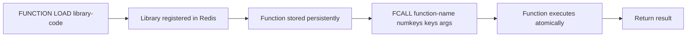

# How to Use FCALL in Redis for Redis Functions (Redis 7+)

Author: [nawazdhandala](https://www.github.com/nawazdhandala)

Tags: Redis, FCALL, Function, Redis 7, Lua, Scripting

Description: Learn how to use FCALL in Redis 7+ to invoke named functions registered with FUNCTION LOAD, the modern replacement for ad-hoc Lua scripting with EVAL.

---

## How FCALL Works

FCALL calls a named function that has been registered in Redis using FUNCTION LOAD. Redis Functions, introduced in Redis 7.0, are a more structured and manageable alternative to ad-hoc Lua scripts. Functions are organized into libraries, persist across server restarts (unlike the script cache used by EVAL/EVALSHA), and are replicated to replicas.

FCALL is the execution command for read-write functions. For read-only functions that are safe to run on replicas, use FCALL_RO.



## Syntax

```redis
FCALL function numkeys [key [key ...]] [arg [arg ...]]
FCALL_RO function numkeys [key [key ...]] [arg [arg ...]]
```

- `function` - the name of the function to call
- `numkeys` - number of key arguments
- `key [key ...]` - key names passed as `keys[1]`, `keys[2]`, etc. in Lua
- `arg [arg ...]` - additional arguments passed as `args[1]`, `args[2]`, etc. in Lua

Note: In Redis Functions, the table arguments are lowercase `keys` and `args`, unlike EVAL's `KEYS` and `ARGV`.

## Examples

### Step 1 - register a library with FUNCTION LOAD

Load a library containing a simple function:

```redis
FUNCTION LOAD "#!lua name=mylib\nredis.register_function('myset', function(keys, args) return redis.call('SET', keys[1], args[1]) end)"
```

```text
"mylib"
```

### Step 2 - call the function with FCALL

```redis
FCALL myset 1 mykey "hello"
```

```text
OK
```

```redis
GET mykey
```

```text
"hello"
```

### Load a more complete library

```redis
FUNCTION LOAD "#!lua name=applib

redis.register_function('set_with_ttl', function(keys, args)
  redis.call('SET', keys[1], args[1])
  redis.call('EXPIRE', keys[1], tonumber(args[2]))
  return 1
end)

redis.register_function('get_with_ttl', function(keys, args)
  local val = redis.call('GET', keys[1])
  local ttl = redis.call('TTL', keys[1])
  return {val, ttl}
end)
"
```

```text
"applib"
```

### Call set_with_ttl

```redis
FCALL set_with_ttl 1 session:user:42 "active" 3600
```

```text
(integer) 1
```

### Call get_with_ttl

```redis
FCALL get_with_ttl 1 session:user:42
```

```text
1) "active"
2) (integer) 3598
```

### FCALL_RO - read-only safe call

For functions that only read data, use FCALL_RO to allow execution on replicas:

```redis
FUNCTION LOAD "#!lua name=rolib

redis.register_function{
  function_name='safe_get',
  callback=function(keys, args)
    return redis.call('GET', keys[1])
  end,
  flags={'no-writes'}
}
"
```

```redis
FCALL_RO safe_get 1 mykey
```

```text
"hello"
```

### Error if function does not exist

```redis
FCALL nonexistent_function 0
```

```text
(error) ERR Library not loaded. Please use FUNCTION LOAD.
```

## FCALL vs EVAL

| Feature | EVAL / EVALSHA | FCALL |
|---|---|---|
| Persistence | Script cache only (lost on restart) | Persisted in RDB/AOF |
| Replication | Not replicated to replicas | Replicated to replicas |
| Organization | Flat scripts | Named libraries with functions |
| Arguments | KEYS[N] and ARGV[N] | keys[N] and args[N] |
| Read-only variant | No | FCALL_RO |
| Redis version | 2.6+ | 7.0+ |

## Use Cases

**Persistent atomic operations** - Functions survive server restarts and are replicated, making them suitable for production-grade atomic operations.

**Library-based script organization** - Group related functions into a named library (e.g., "ratelimit", "session", "inventory") for better code organization.

**Replica-safe reads** - Use FCALL_RO to offload read-heavy function calls to replica nodes.

**Versioned deployments** - Replace a library with FUNCTION LOAD REPLACE to deploy updated function versions atomically.

**Complex business logic** - Implement multi-step, multi-key operations with conditional logic that must be atomic and available after every server restart.

## Summary

FCALL invokes a named function from a registered Redis library, introduced in Redis 7.0 as a superior alternative to EVAL for production scripting. Unlike EVAL's volatile script cache, functions are persisted in RDB/AOF and replicated to replicas. Use FCALL for read-write functions and FCALL_RO for read-only functions that can run on replicas. Register functions using FUNCTION LOAD and organize them into named libraries for maintainability.
