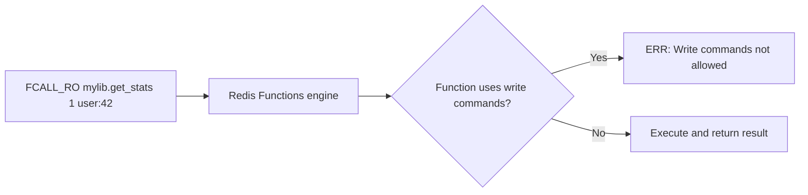
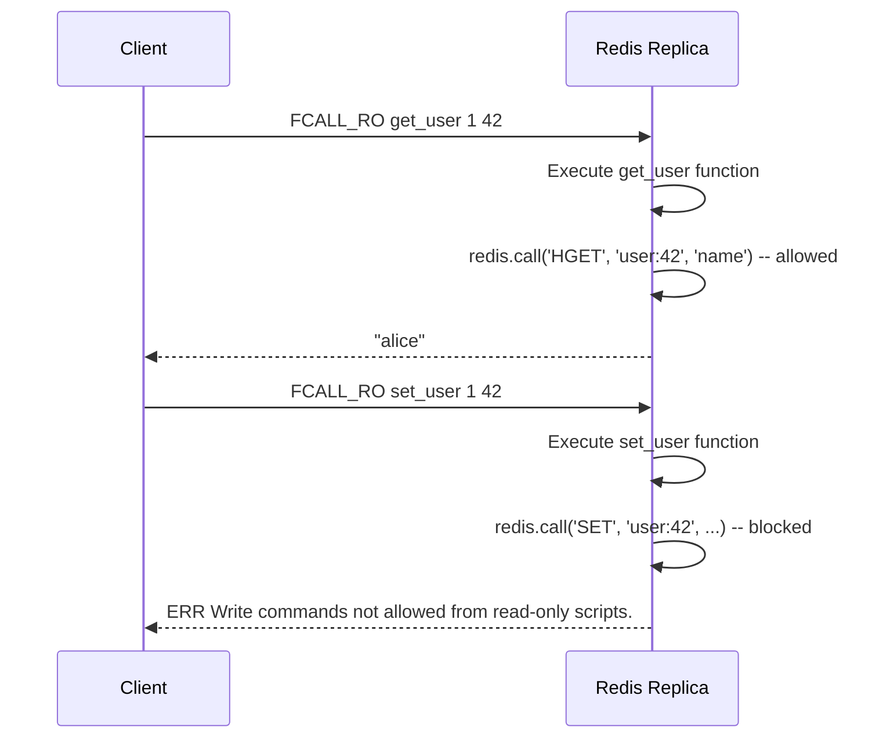

# How to Use FCALL_RO in Redis for Read-Only Function Calls

Author: [nawazdhandala](https://www.github.com/nawazdhandala)

Tags: Redis, FCALL_RO, Function, Lua, Read-only

Description: Learn how to use FCALL_RO in Redis to call registered library functions in read-only mode, enabling safe execution on replicas and read-only connections.

---

## What is FCALL_RO

FCALL_RO calls a function that was registered in a Redis function library, with the constraint that the function may only execute read-only commands. This is the read-only counterpart to FCALL, and it works exactly like FCALL except it rejects any attempt to write data.

```redis
FCALL_RO function-name numkeys [key [key ...]] [arg [arg ...]]
```

FCALL_RO is available from Redis 7.0, the same version that introduced the Functions API.



## When to Use FCALL_RO

### Running functions on replica nodes

Replicas reject write commands. FCALL_RO explicitly declares read-only intent so Redis accepts the call on replica nodes without checking whether the underlying function accidentally writes.

### Safely executing functions from untrusted sources

When function names or arguments come from user input, FCALL_RO ensures no data modification can occur, regardless of what the registered function does.

### Read-only ACL users

A user with only read permissions can call FCALL_RO safely. FCALL on the same user would fail at the ACL layer before the function even runs.

## Basic Usage

First, load a function library that includes a read-only function:

```redis
FUNCTION LOAD "#!lua name=mylib\n
local function get_user(keys, args)
  local id = keys[1]
  local name = redis.call('HGET', 'user:' .. id, 'name')
  local score = redis.call('ZSCORE', 'leaderboard', id)
  return {name, score}
end
redis.register_function('get_user', get_user)
"
```

Call the function in read-only mode:

```redis
FCALL_RO get_user 1 42
-- Returns: ["alice", "9850"]
```

### Passing multiple keys and arguments

```redis
FCALL_RO summarize_keys 3 key1 key2 key3 format json
```

## Write Commands Are Rejected at Runtime

If a function registered without the `no-writes` flag is called via FCALL_RO and tries to write:

```redis
-- Function that calls SET internally
FCALL_RO set_value 1 mykey
-- ERR Write commands not allowed from read-only scripts.
```



## Declaring no-writes in the Function Library

When registering a function, you can declare it has no writes using the `no-writes` flag. This allows the function to be called with FCALL_RO without runtime checking overhead, and also allows it to run during cluster failover:

```redis
FUNCTION LOAD "#!lua name=statslib\n
local function get_count(keys, args)
  return redis.call('SCARD', keys[1])
end
redis.register_function{
  function_name='get_count',
  callback=get_count,
  flags={'no-writes'}
}
"
```

With the `no-writes` flag:
- The function can be called with both FCALL and FCALL_RO
- Redis knows upfront there are no writes, enabling replica execution
- No runtime write-check overhead

## FCALL_RO vs FCALL vs EVAL_RO

| Feature | FCALL | FCALL_RO | EVAL_RO |
|---|---|---|---|
| Executes | Named library function | Named library function | Inline Lua script |
| Writes allowed | Yes | No | No |
| Runs on replicas | No | Yes | Yes |
| Script caching | Functions persist in RDB/AOF | Same | Requires SCRIPT LOAD |
| Replication of script code | Yes (functions survive restart) | Yes | No |

## Checking Function Flags

Use FUNCTION LIST to inspect which functions are registered with the `no-writes` flag:

```redis
FUNCTION LIST LIBRARYNAME statslib WITHCODE
```

Look for `flags: no-writes` in the output to confirm a function is safe for FCALL_RO without runtime enforcement.

## Summary

FCALL_RO calls a registered Redis function while enforcing read-only mode. It is the right choice when executing functions on replica nodes, enforcing safety for untrusted function calls, or running under a read-only ACL user. Declare functions with the `no-writes` flag during registration for the cleanest integration with FCALL_RO. The syntax matches FCALL exactly, making it a drop-in replacement for read-only scenarios.
