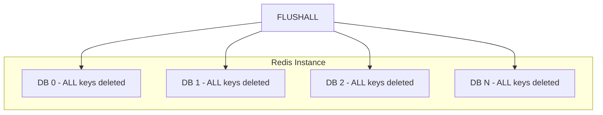
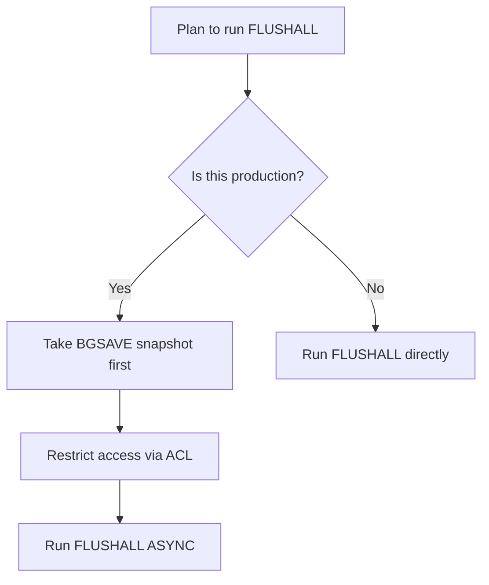

# How to Use FLUSHALL in Redis to Clear All Databases

Author: [nawazdhandala](https://www.github.com/nawazdhandala)

Tags: Redis, Flushall, Database, Administration, Cleanup

Description: Learn how to use FLUSHALL to delete all keys across every Redis database in an instance, with ASYNC and SYNC options and production safety guidance.

---

## Introduction

`FLUSHALL` removes every key from every logical database in the Redis instance. While `FLUSHDB` only clears the currently selected database, `FLUSHALL` is a global wipe. It is the nuclear option for clearing Redis and should be used with caution in production.

## Basic Syntax

```redis
FLUSHALL [ASYNC | SYNC]
```

- `ASYNC` - (Redis 4.0+) reclaims memory in a background thread; the main thread returns immediately
- `SYNC` - blocks until all keys are deleted (default before Redis 4.0; explicit in 6.2+)

Returns `OK`.

## Scope Comparison



## Examples

### Flush all databases synchronously

```redis
SELECT 0
SET users:count 1000

SELECT 1
SET cache:hot "yes"

SELECT 2
SET config:env "prod"

FLUSHALL

SELECT 0
DBSIZE
# (integer) 0

SELECT 1
DBSIZE
# (integer) 0

SELECT 2
DBSIZE
# (integer) 0
```

### Flush all databases asynchronously

```redis
FLUSHALL ASYNC
# OK
```

Useful when the instance holds a very large dataset and you want to avoid blocking the event loop.

### Confirm total key count before and after

```redis
INFO keyspace
# db0:keys=5000,expires=200,avg_ttl=86400
# db1:keys=1200,expires=50,avg_ttl=3600

FLUSHALL

INFO keyspace
# (empty - no databases listed)
```

## FLUSHALL vs FLUSHDB

| Feature | FLUSHDB | FLUSHALL |
|---|---|---|
| Scope | Current database only | All databases |
| Other databases affected | No | Yes |
| ASYNC support | Yes | Yes |
| Returns | OK | OK |

## Interaction with Persistence

- **RDB**: The next `BGSAVE` will write an empty or near-empty RDB file. Previous snapshots on disk are not deleted.
- **AOF**: A `FLUSHALL` is appended to the AOF log. On restart, Redis replays it, resulting in an empty instance.

## Access Control

Restrict `FLUSHALL` in production using ACLs:

```redis
ACL SETUSER app_user ~* +@all -FLUSHALL -FLUSHDB -CONFIG
```

You can also disable the command entirely in `redis.conf`:

```redis
rename-command FLUSHALL ""
```

## Typical Use Cases

- Clearing a test Redis instance between test runs
- Resetting a development environment
- Emergency data purge (with appropriate backups taken first)

## Safety Checklist



## Summary

`FLUSHALL [ASYNC|SYNC]` wipes every key in every database on a Redis instance. Use `ASYNC` to avoid blocking the main thread on large datasets. Protect this command with ACLs or `rename-command` in production, and always take a backup before running it against live data.
