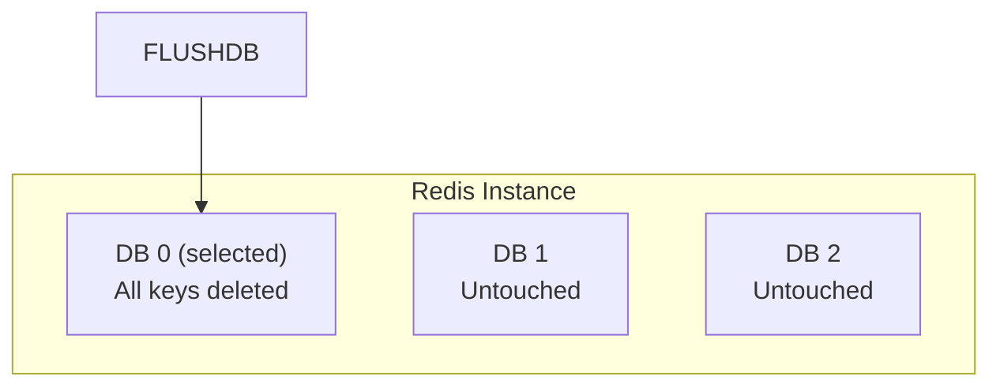
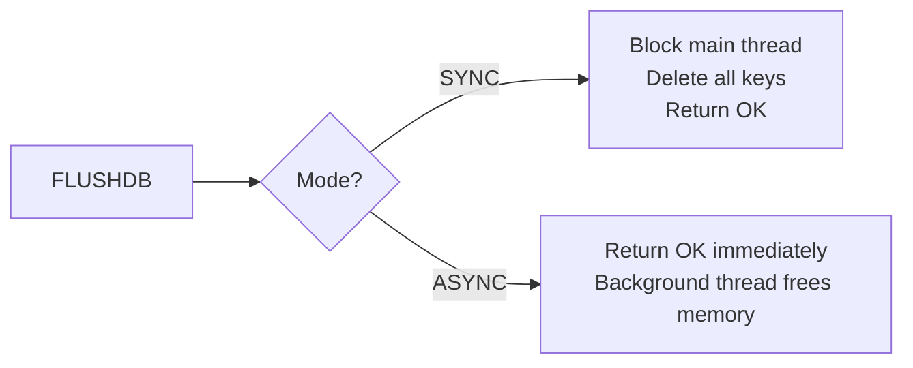

# How to Use FLUSHDB in Redis to Clear a Database

Author: [nawazdhandala](https://www.github.com/nawazdhandala)

Tags: Redis, Flushdb, Database, Administration, Cleanup

Description: Learn how to use FLUSHDB to delete all keys in the currently selected Redis database, with ASYNC and SYNC options and safety considerations.

---

## Introduction

`FLUSHDB` removes all keys from the currently selected Redis database. Unlike `DEL`, which deletes specific keys, `FLUSHDB` wipes the entire keyspace of the active database in one command. It leaves other databases untouched.

## Basic Syntax

```redis
FLUSHDB [ASYNC | SYNC]
```

- `ASYNC` - (Redis 4.0+) deletes keys in a background thread, freeing the main thread immediately
- `SYNC` - (Redis 6.2+) explicitly blocks until deletion completes (default behavior before 4.0)

Returns `OK`.

## How FLUSHDB Relates to Databases



## Examples

### Flush the current database (synchronous)

```redis
SELECT 0
SET key1 "a"
SET key2 "b"
SET key3 "c"

DBSIZE
# (integer) 3

FLUSHDB
# OK

DBSIZE
# (integer) 0
```

### Flush asynchronously (non-blocking)

```redis
SELECT 0
FLUSHDB ASYNC
# OK
```

The main event loop returns immediately. A background thread handles the actual memory reclamation.

### Flush a specific database without switching

```redis
# From db 0, flush db 1 by switching first
SELECT 1
FLUSHDB
SELECT 0
```

### Verify other databases are untouched

```redis
SELECT 0
SET preserved "yes"

SELECT 1
FLUSHDB

SELECT 0
GET preserved
# "yes"
```

## ASYNC vs SYNC



Use `ASYNC` when:
- Your database has millions of keys and you cannot afford latency spikes
- You are running Redis as a cache where brief inconsistency is acceptable

Use `SYNC` when:
- You need a hard guarantee that memory is reclaimed before proceeding
- You are running integration tests and need a clean state

## Interaction with Persistence

- **RDB**: `FLUSHDB` does not immediately trigger a snapshot. The next scheduled `BGSAVE` will produce an RDB with an empty database.
- **AOF**: A `FLUSHDB` entry is appended to the AOF log so the flush is replayed on restart.

## Safety Considerations

`FLUSHDB` is irreversible. Before running it in production:

1. Confirm you are on the correct database index with `SELECT` and `DBSIZE`.
2. Consider taking a snapshot with `BGSAVE` first.
3. Use ACLs to restrict who can run `FLUSHDB`:

```redis
ACL SETUSER app_user ~* +@all -FLUSHDB -FLUSHALL
```

## Summary

`FLUSHDB [ASYNC|SYNC]` deletes all keys in the currently selected Redis database. The `ASYNC` flag offloads memory reclamation to a background thread to avoid latency spikes on large datasets. Always confirm the target database before running this command and protect it with ACL rules in production environments.
