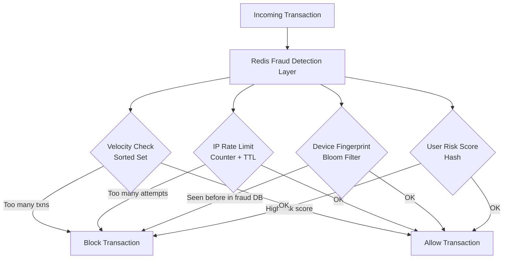

# How to Implement Fraud Detection with Redis

Author: [nawazdhandala](https://github.com/nawazdhandala)

Tags: Redis, Security, Caching, Real-Time, Architecture

Description: Learn how to build a real-time fraud detection system using Redis rate limiting, Bloom filters, sorted sets, and hashes to block suspicious transactions instantly.

---

## Introduction

Fraud detection requires low-latency decisions at high throughput. Traditional relational databases cannot match the sub-millisecond response times needed to block a fraudulent transaction before it completes. Redis serves as the backbone for real-time fraud detection by providing fast counters for rate limiting, Bloom filters for duplicate detection, sorted sets for velocity checks, and hashes for storing user risk profiles.

## Architecture Overview



## Components

### 1. Velocity Checking with Sorted Sets

Track the number and timing of transactions per user using a sorted set with timestamps as scores:

```redis
# Add a transaction with timestamp as score
ZADD user:txns:u123 1712000000 "txn:abc"

# Count transactions in the last 60 seconds
ZCOUNT user:txns:u123 1711999940 1712000000

# Clean up old entries
ZREMRANGEBYSCORE user:txns:u123 -inf 1711999940
```

### 2. IP-Based Rate Limiting

```redis
# Increment transaction count for IP, set TTL on first use
INCR ip:rate:192.168.1.100
EXPIRE ip:rate:192.168.1.100 60

# Check current count
GET ip:rate:192.168.1.100
```

### 3. Bloom Filter for Known Fraudulent Devices

```redis
# Add a fraudulent device fingerprint
BF.ADD fraud:devices "device_fp_abc123"

# Check if a device fingerprint is known fraudulent
BF.EXISTS fraud:devices "device_fp_abc123"
```

### 4. User Risk Profile in Hashes

```redis
# Store user risk profile
HSET user:risk:u123 score 72 last_country "US" failed_attempts 3 created_at 1712000000

# Retrieve and update risk score
HINCRBY user:risk:u123 score 10
HGET user:risk:u123 score
```

## Full Implementation in Python

```python
import redis
import time
import json
from dataclasses import dataclass

r = redis.Redis(host="localhost", port=6379, decode_responses=True)

MAX_TXN_PER_MINUTE = 10
MAX_AMOUNT_PER_HOUR = 5000.0
MAX_IP_ATTEMPTS_PER_MINUTE = 20
RISK_SCORE_THRESHOLD = 80

@dataclass
class Transaction:
    txn_id: str
    user_id: str
    ip: str
    device_fp: str
    amount: float
    country: str

def is_fraudulent(txn: Transaction) -> tuple[bool, str]:
    now = int(time.time())
    window_start = now - 60

    # 1. Velocity check -- too many transactions in 60 seconds
    txn_key = f"user:txns:{txn.user_id}"
    r.zadd(txn_key, {txn.txn_id: now})
    r.zremrangebyscore(txn_key, "-inf", window_start)
    r.expire(txn_key, 120)
    txn_count = r.zcard(txn_key)
    if txn_count > MAX_TXN_PER_MINUTE:
        return True, "velocity_exceeded"

    # 2. IP rate limiting
    ip_key = f"ip:rate:{txn.ip}"
    count = r.incr(ip_key)
    if count == 1:
        r.expire(ip_key, 60)
    if count > MAX_IP_ATTEMPTS_PER_MINUTE:
        return True, "ip_rate_limit"

    # 3. Known fraudulent device fingerprint
    if r.execute_command("BF.EXISTS", "fraud:devices", txn.device_fp):
        return True, "known_fraud_device"

    # 4. User risk score
    risk_key = f"user:risk:{txn.user_id}"
    risk_score = r.hget(risk_key, "score")
    if risk_score and int(risk_score) >= RISK_SCORE_THRESHOLD:
        return True, "high_risk_user"

    # 5. Country mismatch
    last_country = r.hget(risk_key, "last_country")
    if last_country and last_country != txn.country:
        r.hincrby(risk_key, "score", 15)

    # Update profile
    r.hset(risk_key, mapping={"last_country": txn.country, "last_txn": now})
    r.expire(risk_key, 86400 * 30)

    return False, "ok"

# Test
txn = Transaction(
    txn_id="txn:001",
    user_id="u123",
    ip="192.168.1.100",
    device_fp="fp_abc123",
    amount=250.0,
    country="US",
)
is_fraud, reason = is_fraudulent(txn)
print(f"Fraudulent: {is_fraud}, Reason: {reason}")
```

## Node.js Implementation

```javascript
const Redis = require("ioredis");
const redis = new Redis();

const MAX_TXN_PER_MINUTE = 10;
const RISK_THRESHOLD = 80;

async function isFraudulent(txn) {
  const now = Math.floor(Date.now() / 1000);
  const windowStart = now - 60;

  // Velocity check
  const txnKey = `user:txns:${txn.userId}`;
  await redis.zadd(txnKey, now, txn.txnId);
  await redis.zremrangebyscore(txnKey, "-inf", windowStart);
  await redis.expire(txnKey, 120);
  const txnCount = await redis.zcard(txnKey);
  if (txnCount > MAX_TXN_PER_MINUTE) {
    return { fraud: true, reason: "velocity_exceeded" };
  }

  // Known fraudulent device
  const deviceKnown = await redis.call("BF.EXISTS", "fraud:devices", txn.deviceFp);
  if (deviceKnown === 1) {
    return { fraud: true, reason: "known_fraud_device" };
  }

  // Risk score
  const riskScore = await redis.hget(`user:risk:${txn.userId}`, "score");
  if (riskScore && parseInt(riskScore, 10) >= RISK_THRESHOLD) {
    return { fraud: true, reason: "high_risk_user" };
  }

  return { fraud: false, reason: "ok" };
}
```

## Adding Known Fraudulent Devices

```redis
# Bulk-load known fraudulent device fingerprints
BF.MADD fraud:devices "fp_aaa111" "fp_bbb222" "fp_ccc333"

# Check capacity
BF.INFO fraud:devices
```

## Escalating Risk Score Based on Behavior

```redis
# User made a transaction from a new country
HINCRBY user:risk:u123 score 15

# Failed card verification
HINCRBY user:risk:u123 failed_attempts 1
HINCRBY user:risk:u123 score 20

# User verified identity -- reduce risk
HINCRBY user:risk:u123 score -30
```

## Amount Anomaly Detection

Track total spending in a rolling window using a sorted set of amounts:

```python
def check_amount_anomaly(r, user_id, amount, max_hour_total=5000.0):
    now = int(time.time())
    hour_start = now - 3600
    amount_key = f"user:amounts:{user_id}"

    r.zadd(amount_key, {f"{now}:{amount}": now})
    r.zremrangebyscore(amount_key, "-inf", hour_start)
    r.expire(amount_key, 7200)

    entries = r.zrangebyscore(amount_key, hour_start, "+inf")
    total = sum(float(e.split(":")[1]) for e in entries)

    if total > max_hour_total:
        return True, total
    return False, total
```

## Summary

Redis enables real-time fraud detection by combining several data structures. Use sorted sets for velocity checks with sliding time windows, INCR + TTL for IP rate limiting, Bloom filters (BF.ADD / BF.EXISTS) for fast lookups against known fraudulent device databases, and hashes for per-user risk profiles. The result is a sub-millisecond fraud scoring layer that can make blocking decisions before a payment network responds.
