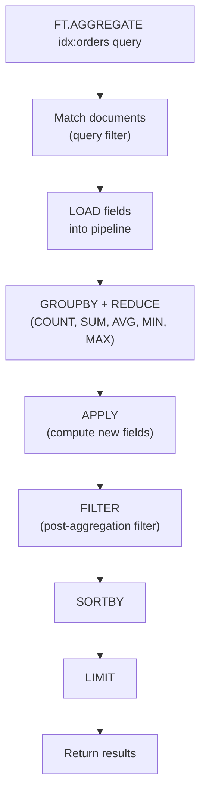

# How to Use FT.AGGREGATE in Redis for Search Aggregations

Author: [nawazdhandala](https://www.github.com/nawazdhandala)

Tags: Redis, RediSearch, Aggregation, Search, Analytics

Description: Learn how to use FT.AGGREGATE in Redis to group, count, sum, and transform search results using a pipeline of reducers and transformations on indexed documents.

---

## Introduction

`FT.AGGREGATE` runs an aggregation pipeline over a RediSearch index. You define a series of steps - filtering, grouping with reducers (COUNT, SUM, AVG, MIN, MAX), applying expressions, sorting, and limiting - to produce summarized results without returning raw documents.

## Prerequisites

```redis
FT.CREATE idx:orders ON HASH PREFIX 1 order:
  SCHEMA
    customer_id TAG
    status TAG
    city TAG
    total NUMERIC SORTABLE
    created_at NUMERIC SORTABLE

HSET order:1 customer_id 101 status "shipped"  city "London" total 49.99  created_at 1711800000
HSET order:2 customer_id 102 status "pending"  city "Paris"  total 19.99  created_at 1711810000
HSET order:3 customer_id 101 status "shipped"  city "London" total 89.99  created_at 1711820000
HSET order:4 customer_id 103 status "canceled" city "Berlin" total 34.99  created_at 1711830000
HSET order:5 customer_id 102 status "shipped"  city "Paris"  total 59.99  created_at 1711840000
```

## Basic Syntax

```redis
FT.AGGREGATE index query
  [LOAD count field [AS name] ...]
  [GROUPBY nargs property [property ...] REDUCE reducer nargs arg [arg ...] AS name ...]
  [SORTBY nargs [property [ASC|DESC]] ...]
  [APPLY expression AS name]
  [LIMIT offset count]
  [FILTER expression]
```

## Count Orders by Status

```redis
FT.AGGREGATE idx:orders "*"
  GROUPBY 1 @status
  REDUCE COUNT 0 AS order_count
  SORTBY 2 @order_count DESC
```

Output:

```
1) (integer) 3
2) 1) "status"
   2) "shipped"
   3) "order_count"
   4) "3"
3) 1) "status"
   2) "pending"
   3) "order_count"
   4) "1"
4) 1) "status"
   2) "canceled"
   3) "order_count"
   4) "1"
```

## Sum Revenue by City

```redis
FT.AGGREGATE idx:orders "*"
  GROUPBY 1 @city
  REDUCE SUM 1 @total AS revenue
  SORTBY 2 @revenue DESC
```

## Average Order Value per Customer

```redis
FT.AGGREGATE idx:orders "*"
  GROUPBY 1 @customer_id
  REDUCE COUNT 0 AS orders
  REDUCE SUM 1 @total AS total_spent
  REDUCE AVG 1 @total AS avg_order
  SORTBY 2 @total_spent DESC
```

## Apply: Computed Fields

```redis
FT.AGGREGATE idx:orders "*"
  LOAD 2 @total @status
  APPLY "@total * 1.2" AS total_with_tax
  SORTBY 2 @total_with_tax DESC
  LIMIT 0 5
```

## Filter After Grouping

```redis
FT.AGGREGATE idx:orders "*"
  GROUPBY 1 @city
  REDUCE COUNT 0 AS cnt
  REDUCE SUM 1 @total AS revenue
  FILTER "@revenue > 50"
```

## Aggregation Pipeline



## Available Reducers

| Reducer | Usage |
|---|---|
| `COUNT` | Count documents in group |
| `COUNT_DISTINCT field` | Count unique values |
| `SUM field` | Sum of values |
| `AVG field` | Average value |
| `MIN field` | Minimum value |
| `MAX field` | Maximum value |
| `STDDEV field` | Standard deviation |
| `QUANTILE field pct` | Percentile (e.g., 0.99 for P99) |
| `TOLIST field` | Collect values into a list |
| `FIRST_VALUE field` | First value in group |
| `RANDOM_SAMPLE field count` | Random sample |

## Percentile Example

```redis
FT.AGGREGATE idx:orders "*"
  GROUPBY 1 @city
  REDUCE QUANTILE 2 @total 0.99 AS p99_order_value
  REDUCE COUNT 0 AS order_count
```

## Query-Filtered Aggregation

```redis
# Aggregate only shipped orders
FT.AGGREGATE idx:orders "@status:{shipped}"
  GROUPBY 1 @city
  REDUCE SUM 1 @total AS shipped_revenue
  SORTBY 2 @shipped_revenue DESC
```

## Python Example

```python
import redis
from redis.commands.search.aggregation import AggregateRequest
from redis.commands.search.reducers import sum as rsum, count

r = redis.Redis()

req = (
    AggregateRequest("*")
    .group_by("@city", count().alias("orders"), rsum("@total").alias("revenue"))
    .sort_by("@revenue", asc=False)
    .limit(0, 10)
)

results = r.ft("idx:orders").aggregate(req)
for row in results.rows:
    print(dict(zip(row[::2], row[1::2])))
```

## Summary

`FT.AGGREGATE` executes a multi-step pipeline: filter documents with a query, load fields, group with reducers (COUNT, SUM, AVG, MIN, MAX, QUANTILE), compute new fields with APPLY, filter results, sort, and paginate. Use it for analytics dashboards, sales summaries, user segmentation, and any scenario requiring server-side aggregation over indexed Redis data.
