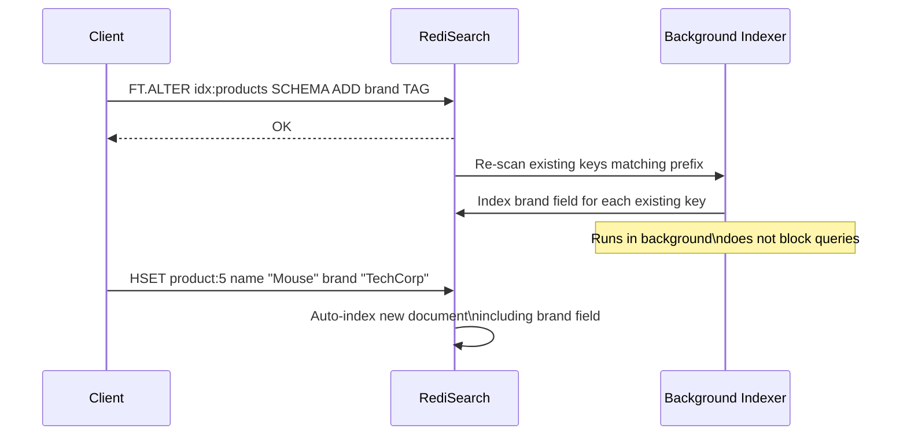

# How to Use FT.ALTER in Redis to Modify Search Indexes

Author: [nawazdhandala](https://www.github.com/nawazdhandala)

Tags: Redis, RediSearch, Index, Schema, Full-text search

Description: Learn how to use FT.ALTER in Redis to add new fields to an existing RediSearch index schema without dropping and recreating the index.

---

## Introduction

`FT.ALTER` adds new fields to an existing RediSearch index schema. It allows you to extend the search schema incrementally - new keys written after the alter are indexed with the new fields immediately, while existing keys are re-indexed in the background if you use `SKIPINITIALSCAN` carefully.

Note: `FT.ALTER` can only add fields; it cannot remove or rename existing fields. To do that you must drop and recreate the index.

## Basic Syntax

```redis
FT.ALTER index SCHEMA ADD field type [options] [field type [options] ...]
```

## Example: Starting Index

```redis
FT.CREATE idx:products ON HASH PREFIX 1 product:
  SCHEMA
    name TEXT
    price NUMERIC SORTABLE
    category TAG

HSET product:1 name "Laptop" price 999 category "electronics"
HSET product:2 name "Desk"   price 149 category "furniture"
```

## Add a New Field to the Schema

```redis
FT.ALTER idx:products SCHEMA ADD brand TAG
```

After this command:
- New documents with a `brand` field will be indexed.
- Existing documents are re-indexed in the background to pick up `brand`.

```redis
HSET product:1 brand "TechCorp"
HSET product:2 brand "OfficeWorld"
HSET product:3 name "Keyboard" price 59 category "electronics" brand "TechCorp"
```

Now you can search by brand:

```redis
FT.SEARCH idx:products "@brand:{TechCorp}"
```

## Add Multiple Fields at Once

```redis
FT.ALTER idx:products SCHEMA ADD
  in_stock TAG
  rating NUMERIC SORTABLE
  description TEXT
```

All three fields are added in a single command.

## Add a Sortable Numeric Field

```redis
FT.ALTER idx:products SCHEMA ADD stock_count NUMERIC SORTABLE
```

## Add a GEO Field

```redis
FT.ALTER idx:products SCHEMA ADD location GEO
```

After adding, store geo data as `"longitude,latitude"`:

```redis
HSET product:4 name "Local Gadget" price 29 category "electronics" location "51.5074,-0.1278"
```

Query by radius:

```redis
FT.SEARCH idx:products "@location:[51.5 -0.12 5 km]"
```

## What Happens After FT.ALTER



## Checking Index Schema After ALTER

```redis
FT.INFO idx:products
# Shows updated attribute list including the newly added fields
```

## Limitations

- You cannot remove or rename fields with `FT.ALTER`.
- You cannot change a field's type or options (e.g., make an unindexed field SORTABLE).
- For those changes, use `FT.DROPINDEX` followed by `FT.CREATE`.

## Comparing FT.ALTER vs Recreating the Index

| Scenario | FT.ALTER | Drop + Create |
|---|---|---|
| Add a new field | Yes | Yes |
| Remove a field | No | Yes |
| Change field type | No | Yes |
| Downtime | None | Index unavailable during re-creation |
| Re-indexing existing docs | Background | Background after CREATE |

## Re-indexing All Existing Documents Manually

If background re-indexing is slow or you want to force it:

```bash
#!/bin/bash
# Touch all product keys to trigger re-indexing
redis-cli --scan --pattern "product:*" | while read key; do
  # A harmless HSET that preserves existing data triggers re-index
  redis-cli HSET "$key" _indexed 1
done
```

## Summary

`FT.ALTER index SCHEMA ADD field type [options] ...` extends an existing RediSearch index with new fields without dropping it. New documents are indexed with the new fields immediately. Existing documents are re-indexed in the background. It supports all field types available in FT.CREATE (TEXT, NUMERIC, TAG, GEO, VECTOR). Use it for schema evolution in live indexes where downtime is not acceptable.
