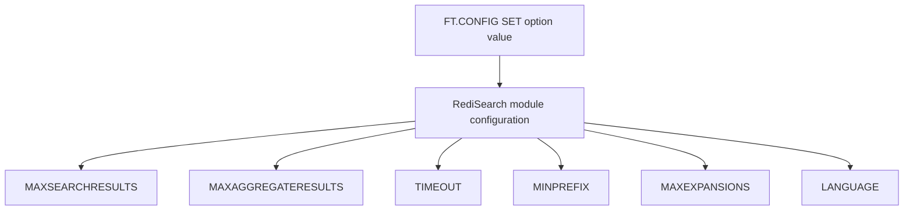

# How to Use FT.CONFIG in Redis to Set Search Configuration

Author: [nawazdhandala](https://www.github.com/nawazdhandala)

Tags: Redis, RediSearch, Search, Configuration, Command

Description: Learn how to use FT.CONFIG SET and FT.CONFIG GET in Redis to read and modify RediSearch module-level configuration at runtime without restarting.

---

## How FT.CONFIG Works

`FT.CONFIG` provides `SET` and `GET` subcommands to read and modify RediSearch module configuration options at runtime. Many settings control search behavior globally: the default language for text analysis, the number of background threads for indexing, memory limits, timeout values, and more. Changes take effect immediately without restarting Redis.



## Syntax

```redis
FT.CONFIG SET option value
FT.CONFIG GET option
FT.CONFIG GET *
```

- `SET option value` - update a configuration option
- `GET option` - retrieve the current value of one option
- `GET *` - retrieve all configuration options and their values

## Viewing Current Configuration

### Get All Configuration Options

```redis
FT.CONFIG GET *
```

```text
 1) 1) "MAXSEARCHRESULTS"
    2) "10000"
 2) 1) "MAXAGGREGATERESULTS"
    2) "10000"
 3) 1) "TIMEOUT"
    2) "500"
 4) 1) "MINPREFIX"
    2) "2"
 5) 1) "MAXEXPANSIONS"
    2) "200"
 6) 1) "MAXDOCTABLESIZE"
    2) "1000000"
 7) 1) "LANGUAGE"
    2) "english"
 8) 1) "LANGUAGEFIELD"
    2) "__language"
 9) 1) "SCORE"
    2) "1"
10) 1) "SCOREFIELD"
    2) "__score"
11) 1) "WORKERS"
    2) "0"
```

### Get a Specific Option

```redis
FT.CONFIG GET TIMEOUT
```

```text
1) 1) "TIMEOUT"
   2) "500"
```

## Key Configuration Options

### MAXSEARCHRESULTS

The maximum number of results `FT.SEARCH` will return in total across all pages:

```redis
FT.CONFIG GET MAXSEARCHRESULTS
FT.CONFIG SET MAXSEARCHRESULTS 50000
```

Set to `-1` to remove the limit (use with caution on large indexes).

### MAXAGGREGATERESULTS

The maximum number of rows `FT.AGGREGATE` returns:

```redis
FT.CONFIG SET MAXAGGREGATERESULTS 100000
```

### TIMEOUT

Query execution timeout in milliseconds. Queries exceeding this limit return partial results:

```redis
FT.CONFIG GET TIMEOUT
-- Default: 500 ms

FT.CONFIG SET TIMEOUT 2000
-- Allow up to 2 seconds for complex queries
```

Set to `0` to disable timeout (not recommended for production).

### MINPREFIX

The minimum number of characters required for prefix queries (`term*`):

```redis
FT.CONFIG GET MINPREFIX
-- Default: 2

-- Require at least 3 characters for prefix search
FT.CONFIG SET MINPREFIX 3
```

Shorter prefixes match more documents and use more CPU.

### MAXEXPANSIONS

The maximum number of terms that a fuzzy or prefix query expands to:

```redis
FT.CONFIG GET MAXEXPANSIONS
-- Default: 200

FT.CONFIG SET MAXEXPANSIONS 500
```

Increasing this allows fuzzier matching at the cost of query performance.

### LANGUAGE

The default language for text analysis (stemming):

```redis
FT.CONFIG GET LANGUAGE
-- Default: english

FT.CONFIG SET LANGUAGE spanish
```

This sets the global default; individual indexes can override it with `LANGUAGE` in `FT.CREATE`.

### WORKERS

The number of background threads used for indexing (0 means single-threaded):

```redis
FT.CONFIG GET WORKERS
FT.CONFIG SET WORKERS 4
```

Increasing workers speeds up indexing of large document sets at the cost of more CPU.

### MINPHONETIC

The minimum edit distance for phonetic matching:

```redis
FT.CONFIG GET MINPHONETIC
-- Default: 5
```

## Practical Configuration Scenarios

### High-Throughput Search Service

Optimize for fast query responses:

```redis
FT.CONFIG SET TIMEOUT 1000
FT.CONFIG SET MAXEXPANSIONS 100
FT.CONFIG SET MINPREFIX 3
FT.CONFIG SET MAXSEARCHRESULTS 10000
```

### Background Data Ingestion

Optimize for fast indexing when loading bulk data:

```redis
FT.CONFIG SET WORKERS 8
FT.CONFIG SET TIMEOUT 0
```

Restore to normal after ingestion completes.

### Multilingual Application

```redis
FT.CONFIG SET LANGUAGE english
-- Or set per-index at FT.CREATE time using the LANGUAGE option
```

## Configuration Persistence

Runtime `FT.CONFIG SET` changes are not persisted across Redis restarts. To make them permanent, set them in the Redis configuration file or as module load arguments:

```text
# redis.conf
loadmodule /path/to/redisearch.so MAXSEARCHRESULTS 50000 TIMEOUT 2000 WORKERS 4
```

## Summary

`FT.CONFIG SET` and `FT.CONFIG GET` let you read and modify RediSearch module-level configuration at runtime. Use them to tune query timeouts, result limits, prefix query thresholds, fuzzy expansion limits, indexing thread counts, and default language. Changes take effect immediately but are not persisted across restarts unless specified in the Redis configuration file.
