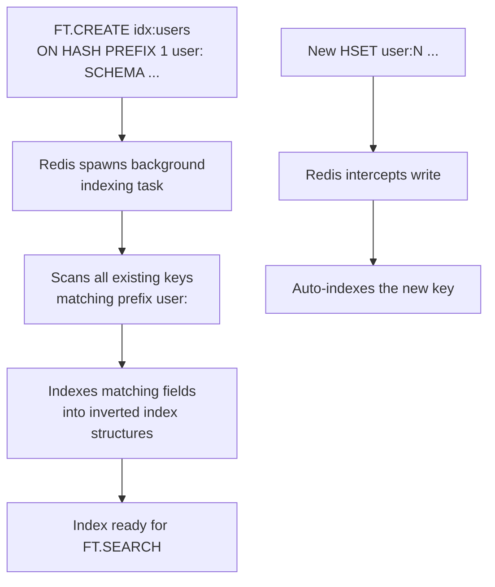

# How to Use FT.CREATE in Redis to Create a Search Index

Author: [nawazdhandala](https://www.github.com/nawazdhandala)

Tags: Redis, RediSearch, Search, Index, Full-Text Search

Description: Learn how to use FT.CREATE in Redis to define a full-text search index over hash or JSON documents, specifying fields, types, and options for efficient querying.

---

## Introduction

`FT.CREATE` defines a search index in RediSearch (part of Redis Stack). It scans existing keys and indexes them, then continuously indexes new keys that match the specified prefix. You define the fields to index, their types (text, numeric, tag, geo, vector), and their options.

## Basic Syntax

```redis
FT.CREATE index-name
  [ON HASH | JSON]
  [PREFIX count prefix [prefix ...]]
  [FILTER filter-expression]
  [LANGUAGE default-lang]
  [SCORE default-score]
  [NOOFFSETS] [NOHL] [NOFIELDS] [NOFREQS]
  SCHEMA field [AS alias] type [options] [field ...]
```

## Create an Index on Hashes

```redis
FT.CREATE idx:users
  ON HASH
  PREFIX 1 user:
  SCHEMA
    name TEXT WEIGHT 5.0
    age NUMERIC SORTABLE
    city TAG
    bio TEXT
```

This indexes all keys starting with `user:`, treating `name` as a weighted text field, `age` as a sortable numeric field, `city` as a tag (exact-match) field, and `bio` as a text field.

## Populate Sample Data

```redis
HSET user:1 name "Alice Smith" age 30 city "London" bio "Redis engineer and open source contributor"
HSET user:2 name "Bob Jones"   age 25 city "Paris"  bio "Full-stack developer who loves databases"
HSET user:3 name "Carol Chen"  age 35 city "London" bio "Data engineer specializing in Redis and Kafka"
```

## Create an Index on JSON Documents

```redis
FT.CREATE idx:products
  ON JSON
  PREFIX 1 product:
  SCHEMA
    $.name AS name TEXT
    $.price AS price NUMERIC SORTABLE
    $.category AS category TAG
    $.description AS description TEXT
```

Use `$.field AS alias` to map JSONPath expressions to index field names.

## Populate JSON Documents

```redis
JSON.SET product:1 $ '{"name":"Redis T-Shirt","price":19.99,"category":"apparel","description":"Comfortable cotton shirt with Redis logo"}'
JSON.SET product:2 $ '{"name":"Redis Mug","price":9.99,"category":"kitchenware","description":"Ceramic mug with Redis branding"}'
JSON.SET product:3 $ '{"name":"Redis Sticker Pack","price":4.99,"category":"accessories","description":"Set of 10 Redis-themed stickers"}'
```

## Field Types

| Type | Description | Supports |
|---|---|---|
| `TEXT` | Full-text search with stemming and tokenization | `WEIGHT`, `NOSTEM`, `PHONETIC` |
| `NUMERIC` | Range queries on numbers | `SORTABLE` |
| `TAG` | Exact-match comma-separated values | `SEPARATOR` |
| `GEO` | Geospatial radius queries | - |
| `VECTOR` | Vector similarity search | `ALGORITHM`, `TYPE`, `DIM` |

## Index Options

```redis
FT.CREATE idx:articles
  ON HASH
  PREFIX 1 article:
  LANGUAGE english
  SCHEMA
    title TEXT WEIGHT 10.0 SORTABLE
    author TAG
    published_at NUMERIC SORTABLE
    content TEXT
    views NUMERIC SORTABLE NOINDEX
```

- `WEIGHT` - boosts relevance of this field in ranking
- `SORTABLE` - allows sorting results by this field (costs extra memory)
- `NOINDEX` - stores the field for retrieval but does not index it for search

## Index Creation Flow



## Checking Index Creation Progress

```redis
FT.INFO idx:users
# Shows: index_definition, fields, num_docs, percent_indexed, ...
```

While indexing is in progress, `percent_indexed` will be less than 1.

## Creating a Vector Index

```redis
FT.CREATE idx:embeddings
  ON HASH
  PREFIX 1 doc:
  SCHEMA
    content TEXT
    embedding VECTOR FLAT 6
      TYPE FLOAT32
      DIM 384
      DISTANCE_METRIC COSINE
```

## Dropping and Recreating

```redis
# Drop without deleting the underlying data
FT.DROPINDEX idx:users

# Recreate with updated schema
FT.CREATE idx:users ON HASH PREFIX 1 user: SCHEMA name TEXT age NUMERIC city TAG bio TEXT email TAG
```

## Summary

`FT.CREATE` defines a RediSearch index over Hash or JSON keys. You specify the key prefix to watch, the fields to index, their types (TEXT, NUMERIC, TAG, GEO, VECTOR), and options like SORTABLE and WEIGHT. Once created, the index is maintained automatically as keys are added, updated, or deleted. Query the index with `FT.SEARCH` and aggregate results with `FT.AGGREGATE`.
