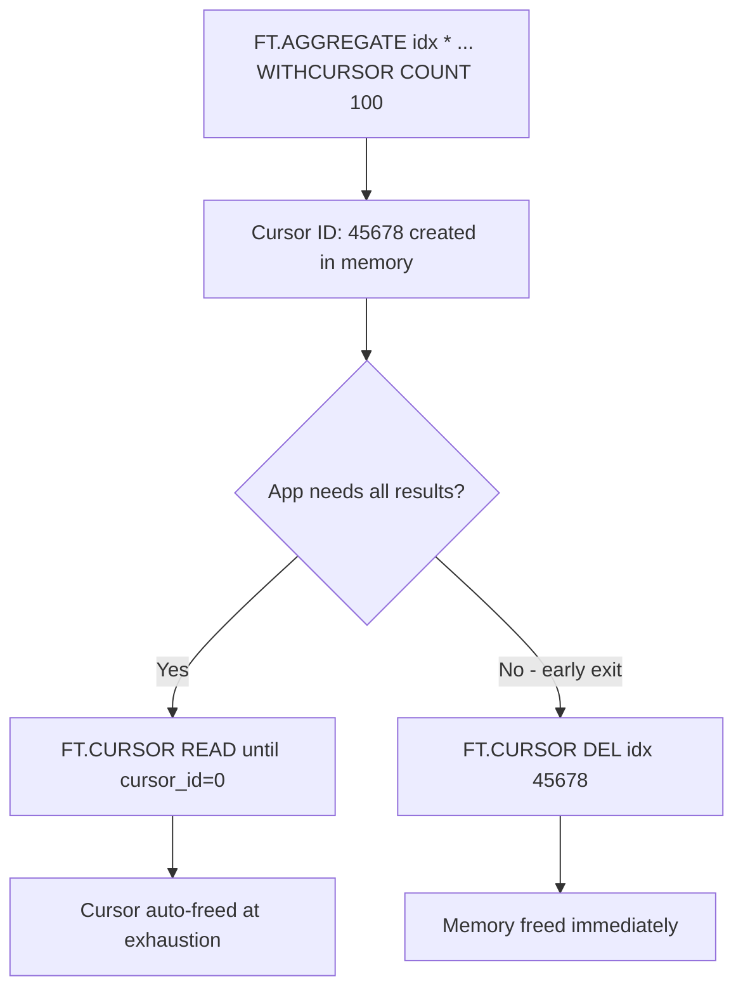
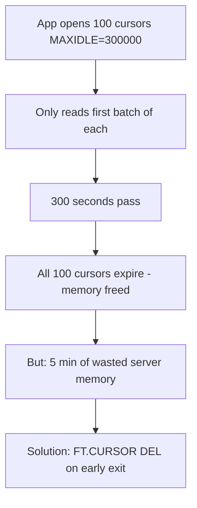

# How to Use FT.CURSOR DEL in Redis to Free Cursors

Author: [nawazdhandala](https://www.github.com/nawazdhandala)

Tags: Redis, RediSearch, Search, Cursor, Command

Description: Learn how to use FT.CURSOR DEL in Redis to explicitly release a RediSearch aggregation cursor and free the server memory it holds before it expires.

---

## How FT.CURSOR DEL Works

`FT.CURSOR DEL` explicitly deletes an open cursor created by `FT.AGGREGATE ... WITHCURSOR`. Cursors reserve server-side state and memory until they are either fully exhausted (cursor ID returns 0) or they expire via `MAXIDLE`. Calling `FT.CURSOR DEL` releases that memory immediately when you no longer need the cursor, preventing memory accumulation in long-running applications.



## Syntax

```redis
FT.CURSOR DEL index cursor_id
```

- `index` - the RediSearch index name
- `cursor_id` - the cursor ID to delete

Returns `OK` on success. Returns an error if the cursor ID does not exist or has already been deleted.

## Examples

### Normal Exhaustion vs Early Deletion

```redis
-- Create a cursor
FT.AGGREGATE orders "*"
  GROUPBY 1 @category
  REDUCE COUNT 0 AS cnt
  WITHCURSOR COUNT 2
```

```text
1) 1) (integer) 3
   2) ... (2 rows)
2) (integer) 55443
```

**Case 1: Read all results (cursor auto-freed)**

```redis
FT.CURSOR READ orders 55443 COUNT 2
-- Returns cursor_id=0: cursor is now gone automatically
```

**Case 2: Early exit (explicit deletion)**

```redis
-- Found what you need in first batch, stop early
FT.CURSOR DEL orders 55443
```

```text
OK
```

The cursor memory is immediately released without reading remaining batches.

### Delete After an Application Error

If your application encounters an error mid-pagination, clean up the cursor:

```redis
-- Application opened cursor 77889 but hit an error
FT.CURSOR DEL orders 77889
```

### Attempt to Delete a Non-Existent Cursor

```redis
FT.CURSOR DEL orders 99999
```

```text
(error) ERR Cursor not found
```

## Why Cursor Cleanup Matters

Each open cursor holds a partial aggregation pipeline in server memory. With many concurrent aggregations and long `MAXIDLE` timeouts, undrained cursors accumulate:



### Memory Impact Example

For a large aggregation over 10 million documents with 1000 groups, each cursor may hold several megabytes of intermediate state. Accumulating dozens of such cursors can exhaust Redis memory.

## Best Practices

### Always Delete on Early Exit

```redis
-- Pattern: open, read partial, delete
FT.AGGREGATE products "*"
  GROUPBY 1 @brand
  REDUCE COUNT 0 AS cnt
  WITHCURSOR COUNT 50

-- Read first page
FT.CURSOR READ products <cursor_id> COUNT 50

-- User navigates away; clean up
FT.CURSOR DEL products <cursor_id>
```

### Use Short MAXIDLE for Web Applications

For interactive applications where users may abandon pagination, set a short MAXIDLE so cursors self-clean quickly:

```redis
FT.AGGREGATE products "*"
  GROUPBY 1 @category
  REDUCE COUNT 0 AS cnt
  WITHCURSOR COUNT 20 MAXIDLE 10000
```

10 seconds is often sufficient for web session timeouts.

### Track Open Cursors in Application Code

Maintain a list of open cursor IDs in your application and call `FT.CURSOR DEL` in cleanup handlers (exception handlers, session cleanup, application shutdown).

## FT.CURSOR DEL vs MAXIDLE

| Approach | When Memory Is Freed | Best For |
|----------|---------------------|----------|
| `FT.CURSOR DEL` | Immediately | Early exit, error handling |
| `MAXIDLE` expiry | After idle timeout | Fallback if app crashes |
| Full read to cursor_id=0 | At exhaustion | Normal complete iteration |

Use `FT.CURSOR DEL` as the primary cleanup mechanism and `MAXIDLE` as a safety net.

## Summary

`FT.CURSOR DEL` immediately releases a RediSearch aggregation cursor and frees its server memory. Call it whenever your application stops reading from a cursor before it is fully exhausted: on early exits, user navigation, application errors, or session timeouts. Without explicit deletion, cursors persist until the `MAXIDLE` timeout expires, wasting server memory.
