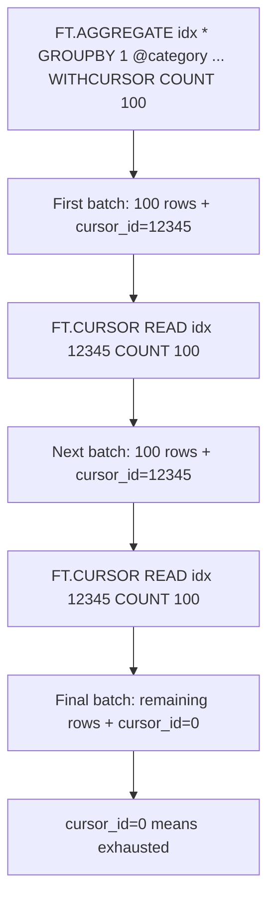

# How to Use FT.CURSOR READ in Redis for Large Search Results

Author: [nawazdhandala](https://www.github.com/nawazdhandala)

Tags: Redis, RediSearch, Search, Cursor, Command

Description: Learn how to use FT.CURSOR READ in Redis to paginate through large RediSearch aggregation result sets without loading all results into memory at once.

---

## How FT.CURSOR READ Works

`FT.CURSOR READ` fetches the next batch of results from a cursor created by `FT.AGGREGATE` with the `WITHCURSOR` option. Cursors allow you to process large aggregation result sets incrementally rather than returning all results in a single response, which would be slow and memory-intensive for millions of documents.



## Syntax

```redis
FT.CURSOR READ index cursor_id [COUNT count]
```

- `index` - the RediSearch index name
- `cursor_id` - the cursor ID returned by a previous `FT.AGGREGATE WITHCURSOR` call
- `COUNT` - number of results to fetch in this batch (default is the server-configured value)

Returns `[results, cursor_id]`. When `cursor_id` is `0`, the cursor is exhausted and all results have been read.

## Creating a Cursor with FT.AGGREGATE

Cursors are created by adding `WITHCURSOR` to an `FT.AGGREGATE` call:

```redis
FT.AGGREGATE index query
  GROUPBY 1 @field
  REDUCE COUNT 0 AS count
  WITHCURSOR COUNT 100 [MAXIDLE timeout_ms]
```

- `COUNT` - how many rows to return per `FT.CURSOR READ` call
- `MAXIDLE` - milliseconds the cursor stays alive between reads (default 300000, 5 minutes)

## Setting Up Sample Data

```redis
FT.CREATE orders ON HASH PREFIX 1 order:
  SCHEMA product TEXT
         category TAG
         amount NUMERIC
         region TAG

-- Add sample orders
HSET order:1 product "Widget A" category "electronics" amount 99 region "us-east"
HSET order:2 product "Widget B" category "electronics" amount 149 region "us-west"
HSET order:3 product "Gadget X" category "appliances" amount 299 region "eu-central"
HSET order:4 product "Gadget Y" category "appliances" amount 199 region "us-east"
HSET order:5 product "Thing Z" category "furniture" amount 499 region "ap-southeast"
```

## Examples

### Create a Cursor and Read Batches

```redis
-- Create cursor requesting 2 results per batch
FT.AGGREGATE orders "*"
  GROUPBY 1 @category
  REDUCE COUNT 0 AS order_count
  REDUCE SUM 1 @amount AS total_revenue
  WITHCURSOR COUNT 2
```

```text
1) 1) (integer) 3
   2) 1) "category"
      2) "electronics"
      3) "order_count"
      4) "2"
      5) "total_revenue"
      6) "248"
   3) 1) "category"
      2) "appliances"
      3) "order_count"
      4) "2"
      5) "total_revenue"
      6) "498"
2) (integer) 67891
```

The first element is the results array (2 rows). The second element is the cursor ID `67891`.

### Read the Next Batch

```redis
FT.CURSOR READ orders 67891 COUNT 2
```

```text
1) 1) (integer) 1
   2) 1) "category"
      2) "furniture"
      3) "order_count"
      4) "1"
      5) "total_revenue"
      6) "499"
2) (integer) 0
```

The cursor ID is `0`, indicating all results have been read.

## Complete Pagination Loop Pattern

```redis
-- Step 1: Open cursor
FT.AGGREGATE orders "*"
  GROUPBY 1 @region
  REDUCE COUNT 0 AS orders
  WITHCURSOR COUNT 50 MAXIDLE 60000

-- Store the cursor ID from the response (e.g., 99887)

-- Step 2: Read until cursor_id = 0
FT.CURSOR READ orders 99887 COUNT 50
FT.CURSOR READ orders 99887 COUNT 50
-- Continue until second element is 0
```

## MAXIDLE Timeout

Cursors consume server memory. The `MAXIDLE` parameter specifies how many milliseconds a cursor remains alive between read operations:

```redis
-- Cursor expires after 30 seconds of inactivity
FT.AGGREGATE orders "*"
  GROUPBY 1 @category
  REDUCE COUNT 0 AS cnt
  WITHCURSOR COUNT 100 MAXIDLE 30000
```

If you wait longer than `MAXIDLE` between reads, the cursor is deleted and the next `FT.CURSOR READ` returns an error.

## Error Handling

```redis
-- Reading an expired or invalid cursor
FT.CURSOR READ orders 999999

-- Returns error:
-- (error) ERR Cursor not found
```

Always check for this error in your application and restart the aggregation if needed.

## When to Use Cursors

| Scenario | Use Cursor? |
|----------|------------|
| Aggregation result < 1000 rows | No, use LIMIT directly |
| Aggregation over millions of documents | Yes |
| Background batch processing | Yes |
| Interactive UI pagination | No, use LIMIT/OFFSET |
| Exporting all data | Yes |

For interactive pagination where users click page numbers, use `FT.AGGREGATE ... LIMIT offset count` instead, as cursors are sequential and cannot seek backward.

## Summary

`FT.CURSOR READ` fetches the next batch of results from a RediSearch aggregation cursor. Open a cursor with `FT.AGGREGATE ... WITHCURSOR COUNT n`, then call `FT.CURSOR READ` repeatedly until the returned cursor ID is `0`. Use `MAXIDLE` to control cursor lifetime and always free unused cursors with `FT.CURSOR DEL` to release server memory.
