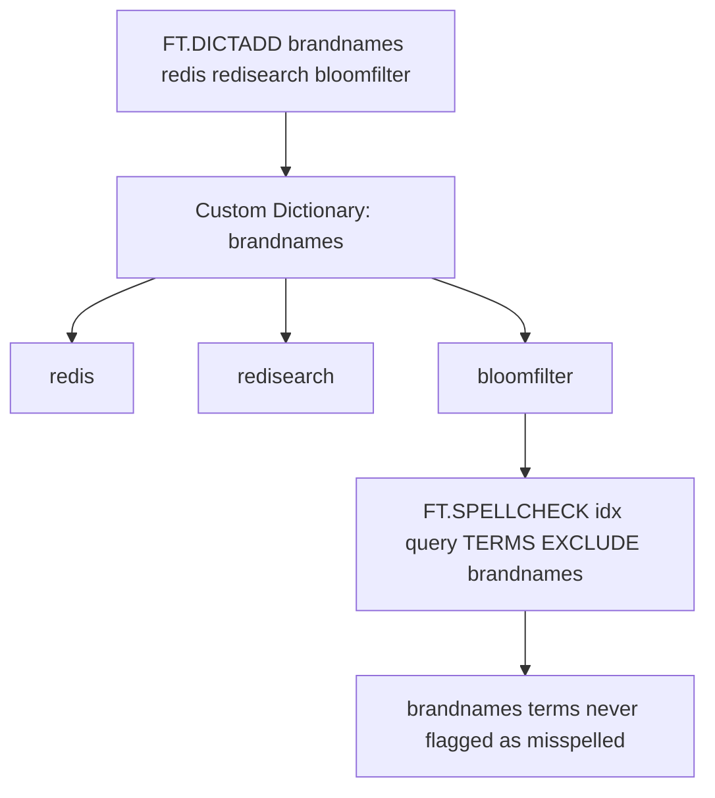

# How to Use FT.DICTADD in Redis to Add to Custom Dictionaries

Author: [nawazdhandala](https://www.github.com/nawazdhandala)

Tags: Redis, RediSearch, Search, Dictionary, Command

Description: Learn how to use FT.DICTADD in Redis to add terms to a custom RediSearch dictionary for use with spellcheck inclusion and exclusion lists.

---

## How FT.DICTADD Works

`FT.DICTADD` adds one or more terms to a named custom dictionary in RediSearch. Custom dictionaries are referenced by `FT.SPELLCHECK` with the `TERMS INCLUDE` or `TERMS EXCLUDE` options to control which terms are treated as valid spellings. This lets you teach RediSearch about domain-specific vocabulary, brand names, technical jargon, and acronyms that are not in the standard index vocabulary.



## Syntax

```redis
FT.DICTADD dict term [term ...]
```

- `dict` - the name of the custom dictionary (created automatically if it does not exist)
- `term [term ...]` - one or more terms to add

Returns an integer indicating how many new terms were added (existing terms are skipped and not counted).

## Examples

### Create a Dictionary and Add Terms

```redis
FT.DICTADD techterms elasticsearch opensearch solr lucene whoosh
```

```text
(integer) 5
```

All 5 terms are new, so 5 is returned.

### Add Terms to an Existing Dictionary

```redis
FT.DICTADD techterms meilisearch typesense
```

```text
(integer) 2
```

### Add a Duplicate Term

```redis
FT.DICTADD techterms elasticsearch
```

```text
(integer) 0
```

`elasticsearch` already exists, so 0 new terms were added.

### Add Brand Names to Exclude from Spellcheck

```redis
FT.DICTADD brandnames redis redisearch redisbloom redistimeseries
```

Use this dictionary with `TERMS EXCLUDE` so these brand names are never flagged as misspelled:

```redis
FT.SPELLCHECK products "redisbloom performnce" TERMS EXCLUDE brandnames
```

```text
1) 1) "TERM"
   2) "redisbloom"
   3) (empty array)
2) 1) "TERM"
   2) "performnce"
   3) 1) 1) "0.5"
         2) "performance"
```

`redisbloom` is excluded so no suggestions are generated for it. `performnce` is still checked.

### Add Domain Vocabulary as Inclusion Suggestions

```redis
FT.DICTADD medicalterms cardiogram electrocardiograph echocardiogram
```

Use with `TERMS INCLUDE` to suggest these terms when a user types something close:

```redis
FT.SPELLCHECK medrecords "cardigramm" TERMS INCLUDE medicalterms DISTANCE 2
```

The custom dictionary terms become candidates for suggestions.

## Dictionary Types by Use Case

### Exclude List: Known Valid Terms

Terms that are intentionally unusual and should never trigger a spellcheck warning:

```redis
-- Acronyms
FT.DICTADD acronyms API REST HTTP CRUD SQL NoSQL

-- Product names
FT.DICTADD products iPhone iPad MacBook Kubernetes

-- Company names
FT.DICTADD companies GitHub Atlassian Datadog Cloudflare
```

### Include List: Additional Suggestions

Terms not in your index that should appear as suggestions when a user types something close:

```redis
-- Competitor product names users might search for
FT.DICTADD alternatives memcached dynamodb cassandra mongodb
```

## Viewing Dictionary Contents

After adding terms, verify with `FT.DICTDUMP`:

```redis
FT.DICTDUMP techterms
```

```text
1) "elasticsearch"
2) "lucene"
3) "meilisearch"
4) "opensearch"
5) "solr"
6) "typesense"
7) "whoosh"
```

## Managing Multiple Dictionaries

You can maintain separate dictionaries for different purposes:

```redis
-- Separate dictionaries by category
FT.DICTADD brands_tech apple google microsoft amazon
FT.DICTADD brands_fashion gucci prada versace armani
FT.DICTADD jargon_legal plaintiff defendant litigant

-- Use the relevant dictionary per index or query
FT.SPELLCHECK tech_products "gooogle" TERMS EXCLUDE brands_tech
FT.SPELLCHECK fashion_catalog "pradi" TERMS INCLUDE brands_fashion
```

## Summary

`FT.DICTADD` adds terms to a named custom dictionary in RediSearch. Custom dictionaries control spellcheck behavior: use them with `TERMS EXCLUDE` to prevent brand names or technical jargon from being flagged as misspelled, or with `TERMS INCLUDE` to add domain-specific suggestions. Returns the count of newly added terms so you can detect duplicates.
