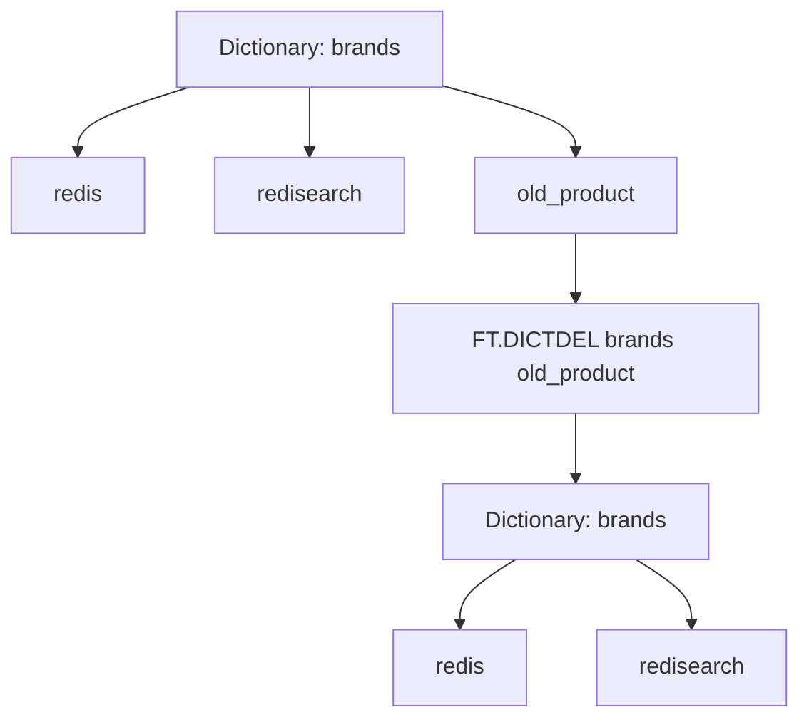

# How to Use FT.DICTDEL in Redis to Remove from Dictionaries

Author: [nawazdhandala](https://www.github.com/nawazdhandala)

Tags: Redis, RediSearch, Search, Dictionary, Command

Description: Learn how to use FT.DICTDEL in Redis to remove specific terms from a RediSearch custom dictionary to keep spellcheck exclusion and inclusion lists accurate.

---

## How FT.DICTDEL Works

`FT.DICTDEL` removes one or more terms from a named custom RediSearch dictionary. This is the complement to `FT.DICTADD`. Use it to clean up obsolete brand names, retired product terms, or incorrectly added entries without having to delete and recreate the entire dictionary.



## Syntax

```redis
FT.DICTDEL dict term [term ...]
```

- `dict` - the name of the custom dictionary
- `term [term ...]` - one or more terms to remove

Returns an integer indicating how many terms were actually removed. Terms not present in the dictionary are silently ignored and not counted.

## Examples

### Remove a Single Term

```redis
FT.DICTADD techterms elasticsearch opensearch solr lucene oldengine
FT.DICTDEL techterms oldengine
```

```text
(integer) 1
```

### Remove Multiple Terms at Once

```redis
FT.DICTDEL techterms solr lucene
```

```text
(integer) 2
```

### Attempt to Remove a Non-Existent Term

```redis
FT.DICTDEL techterms nosuchterm
```

```text
(integer) 0
```

The term is not present; 0 is returned without an error.

### Verify the Deletion

```redis
FT.DICTDUMP techterms
```

```text
1) "elasticsearch"
2) "opensearch"
```

Only the two remaining terms are listed.

## Practical Use Cases

### Retiring a Product Name

When a product is discontinued, remove it from the exclude list so searches for similarly spelled terms now get suggestions:

```redis
-- Before: "oldproduct" was excluded so it was never flagged
FT.DICTADD brandnames oldproduct newproduct currentproduct

-- Product is discontinued, remove from exclusion list
FT.DICTDEL brandnames oldproduct

-- Now "oldproduct" will be flagged by spellcheck if misspelled
```

### Cleaning Up After a Migration

After migrating to a new system, remove old system names from dictionaries:

```redis
FT.DICTADD systems legacydb newdb
-- After completing migration:
FT.DICTDEL systems legacydb
FT.DICTDUMP systems
```

### Correcting Accidental Additions

If a term was added to the wrong dictionary:

```redis
-- Accidentally added a common word to a brand exclusion list
FT.DICTADD brands computer keyboard screen

-- Remove the common words that should be spellchecked normally
FT.DICTDEL brands computer keyboard screen
```

## FT.DICTDEL vs Recreating the Dictionary

There is no single command to delete an entire custom dictionary. To remove all terms:

```redis
-- Option 1: Remove terms one by one
FT.DICTDUMP mydict
FT.DICTDEL mydict term1 term2 term3 ...

-- Option 2: The dictionary naturally disappears when empty
-- (no explicit delete command needed for the dictionary itself)
```

## Summary

`FT.DICTDEL` removes specific terms from a RediSearch custom dictionary. It returns the count of successfully removed terms and silently ignores terms that are not present. Use it to maintain accurate spellcheck exclusion and inclusion lists by removing retired product names, obsolete jargon, or incorrectly added entries. Pair with `FT.DICTDUMP` to verify the dictionary state after modifications.
