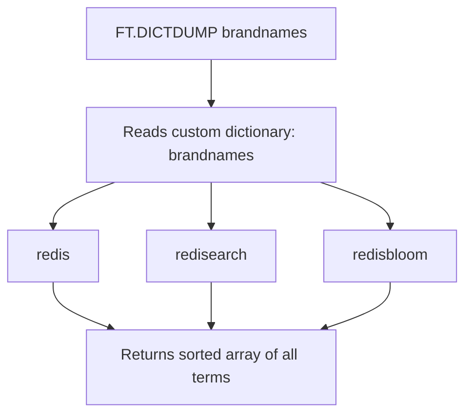
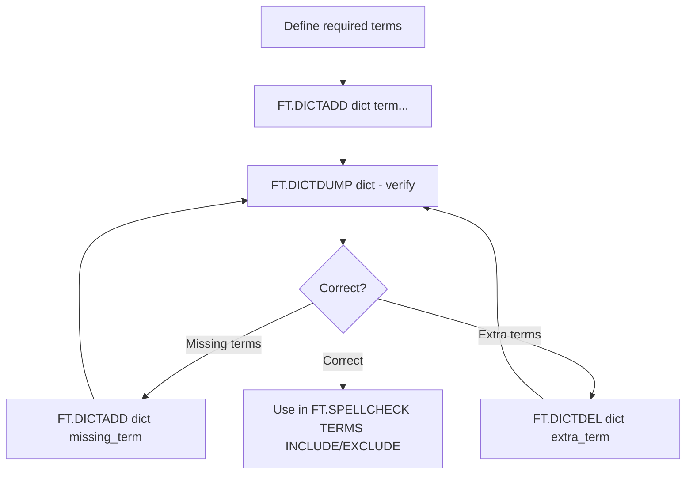

# How to Use FT.DICTDUMP in Redis to View Custom Dictionaries

Author: [nawazdhandala](https://www.github.com/nawazdhandala)

Tags: Redis, RediSearch, Search, Dictionary, Command

Description: Learn how to use FT.DICTDUMP in Redis to list all terms stored in a RediSearch custom dictionary for auditing and managing spellcheck word lists.

---

## How FT.DICTDUMP Works

`FT.DICTDUMP` returns all terms currently stored in a named custom RediSearch dictionary. Custom dictionaries are used with `FT.SPELLCHECK` to include additional suggestion sources or exclude specific terms from being flagged as misspelled. `FT.DICTDUMP` lets you inspect the current contents of a dictionary before making modifications.



## Syntax

```redis
FT.DICTDUMP dict
```

- `dict` - the name of the custom dictionary

Returns an array of all terms in the dictionary in alphabetical order. Returns an empty array if the dictionary is empty or does not exist.

## Examples

### View a Dictionary After Adding Terms

```redis
FT.DICTADD brandnames redis redisearch redisbloom redistimeseries
FT.DICTDUMP brandnames
```

```text
1) "redis"
2) "redisbloom"
3) "redistimeseries"
4) "redisearch"
```

Terms are returned in alphabetical order.

### View an Empty or Missing Dictionary

```redis
FT.DICTDUMP doesnotexist
```

```text
(empty array)
```

No error is raised for a non-existent dictionary name.

### View After Deletions

```redis
FT.DICTADD techterms elasticsearch opensearch solr lucene
FT.DICTDEL techterms solr lucene
FT.DICTDUMP techterms
```

```text
1) "elasticsearch"
2) "opensearch"
```

## Use Cases

### Auditing Spellcheck Configuration

Before a production deployment, dump all dictionaries to verify that the exclusion and inclusion lists contain the expected terms:

```redis
FT.DICTDUMP brand_exclusions
FT.DICTDUMP domain_inclusions
FT.DICTDUMP acronyms
```

Compare the output with your source-of-truth list to detect missing or extra entries.

### Exporting Dictionaries for Migration

When migrating to a new Redis instance, dump each dictionary and re-add the terms:

```redis
-- On old instance
FT.DICTDUMP myterms
-- Output: 1) "term1" 2) "term2" 3) "term3"

-- On new instance
FT.DICTADD myterms term1 term2 term3
```

### Debugging Spellcheck Behavior

If `FT.SPELLCHECK` is not behaving as expected, dump the relevant dictionaries to check whether terms were correctly added or removed:

```redis
-- User reports that "redis" is being flagged as misspelled
-- Check if the exclusion dictionary contains it
FT.DICTDUMP brand_exclusions

-- If "redis" is missing, add it
FT.DICTADD brand_exclusions redis
```

## Complete Dictionary Management Workflow



## Comparing FT.DICTDUMP with FT.SYNDUMP

| Command | What It Returns |
|---------|----------------|
| `FT.DICTDUMP dict` | Terms in a standalone custom dictionary |
| `FT.SYNDUMP index` | Synonym groups defined on a specific index |

Dictionaries and synonym groups are separate concepts. Dictionaries affect spellcheck behavior; synonym groups affect query expansion.

## Summary

`FT.DICTDUMP` returns all terms stored in a RediSearch custom dictionary in alphabetical order. Use it to audit dictionary contents before applying them to spellcheck queries, verify that `FT.DICTADD` and `FT.DICTDEL` operations had the intended effect, and export dictionaries for backup or migration. The command returns an empty array for missing or empty dictionaries rather than an error.
