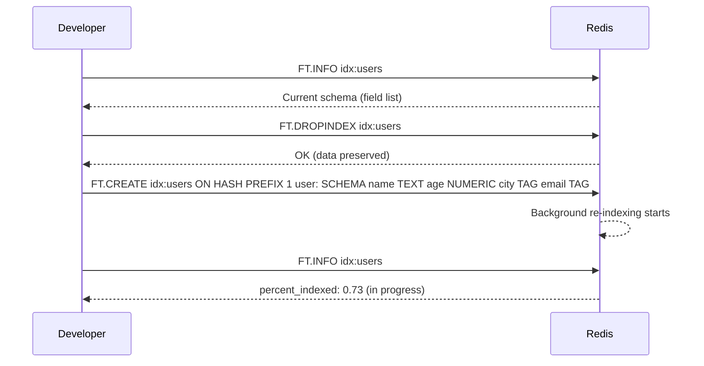
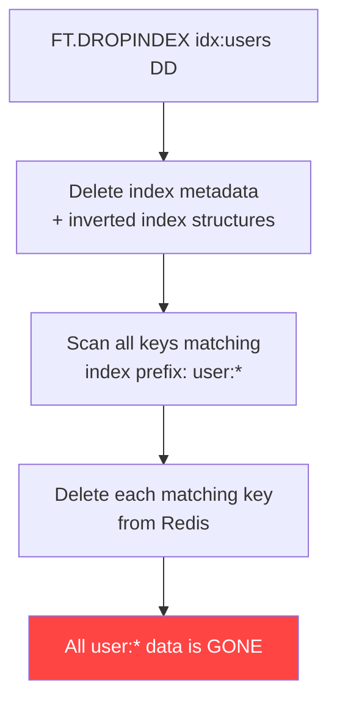

# How to Use FT.DROPINDEX in Redis to Delete Search Indexes

Author: [nawazdhandala](https://www.github.com/nawazdhandala)

Tags: Redis, RediSearch, Index, Search, Operations

Description: Learn how to use FT.DROPINDEX in Redis to delete a RediSearch index, with options to preserve or delete the underlying documents.

---

## Introduction

`FT.DROPINDEX` deletes a RediSearch index and its associated metadata. By default it preserves the underlying data keys (hashes or JSON documents). You can optionally also delete those documents with the `DD` (Delete Documents) flag.

## Basic Syntax

```redis
FT.DROPINDEX index [DD]
```

- `index` - the name of the index to drop
- `DD` - (Delete Documents) also delete all keys that were indexed

## Drop an Index While Keeping Data

```redis
127.0.0.1:6379> FT.DROPINDEX idx:users
OK
```

The index is removed. The `user:*` keys remain intact.

## Verify the Index is Gone

```redis
FT.INFO idx:users
# (error) Unknown Index name
```

## Verify Data Still Exists

```redis
HGET user:1 name
# "Alice Smith"
```

## Drop an Index AND Delete All Indexed Documents

```redis
FT.DROPINDEX idx:users DD
OK
```

All keys that matched the index's prefix (`user:*`) are now also deleted.

## Verify Documents Are Deleted

```redis
EXISTS user:1
# (integer) 0
```

## Typical Workflow: Drop and Recreate

This pattern is used when you need to change field types or remove fields from the schema:



## Safe Drop Pattern in Scripts

```bash
#!/bin/bash
INDEX="idx:products"

# Check if index exists before dropping
EXISTS=$(redis-cli FT.INFO "$INDEX" 2>&1 | grep -c "index_name" || true)
if [ "$EXISTS" -gt 0 ]; then
  redis-cli FT.DROPINDEX "$INDEX"
  echo "Index $INDEX dropped"
else
  echo "Index $INDEX does not exist"
fi
```

## Python: Drop and Recreate

```python
import redis
from redis.commands.search.field import TextField, NumericField, TagField
from redis.commands.search.indexDefinition import IndexDefinition, IndexType

r = redis.Redis()

def recreate_index(index_name, fields, prefix):
    try:
        r.ft(index_name).dropindex(delete_documents=False)
        print(f"Dropped existing index: {index_name}")
    except Exception:
        print(f"Index {index_name} did not exist")

    definition = IndexDefinition(prefix=[prefix], index_type=IndexType.HASH)
    r.ft(index_name).create_index(fields, definition=definition)
    print(f"Created index: {index_name}")

recreate_index(
    "idx:users",
    [TextField("name"), NumericField("age", sortable=True), TagField("city"), TagField("email")],
    "user:"
)
```

## DD Flag Warning



The `DD` flag is destructive. Use it only when you intend to remove both the index and the source data.

## Summary

`FT.DROPINDEX index [DD]` removes a RediSearch index and all its internal structures. Without `DD`, the underlying data keys are preserved. With `DD`, all documents that were indexed are also deleted. Use it before recreating an index with a changed schema, or when decommissioning a search feature entirely.
