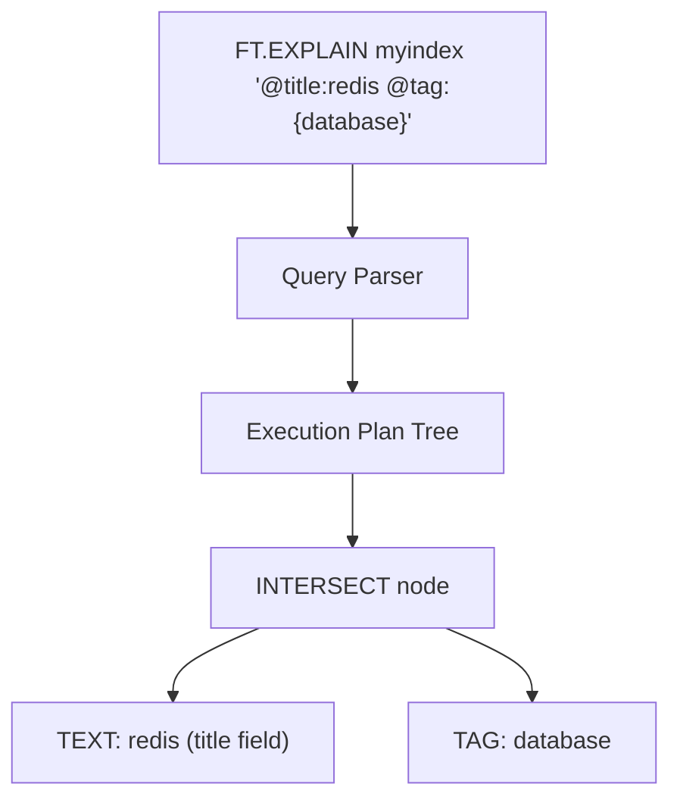

# How to Use FT.EXPLAIN in Redis to Debug Search Queries

Author: [nawazdhandala](https://www.github.com/nawazdhandala)

Tags: Redis, RediSearch, Search, Debugging, Command

Description: Learn how to use FT.EXPLAIN in Redis to inspect the internal query execution plan for RediSearch queries and debug unexpected search results.

---

## How FT.EXPLAIN Works

`FT.EXPLAIN` parses a RediSearch query and returns the internal execution plan as a string tree. No documents are fetched and no search is executed. The output shows how the query planner interprets your query string, which is critical for diagnosing why results are missing, incorrect, or unexpectedly large.



## Syntax

```redis
FT.EXPLAIN index query [DIALECT dialect]
```

- `index` - the name of the RediSearch index
- `query` - the query string to explain
- `DIALECT` - optional query dialect version (1, 2, or 3)

Returns a multi-line string representing the query execution plan tree.

## Setting Up an Index to Follow Along

```redis
FT.CREATE products ON HASH PREFIX 1 product:
  SCHEMA title TEXT WEIGHT 2.0
         description TEXT
         category TAG
         price NUMERIC
         stock NUMERIC
```

## Examples

### Explain a Simple Text Query

```redis
FT.EXPLAIN products "redis"
```

```text
UNION {
  redis
  +redis(expanded)
}
```

The UNION node shows that the query also searches for stemmed variants.

### Explain an Intersect Query

```redis
FT.EXPLAIN products "@title:redis @category:{database}"
```

```text
INTERSECT {
  @title:UNION {
    redis
    +redis(expanded)
  }
  @category:TAG:database
}
```

Both conditions must match; the plan reflects the intersection.

### Explain an OR Query

```redis
FT.EXPLAIN products "@title:redis | @title:cache"
```

```text
UNION {
  @title:UNION {
    redis
    +redis(expanded)
  }
  @title:UNION {
    cache
    +cache(expanded)
  }
}
```

### Explain a Numeric Range Query

```redis
FT.EXPLAIN products "@price:[10 100]"
```

```text
NUMERIC {10.000000 <= @price <= 100.000000}
```

### Explain a Negation

```redis
FT.EXPLAIN products "@title:redis -@category:{archived}"
```

```text
INTERSECT {
  @title:UNION {
    redis
    +redis(expanded)
  }
  NOT {
    @category:TAG:archived
  }
}
```

### Explain a Phrase Query

```redis
FT.EXPLAIN products "@title:(redis cache)"
```

```text
@title:INTERSECT {
  UNION {
    redis
    +redis(expanded)
  }
  UNION {
    cache
    +cache(expanded)
  }
}
```

### Use DIALECT for Newer Query Syntax

```redis
FT.EXPLAIN products "@title:%reedis%" DIALECT 2
```

```text
UNION {
  FUZZY{reedis}
}
```

Dialect 2 enables fuzzy matching with `%term%` syntax.

## Reading the Plan Tree

| Node Type | Meaning |
|-----------|---------|
| `UNION` | Results from any child node qualify (OR logic) |
| `INTERSECT` | Results must satisfy all child nodes (AND logic) |
| `NOT` | Excludes results matching the child node |
| `NUMERIC` | Range filter on a numeric field |
| `TAG` | Exact tag match |
| `FUZZY` | Fuzzy text match |
| `+term(expanded)` | Stemmed or expanded form of the search term |

## Common Debugging Scenarios

### Why Are No Results Returned?

Run `FT.EXPLAIN` and check:
- Field names spelled correctly (`@title` vs `@name`)
- Tag syntax uses `{value}` not just `value`
- Numeric range syntax uses brackets `[min max]`

```redis
-- Wrong tag syntax - returns nothing
FT.EXPLAIN products "@category:database"

-- Correct tag syntax
FT.EXPLAIN products "@category:{database}"
```

### Verifying Stopwords Are Not Filtering Your Term

```redis
FT.EXPLAIN products "@description:the quick fox"
```

If `the` is a stopword it will be omitted from the plan tree entirely.

### Understanding Score Weights

`FT.EXPLAIN` does not show score weights but confirms which fields are searched. Use `FT.SEARCH` with `WITHSCORES` to measure impact.

## FT.EXPLAIN vs FT.EXPLAINCLI

`FT.EXPLAINCLI` formats the output with indentation for easier reading in a terminal. Programmatically, `FT.EXPLAIN` returns a flat string that you can parse.

```redis
FT.EXPLAINCLI products "@title:redis @category:{database}"
```

```text
INTERSECT {
  @title:UNION {
    redis
    +redis(expanded)
  }
  @category:TAG:database
}
```

## Summary

`FT.EXPLAIN` parses a RediSearch query and returns the execution plan tree without running the search. Use it to verify that field filters, tag syntax, numeric ranges, fuzzy operators, and boolean logic are interpreted as intended. Pair it with `FT.SEARCH` to correlate the plan with actual result counts and diagnose unexpected behavior.
