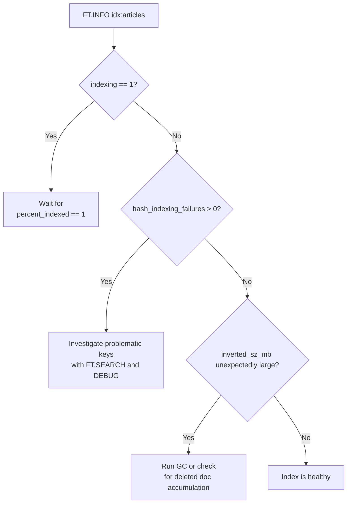

# How to Use FT.INFO in Redis to Get Search Index Information

Author: [nawazdhandala](https://www.github.com/nawazdhandala)

Tags: Redis, RediSearch, Index, Monitoring, Search

Description: Learn how to use FT.INFO in Redis to inspect a RediSearch index definition, field schema, document count, indexing progress, and memory usage.

---

## Introduction

`FT.INFO` returns detailed metadata about a RediSearch index: its configuration, schema fields, document count, number of terms, memory consumed, and indexing progress. Use it to verify a newly created index, diagnose search issues, and monitor index health.

## Basic Syntax

```redis
FT.INFO index
```

Returns a flat list of alternating field-name / value pairs.

## Example Setup

```redis
FT.CREATE idx:articles ON HASH PREFIX 1 article:
  SCHEMA title TEXT WEIGHT 5.0 author TAG published_at NUMERIC SORTABLE content TEXT

HSET article:1 title "Redis Search Guide"  author "alice" published_at 1711800000 content "How to use FT.CREATE and FT.SEARCH"
HSET article:2 title "JSON in Redis"       author "bob"   published_at 1711810000 content "RedisJSON commands and JSONPath"
HSET article:3 title "Redis Performance"   author "alice" published_at 1711820000 content "Latency optimization for Redis"
```

## Run FT.INFO

```redis
127.0.0.1:6379> FT.INFO idx:articles
 1) "index_name"
 2) "idx:articles"
 3) "index_options"
 4) (empty array)
 5) "index_definition"
 6) 1) "key_type"
    2) "HASH"
    3) "prefixes"
    4) 1) "article:"
    5) "language_field"
    6) "__language"
    7) "default_score"
    8) "1"
    9) "score_field"
   10) "__score"
 7) "attributes"
 8) 1) 1) "identifier"
       2) "title"
       3) "attribute"
       4) "title"
       5) "type"
       6) "TEXT"
       7) "WEIGHT"
       8) "5"
    ...
 9) "num_docs"
10) (integer) 3
11) "max_doc_id"
12) (integer) 3
13) "num_terms"
14) (integer) 47
15) "num_records"
16) (integer) 53
17) "inverted_sz_mb"
18) "0.00064849853515625"
19) "vector_index_sz_mb"
20) "0"
21) "total_inverted_index_blocks"
22) (integer) 47
23) "offset_vectors_sz_mb"
24) "4.76837158203125e-05"
25) "doc_table_size_mb"
26) "0.000301361083984375"
27) "sortable_values_size_mb"
28) "0.000164031982421875"
29) "key_table_size_mb"
30) "0.000179290771484375"
31) "geoshapes_sz_mb"
32) "0"
33) "records_per_doc_avg"
34) "17.666666666666668"
35) "bytes_per_record_avg"
36) "7.943396226415094"
37) "offsets_per_term_avg"
38) "1.1276595744680851"
39) "offset_bits_per_record_avg"
40) "8"
41) "hash_indexing_failures"
42) (integer) 0
43) "total_indexing_time"
44) "0.392"
45) "indexing"
46) (integer) 0
47) "percent_indexed"
48) "1"
49) "number_of_uses"
50) (integer) 0
51) "cleaning"
52) (integer) 0
53) "gc_stats"
54) ...
55) "cursor_stats"
56) ...
57) "stopwords_list"
58) (empty array)
```

## Key Fields to Watch

| Field | Meaning |
|---|---|
| `num_docs` | Total indexed documents |
| `percent_indexed` | Fraction of keys indexed (1 = complete) |
| `indexing` | 1 if background indexing is in progress |
| `hash_indexing_failures` | Count of keys that failed to index |
| `inverted_sz_mb` | Memory for the inverted text index |
| `sortable_values_size_mb` | Memory for sortable fields |
| `num_terms` | Distinct terms in the text index |
| `total_indexing_time` | Milliseconds spent indexing |

## Monitoring Indexing Progress

```bash
#!/bin/bash
# Poll until indexing is complete
INDEX="idx:articles"
while true; do
  PCT=$(redis-cli FT.INFO "$INDEX" | awk '/percent_indexed/{getline; print}')
  echo "Indexed: $PCT"
  if [ "$(echo "$PCT >= 1" | bc)" -eq 1 ]; then
    echo "Indexing complete"
    break
  fi
  sleep 1
done
```

## Checking for Indexing Failures

```redis
FT.INFO idx:articles
# Look for "hash_indexing_failures" > 0
# Then check: FT.INFO will show "index_errors" with details
```

If failures exist, check whether your hash fields match the types declared in the schema (e.g., a non-numeric value in a NUMERIC field).

## Index Health Check Flow



## Listing All Indexes

```redis
FT._LIST
# 1) "idx:articles"
# 2) "idx:users"
# 3) "idx:products"
```

## Python: Health Check

```python
import redis

r = redis.Redis()

def index_health(index_name):
    info = r.ft(index_name).info()
    print(f"Index: {index_name}")
    print(f"  Documents:  {info.get('num_docs', 0)}")
    print(f"  Indexed:    {float(info.get('percent_indexed', 0)) * 100:.1f}%")
    print(f"  Failures:   {info.get('hash_indexing_failures', 0)}")
    print(f"  Index size: {float(info.get('inverted_sz_mb', 0)):.4f} MB")

index_health("idx:articles")
```

## Summary

`FT.INFO index` returns the full metadata of a RediSearch index: schema fields and their types, document count, indexing progress (`percent_indexed`), memory breakdown, failure counts, and GC statistics. Monitor `percent_indexed` after `FT.CREATE` to confirm indexing is complete, and check `hash_indexing_failures` to catch schema mismatches. Use `FT._LIST` to enumerate all indexes in the instance.
