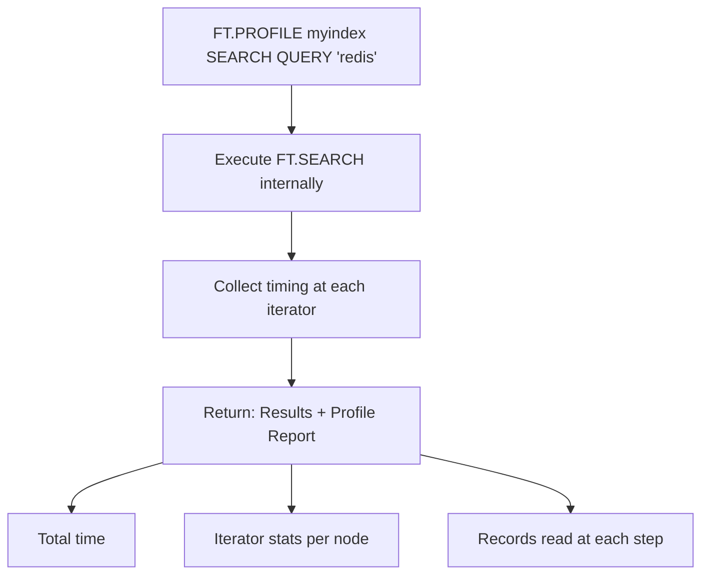
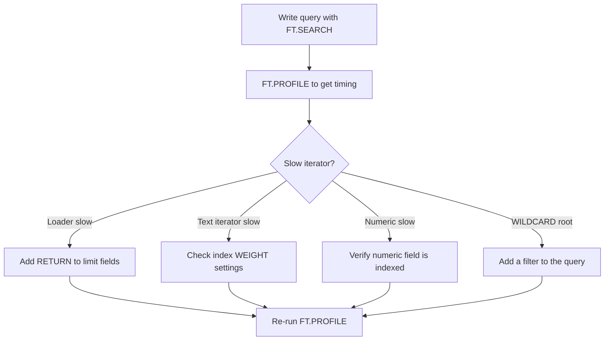

# How to Use FT.PROFILE in Redis to Analyze Search Performance

Author: [nawazdhandala](https://www.github.com/nawazdhandala)

Tags: Redis, RediSearch, Search, Performance, Command

Description: Learn how to use FT.PROFILE in Redis to measure execution time and iterator stats for RediSearch queries and aggregations to identify bottlenecks.

---

## How FT.PROFILE Works

`FT.PROFILE` runs a real `FT.SEARCH` or `FT.AGGREGATE` query and returns the actual results alongside a detailed performance profile. The profile breaks down time spent in each stage of execution, the number of records processed at each step, and the iterators used. This is the primary tool for optimizing slow RediSearch queries.



## Syntax

```redis
FT.PROFILE index SEARCH|AGGREGATE [LIMITED] QUERY query [query options]
```

- `index` - the RediSearch index name
- `SEARCH|AGGREGATE` - which command to profile
- `LIMITED` - reduces profiling overhead by only collecting top-level stats
- `QUERY` - the query string followed by any options valid for FT.SEARCH or FT.AGGREGATE

Returns an array: `[search_results, profile_data]`.

## Setting Up Sample Data

```redis
FT.CREATE products ON HASH PREFIX 1 product:
  SCHEMA title TEXT WEIGHT 2.0
         category TAG
         price NUMERIC

HSET product:1 title "Redis in Action" category "book" price 45
HSET product:2 title "Redis Cookbook" category "book" price 38
HSET product:3 title "Redis Essentials" category "ebook" price 19
HSET product:4 title "Database Internals" category "book" price 52
HSET product:5 title "Redis Patterns" category "ebook" price 25
```

## Examples

### Profile a Simple Text Search

```redis
FT.PROFILE products SEARCH QUERY "redis"
```

```text
1) 1) (integer) 4
   2) "product:1"
   ...
2) 1) 1) "Total profile time"
      2) "0.123"
   2) 1) "Parsing time"
      2) "0.012"
   3) 1) "Pipeline creation time"
      2) "0.008"
   4) 1) "Warning"
      2) (empty array)
   5) 1) "Iterators profile"
      2) 1) 1) "Type"
            2) "UNION"
            3) "Time"
            4) "0.089"
            5) "Counter"
            6) (integer) 4
            7) "Child iterators"
            ...
   6) 1) "Result processors profile"
      ...
```

### Profile with Field Filters

```redis
FT.PROFILE products SEARCH QUERY "@category:{book} @price:[30 60]"
```

The profile shows time spent in the TAG iterator and NUMERIC iterator separately.

### Profile with LIMITED Flag

When profiling in production use `LIMITED` to reduce overhead:

```redis
FT.PROFILE products SEARCH LIMITED QUERY "@title:redis"
```

`LIMITED` skips per-node timing, returning only the total time and top-level counters.

### Profile an Aggregation

```redis
FT.PROFILE products AGGREGATE QUERY "*"
  GROUPBY 1 @category
  REDUCE COUNT 0 AS count
```

```text
1) 1) "category"
   2) "book"
   3) "count"
   4) "3"
   ...
2) 1) 1) "Total profile time"
      2) "0.245"
   ...
   5) 1) "Iterators profile"
      2) ...
   6) 1) "Result processors profile"
      2) 1) 1) "Type"
            2) "Index"
            3) "Time"
            4) "0.022"
            5) "Counter"
            6) (integer) 5
         2) 1) "Type"
            2) "Loader"
            3) "Time"
            4) "0.087"
            5) "Counter"
            6) (integer) 5
         3) 1) "Type"
            2) "Grouper"
            3) "Time"
            4) "0.118"
            5) "Counter"
            6) (integer) 5
```

## Understanding the Profile Output

### Iterator Types

| Iterator | What It Does |
|----------|-------------|
| `UNION` | Combines results from multiple iterators (OR) |
| `INTERSECT` | Narrows results across iterators (AND) |
| `NOT` | Subtracts a set from results |
| `TEXT` | Inverted index lookup for text terms |
| `TAG` | Inverted index lookup for tag values |
| `NUMERIC` | Range scan on a numeric index |
| `WILDCARD` | Full scan of all documents |

### Result Processor Types

| Processor | Role |
|-----------|------|
| `Index` | Reads document IDs from iterators |
| `Scorer` | Computes relevance scores |
| `Loader` | Fetches field values from hashes or JSON |
| `Sorter` | Sorts results by score or field |
| `Grouper` | Groups results for aggregations |
| `Reducer` | Applies aggregate functions (COUNT, SUM, etc.) |

## Interpreting Results for Optimization

### High Time in Loader

If the `Loader` processor takes most of the time, your query is fetching too many fields. Use `RETURN` to limit loaded fields:

```redis
FT.PROFILE products SEARCH QUERY "@title:redis" RETURN 1 title
```

### High Counter with Low Results

A large `Counter` in an early iterator that shrinks dramatically in a later INTERSECT means one side of your query is very selective. Rewrite the query to lead with the most selective filter.

### WILDCARD Iterator as Root

A WILDCARD iterator scans all documents. Ensure your query has at least one specific filter to avoid full scans:

```redis
-- Full scan - avoid for large indexes
FT.PROFILE products SEARCH QUERY "*"

-- Targeted - add a filter
FT.PROFILE products SEARCH QUERY "@category:{book}"
```

## Workflow for Query Optimization



## Summary

`FT.PROFILE` executes a RediSearch query and returns both the results and a detailed timing breakdown by iterator and result processor. Use it to identify which part of the query consumes the most time, whether that is text lookup, numeric range scanning, field loading, or aggregation grouping. The `LIMITED` flag reduces profiling overhead for use in near-production environments.
