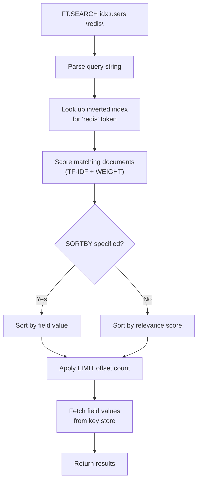

# How to Use FT.SEARCH in Redis for Full-Text Search

Author: [nawazdhandala](https://www.github.com/nawazdhandala)

Tags: Redis, RediSearch, Full-Text Search, Search, Query

Description: Learn how to use FT.SEARCH in Redis to run full-text, numeric range, tag, and combined queries against a RediSearch index, with sorting, pagination, and projection.

---

## Introduction

`FT.SEARCH` executes a search query against a RediSearch index and returns matching documents with their scores and field values. It supports full-text search with stemming, numeric ranges, tag filters, geo queries, and combined boolean logic.

## Prerequisites

An index must exist. Using the example from FT.CREATE:

```redis
FT.CREATE idx:users ON HASH PREFIX 1 user:
  SCHEMA name TEXT WEIGHT 5.0 age NUMERIC SORTABLE city TAG bio TEXT

HSET user:1 name "Alice Smith" age 30 city "London" bio "Redis engineer and open source contributor"
HSET user:2 name "Bob Jones"   age 25 city "Paris"  bio "Full-stack developer who loves databases"
HSET user:3 name "Carol Chen"  age 35 city "London" bio "Data engineer specializing in Redis and Kafka"
```

## Basic Syntax

```redis
FT.SEARCH index query
  [NOCONTENT]
  [VERBATIM] [NOSTOPWORDS]
  [WITHSCORES] [WITHPAYLOADS] [WITHSORTKEYS]
  [FILTER field min max]
  [RETURN count field [AS name] ...]
  [SORTBY field [ASC | DESC]]
  [LIMIT offset count]
  [PARAMS nargs name value ...]
```

## Full-Text Search

```redis
127.0.0.1:6379> FT.SEARCH idx:users "redis"
1) (integer) 2
2) "user:1"
3) 1) "name"
   2) "Alice Smith"
   3) "age"
   4) "30"
   5) "city"
   6) "London"
   7) "bio"
   8) "Redis engineer and open source contributor"
4) "user:3"
5) 1) "name"
   2) "Carol Chen"
   ...
```

Returns: total match count, then key + fields alternating.

## Search in a Specific Field

```redis
FT.SEARCH idx:users "@name:Alice"
```

## Phrase Search

```redis
FT.SEARCH idx:users "@bio:\"open source\""
```

## Tag Filter

```redis
FT.SEARCH idx:users "@city:{London}"
```

Multiple tags (OR):

```redis
FT.SEARCH idx:users "@city:{London|Paris}"
```

## Numeric Range Filter

```redis
# Users aged 25 to 32
FT.SEARCH idx:users "@age:[25 32]"

# Users older than 30 (exclusive)
FT.SEARCH idx:users "@age:[(30 +inf]"

# Users younger than 30
FT.SEARCH idx:users "@age:[-inf (30]"
```

## Combined Query

```redis
# Full-text "redis" AND city is London
FT.SEARCH idx:users "redis @city:{London}"

# Full-text "developer" AND age 20 to 30
FT.SEARCH idx:users "developer @age:[20 30]"
```

## Sort Results

```redis
# Sort by age ascending
FT.SEARCH idx:users "*" SORTBY age ASC

# Sort by age descending, return only name and city
FT.SEARCH idx:users "*" SORTBY age DESC RETURN 2 name city
```

## Pagination

```redis
# First page (10 results)
FT.SEARCH idx:users "*" LIMIT 0 10

# Second page
FT.SEARCH idx:users "*" LIMIT 10 10
```

## Return Only Specific Fields

```redis
FT.SEARCH idx:users "redis" RETURN 2 name city
```

## Keys Only (No Field Values)

```redis
FT.SEARCH idx:users "redis" NOCONTENT
```

## Return Relevance Scores

```redis
FT.SEARCH idx:users "redis engineer" WITHSCORES
```

## Query Syntax Reference

| Syntax | Example | Meaning |
|---|---|---|
| `word` | `redis` | Full-text match |
| `@field:word` | `@name:alice` | Field-specific text |
| `@field:{tag}` | `@city:{London}` | Tag exact match |
| `@field:[min max]` | `@age:[20 30]` | Numeric range |
| `"phrase"` | `"open source"` | Exact phrase |
| `-word` | `-admin` | Exclude |
| `word*` | `redis*` | Prefix |
| `%word%` | `%rdis%` | Fuzzy (1 edit distance) |

## Search Request Flow



## Python Example

```python
import redis

r = redis.Redis()

results = r.ft("idx:users").search(
    "redis",
    sort_by="age",
    ascending=True,
    offset=0,
    num=10
)

print(f"Total: {results.total}")
for doc in results.docs:
    print(f"{doc.id}: {doc.name} (age {doc.age})")
```

## Summary

`FT.SEARCH index query` runs a full-text, numeric, tag, or combined query against a RediSearch index. Use field prefixes (`@field:`) to scope searches, curly braces for tags, brackets for numeric ranges, and quoted phrases for exact matches. Control output with `RETURN`, `SORTBY`, `LIMIT`, `WITHSCORES`, and `NOCONTENT`.
