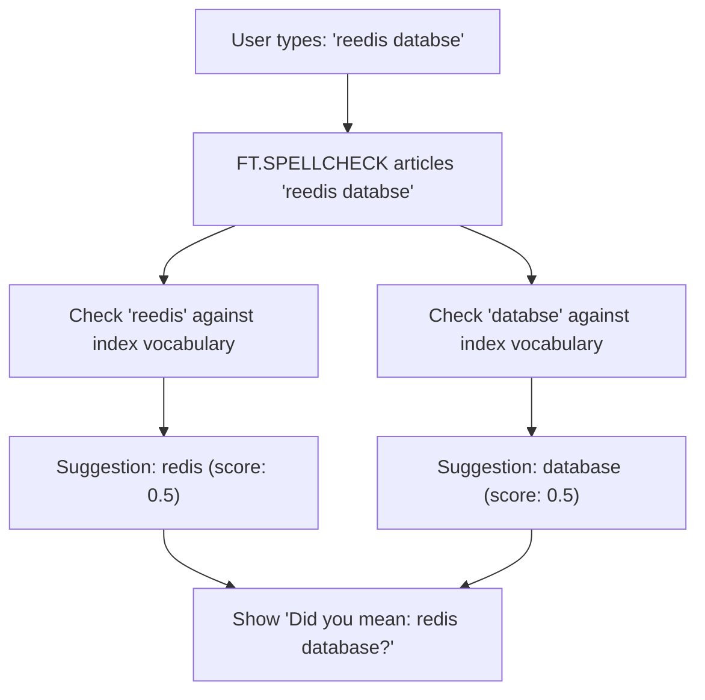
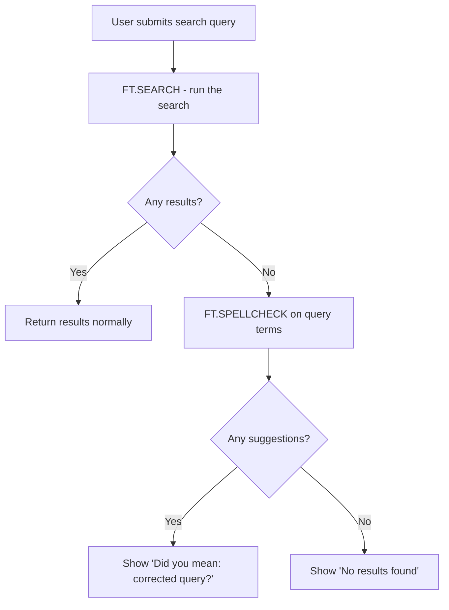

# How to Use FT.SPELLCHECK in Redis for Fuzzy Search

Author: [nawazdhandala](https://www.github.com/nawazdhandala)

Tags: Redis, RediSearch, Search, Spellcheck, Command

Description: Learn how to use FT.SPELLCHECK in Redis to suggest spelling corrections for misspelled query terms based on indexed terms and custom dictionaries.

---

## How FT.SPELLCHECK Works

`FT.SPELLCHECK` checks the terms in a query against the index vocabulary and returns spelling suggestions for terms not found in the index. It uses edit distance to find close matches, with a configurable distance limit. Use it to implement "Did you mean?" features, reduce zero-result searches caused by typos, and improve search quality.



## Syntax

```redis
FT.SPELLCHECK index query [DISTANCE distance] [TERMS INCLUDE|EXCLUDE dict [dict ...]] [DIALECT dialect]
```

- `index` - the RediSearch index name
- `query` - the query string with potentially misspelled terms
- `DISTANCE` - maximum edit distance for suggestions (1 to 4, default 1)
- `TERMS INCLUDE dict` - also check a custom dictionary for suggestions
- `TERMS EXCLUDE dict` - exclude terms in a custom dictionary from being flagged
- `DIALECT` - query dialect version

Returns one entry per misspelled term, each with a list of suggestions and their scores.

## Setting Up Sample Data

```redis
FT.CREATE articles ON HASH PREFIX 1 article:
  SCHEMA title TEXT body TEXT

HSET article:1 title "Redis database performance" body "Optimizing Redis for high throughput"
HSET article:2 title "Database indexing strategies" body "How indexes improve query performance"
HSET article:3 title "Caching with Redis" body "Using Redis as a cache layer"
```

## Examples

### Check a Misspelled Query

```redis
FT.SPELLCHECK articles "reedis performnce"
```

```text
1) 1) "TERM"
   2) "reedis"
   3) 1) 1) "0.5"
         2) "redis"
2) 1) "TERM"
   2) "performnce"
   3) 1) 1) "0.5"
         2) "performance"
```

Each entry contains the misspelled term and an array of (score, suggestion) pairs. Higher scores indicate more frequent matches in the index.

### Correctly Spelled Term Returns Empty Suggestions

```redis
FT.SPELLCHECK articles "redis performance"
```

```text
1) 1) "TERM"
   2) "redis"
   3) (empty array)
2) 1) "TERM"
   2) "performance"
   3) (empty array)
```

Empty suggestion arrays mean the term exists in the index and is correctly spelled.

### Increase Distance for More Suggestions

```redis
FT.SPELLCHECK articles "reddiss" DISTANCE 2
```

```text
1) 1) "TERM"
   2) "reddiss"
   3) 1) 1) "0.5"
         2) "redis"
```

Distance 2 catches two-character edits. Higher distances increase suggestions but may return irrelevant results.

### Use a Custom Dictionary

```redis
-- Add domain-specific terms to a custom dictionary
FT.DICTADD mydict "elasticsearch" "opensearch" "solr" "whoosh"

-- Include the dictionary in spell check
FT.SPELLCHECK articles "elasticseerch" TERMS INCLUDE mydict
```

Terms in an included dictionary are treated as valid words and will appear as suggestions.

### Exclude Terms from Spell Check

```redis
-- Add brand names that should never be flagged
FT.DICTADD brandnames "redis" "redisearch" "redisbloom"

-- Exclude brandnames so they are not suggested or flagged
FT.SPELLCHECK articles "rediz" TERMS EXCLUDE brandnames
```

Excluded terms are removed from the suggestion candidates.

## Implementing "Did You Mean?" Logic

A typical flow for implementing search suggestions:



### Implementation Pattern

```redis
-- 1. Run the original search
FT.SEARCH articles "reedis cacheing" LIMIT 0 0

-- If count is 0, run spellcheck
FT.SPELLCHECK articles "reedis cacheing" DISTANCE 1

-- Take the top suggestion for each misspelled term
-- Rebuild the query: "redis caching"
-- Run the corrected search
FT.SEARCH articles "redis caching" LIMIT 0 10
```

## Scoring Explained

The score returned with each suggestion is proportional to how frequently the suggested term appears in the indexed documents. A score of `0.5` means 50% of documents containing that term were considered. Higher scores indicate more prevalent terms in your index.

## Limitations

- Spellcheck applies to TEXT fields only
- Very short terms (1-2 characters) generate many false suggestions
- At `DISTANCE 4`, performance degrades on large vocabularies
- Spellcheck does not understand phrase context; each term is checked independently

## Summary

`FT.SPELLCHECK` identifies potentially misspelled terms in a query and returns scored suggestions based on the index vocabulary and optional custom dictionaries. Use it to power "Did you mean?" features, auto-correct search inputs before execution, and reduce zero-result searches caused by typos. Combine it with `FT.DICTADD` to handle domain-specific terminology.
