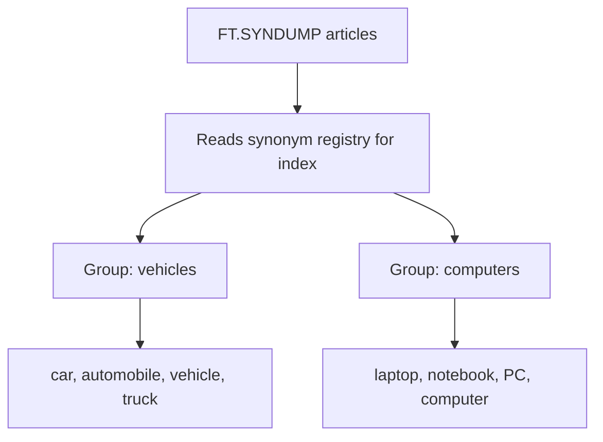

# How to Use FT.SYNDUMP in Redis to View Synonyms

Author: [nawazdhandala](https://www.github.com/nawazdhandala)

Tags: Redis, RediSearch, Search, Synonym, Command

Description: Learn how to use FT.SYNDUMP in Redis to retrieve all synonym groups defined on a RediSearch index for auditing and managing synonym configurations.

---

## How FT.SYNDUMP Works

`FT.SYNDUMP` returns all synonym groups currently defined on a RediSearch index. Each synonym group is identified by its group ID and contains the list of terms that are treated as interchangeable during search. Use it to audit synonym configurations, verify that `FT.SYNUPDATE` calls were applied correctly, and export synonym definitions for backup or migration.



## Syntax

```redis
FT.SYNDUMP index
```

- `index` - the name of the RediSearch index

Returns a flat array alternating between group IDs and their term arrays. Returns an empty array if no synonym groups exist.

## Setting Up Synonym Groups to Follow Along

```redis
FT.CREATE products ON HASH PREFIX 1 product:
  SCHEMA title TEXT description TEXT category TAG

FT.SYNUPDATE products vehicles car automobile vehicle truck
FT.SYNUPDATE products computing laptop computer notebook PC
FT.SYNUPDATE products storage disk drive SSD HDD
```

## Examples

### View All Synonym Groups

```redis
FT.SYNDUMP products
```

```text
1) "vehicles"
2) 1) "car"
   2) "automobile"
   3) "vehicle"
   4) "truck"
3) "computing"
4) 1) "laptop"
   2) "computer"
   3) "notebook"
   4) "PC"
5) "storage"
6) 1) "disk"
   2) "drive"
   3) "SSD"
   4) "HDD"
```

### Empty Index Has No Synonyms

```redis
FT.CREATE fresh ON HASH PREFIX 1 doc: SCHEMA body TEXT
FT.SYNDUMP fresh
```

```text
(empty array)
```

### Check a Single Group After Update

Add a term and verify it was added:

```redis
FT.SYNUPDATE products vehicles car automobile vehicle truck van
FT.SYNDUMP products
```

Confirm that `van` now appears in the `vehicles` group.

## Parsing the Output

The `FT.SYNDUMP` response alternates: group ID, terms array, group ID, terms array. Most Redis clients return this as a flat array that you iterate in pairs:

```text
Index 0: "vehicles"     <- group ID
Index 1: ["car", ...]   <- terms for that group
Index 2: "computing"    <- next group ID
Index 3: ["laptop", ...] <- terms for that group
```

In a Python client:

```text
result = r.ft("products").syndump()
-- result is a dict: {"vehicles": ["car", ...], "computing": [...]}
```

## Use Cases

### Auditing Synonym Configuration

Before deploying changes to a production index, dump synonyms from staging and compare:

```redis
-- On staging
FT.SYNDUMP catalog

-- On production
FT.SYNDUMP catalog

-- Compare both outputs to detect missing or extra groups
```

### Migrating Synonyms to a New Index

When rebuilding an index, re-apply all synonyms:

```redis
-- Dump from old index
FT.SYNDUMP old_products

-- Recreate each group on the new index
FT.SYNUPDATE new_products vehicles car automobile vehicle truck
FT.SYNUPDATE new_products computing laptop computer notebook PC
```

### Debugging Missing Search Results

If a synonym search is not returning expected results, dump the synonyms to verify the group exists and contains the right terms:

```redis
FT.SYNDUMP catalog
-- Check if "notebook" is in the computing group
-- If missing, run FT.SYNUPDATE to add it
```

## FT.SYNDUMP vs FT.SYNUPDATE

| Command | Purpose |
|---------|---------|
| `FT.SYNUPDATE` | Create or replace a synonym group |
| `FT.SYNDUMP` | Read all existing synonym groups |

There is no built-in command to delete a specific synonym group. To remove a group, recreate the index or update the group to a single term (which effectively makes it do nothing):

```redis
-- Remove "vehicles" group by overwriting with a single term
FT.SYNUPDATE products vehicles placeholder
```

## Summary

`FT.SYNDUMP` returns all synonym groups defined on a RediSearch index as alternating group IDs and term arrays. Use it to audit which terms are considered synonyms, verify that `FT.SYNUPDATE` was applied correctly, and export synonym definitions for migration or backup. Pair it with `FT.SYNUPDATE` to manage the full synonym lifecycle on your search indexes.
