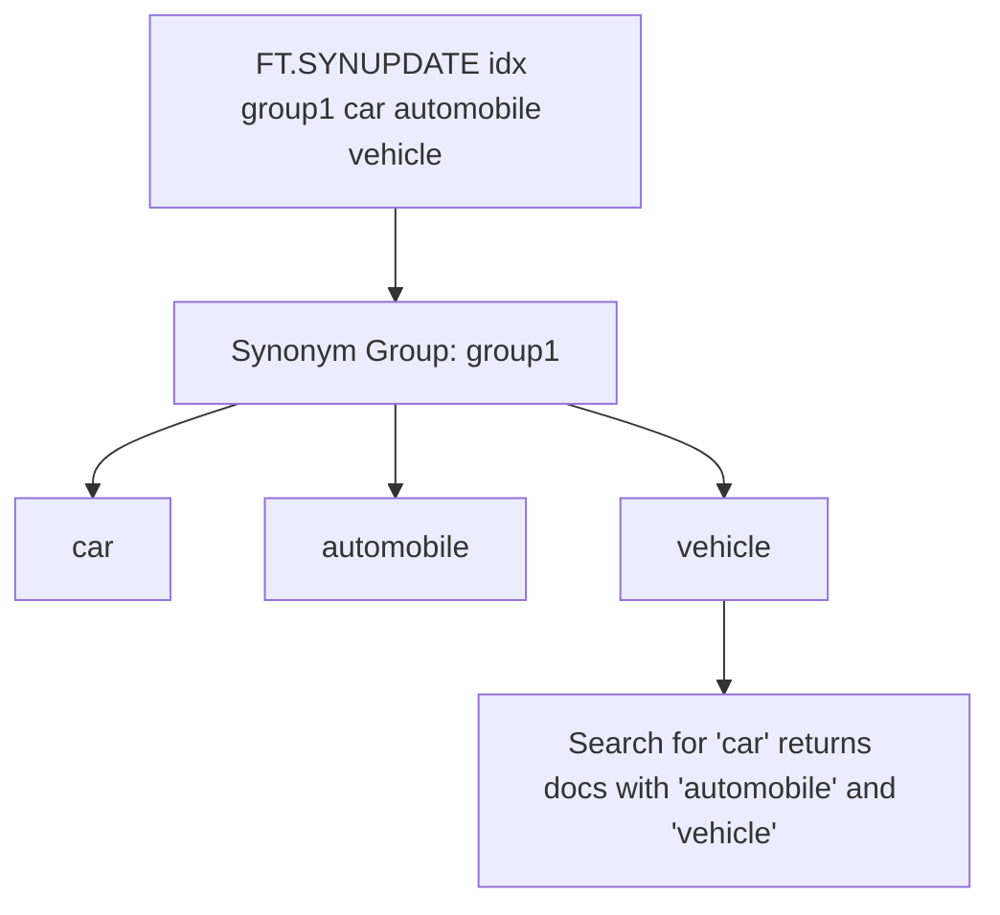
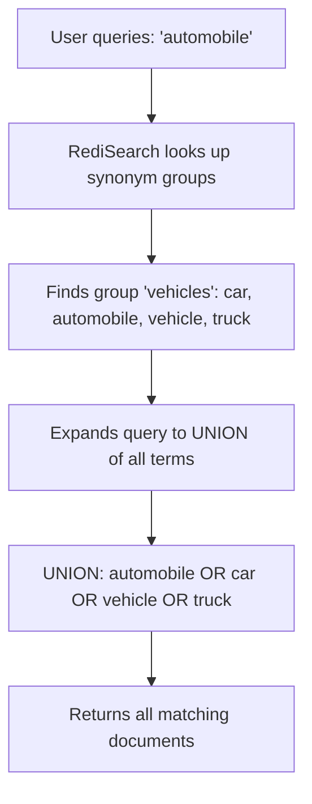

# How to Use FT.SYNUPDATE in Redis to Add Synonyms

Author: [nawazdhandala](https://www.github.com/nawazdhandala)

Tags: Redis, RediSearch, Search, Synonym, Command

Description: Learn how to use FT.SYNUPDATE in Redis to add synonym groups to a RediSearch index so that searching one term also matches its synonyms.

---

## How FT.SYNUPDATE Works

`FT.SYNUPDATE` adds or updates a synonym group in a RediSearch index. A synonym group is a set of terms that are considered interchangeable during search. When a user searches for any term in the group, documents containing any other term in the same group are also returned. Synonym groups are stored per-index and applied at query time.



## Syntax

```redis
FT.SYNUPDATE index synonym_group_id [SKIPINITIALSCAN] term [term ...]
```

- `index` - the RediSearch index name
- `synonym_group_id` - a string identifier for the synonym group (create new or overwrite existing)
- `SKIPINITIALSCAN` - do not re-index existing documents for this synonym group (faster for large indexes)
- `term [term ...]` - two or more terms that are synonyms of each other

Returns `OK` on success.

## Setting Up Sample Data

```redis
FT.CREATE articles ON HASH PREFIX 1 article:
  SCHEMA title TEXT body TEXT

HSET article:1 title "Buying a car in 2024" body "Tips for purchasing an automobile"
HSET article:2 title "Vehicle maintenance guide" body "How to maintain your car"
HSET article:3 title "Laptop reviews" body "Best notebooks for developers"
HSET article:4 title "Computer buying guide" body "Choosing the right PC"
```

## Examples

### Add a Synonym Group for Vehicles

```redis
FT.SYNUPDATE articles vehicles car automobile vehicle
```

Now searching for "car" also matches "automobile" and "vehicle":

```redis
FT.SEARCH articles "car"
```

```text
1) (integer) 2
2) "article:1"
3) 1) "title"
   2) "Buying a car in 2024"
   3) "body"
   4) "Tips for purchasing an automobile"
4) "article:2"
5) 1) "title"
   2) "Vehicle maintenance guide"
   3) "body"
   4) "How to maintain your car"
```

### Add a Synonym Group for Computing Terms

```redis
FT.SYNUPDATE articles computers laptop notebook computer PC
```

```redis
FT.SEARCH articles "laptop"
```

```text
1) (integer) 2
2) "article:3"
3) ...
4) "article:4"
5) ...
```

### Update an Existing Synonym Group

To add a new term to an existing group, call `FT.SYNUPDATE` with the same group ID and include all terms (old plus new):

```redis
-- Original group: vehicles = car, automobile, vehicle
-- Add "truck" to the group
FT.SYNUPDATE articles vehicles car automobile vehicle truck
```

Calling `FT.SYNUPDATE` with an existing group ID replaces the group's terms.

### Skip Initial Scan for Large Indexes

When adding synonyms to an index with millions of documents, use `SKIPINITIALSCAN` to avoid a full re-index. The synonym will apply to documents indexed after this point:

```redis
FT.SYNUPDATE articles electronics SKIPINITIALSCAN phone mobile smartphone
```

## Viewing Current Synonym Groups

Use `FT.SYNDUMP` to see all synonym groups defined on an index:

```redis
FT.SYNDUMP articles
```

```text
1) "vehicles"
2) 1) "car"
   2) "automobile"
   3) "vehicle"
   4) "truck"
3) "computers"
4) 1) "laptop"
   2) "notebook"
   3) "computer"
   4) "PC"
```

## Practical Use Cases

### E-commerce Search

Customers use many words for the same product. Synonyms ensure results across all variations:

```redis
FT.SYNUPDATE products footwear shoes sneakers trainers boots
FT.SYNUPDATE products tops shirt blouse tshirt tee
FT.SYNUPDATE products trousers pants jeans leggings
```

### Technical Documentation Search

Engineering terms often have multiple names:

```redis
FT.SYNUPDATE docs networking network net LAN WAN
FT.SYNUPDATE docs authentication auth login signin
FT.SYNUPDATE docs database db datastore storage
```

### Medical or Legal Content

Domain-specific synonyms reduce terminology barriers:

```redis
FT.SYNUPDATE medical cardio heart cardiac cardiovascular
FT.SYNUPDATE legal contract agreement deed covenant
```

## How Synonym Matching Works at Query Time



Synonyms are bidirectional within a group. Searching for any term in the group matches all others.

## Limitations

- Synonym expansion happens at query time; it does not modify the stored data
- Very large synonym groups with many terms can slow query parsing
- Synonyms apply to TEXT fields only, not TAG or NUMERIC fields
- Group IDs are case-sensitive strings

## Summary

`FT.SYNUPDATE` defines synonym groups for a RediSearch index, making searches for one term automatically include results containing its synonyms. Groups are identified by a string ID and can be updated by re-calling the command with the same ID. Use `SKIPINITIALSCAN` when adding synonyms to large indexes to avoid blocking re-indexing.
