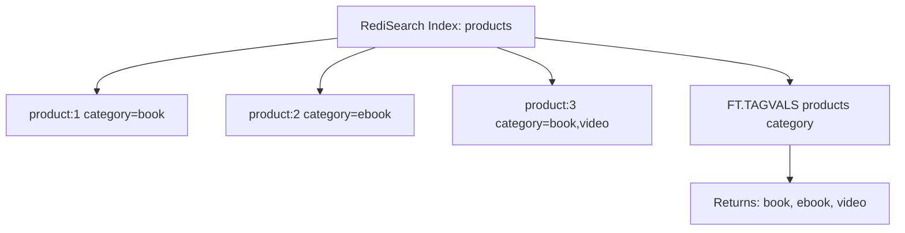

# How to Use FT.TAGVALS in Redis to Get All Tag Values

Author: [nawazdhandala](https://www.github.com/nawazdhandala)

Tags: Redis, RediSearch, Search, Tag, Command

Description: Learn how to use FT.TAGVALS in Redis to retrieve all distinct values stored in a TAG field of a RediSearch index for faceted navigation and validation.

---

## How FT.TAGVALS Works

`FT.TAGVALS` returns all distinct values that exist in a TAG field across all indexed documents. This is useful for building faceted search interfaces, populating filter dropdowns, validating which values are actually indexed, and understanding the cardinality of a tag field without scanning documents manually.



## Syntax

```redis
FT.TAGVALS index field
```

- `index` - the name of the RediSearch index
- `field` - the name of a TAG-type field in that index

Returns an array of all unique tag values found in the field across all indexed documents.

## Setting Up Sample Data

```redis
FT.CREATE products ON HASH PREFIX 1 product:
  SCHEMA title TEXT
         category TAG
         tags TAG SEPARATOR ","
         status TAG

HSET product:1 title "Redis Guide" category "book" tags "redis,database,nosql" status "active"
HSET product:2 title "Redis Patterns" category "ebook" tags "redis,patterns" status "active"
HSET product:3 title "Database Design" category "book" tags "database,sql" status "archived"
HSET product:4 title "NoSQL Essentials" category "video" tags "nosql,database" status "active"
HSET product:5 title "Redis Advanced" category "ebook" tags "redis,advanced,nosql" status "draft"
```

## Examples

### Get All Categories

```redis
FT.TAGVALS products category
```

```text
1) "book"
2) "ebook"
3) "video"
```

### Get All Tag Values

```redis
FT.TAGVALS products tags
```

```text
1) "advanced"
2) "database"
3) "nosql"
4) "patterns"
5) "redis"
6) "sql"
```

Values are returned in alphabetical order.

### Get All Status Values

```redis
FT.TAGVALS products status
```

```text
1) "active"
2) "archived"
3) "draft"
```

## Building a Faceted Search UI

`FT.TAGVALS` is the backbone of faceted navigation. You retrieve all available filter options and then let users combine them:

```redis
-- Step 1: Get all available categories for the sidebar
FT.TAGVALS products category

-- Step 2: User selects "book" and "ebook" - run filtered search
FT.SEARCH products "@category:{book | ebook}" LIMIT 0 10

-- Step 3: Show all available tags for books and ebooks
FT.SEARCH products "@category:{book | ebook}" RETURN 1 tags
```

## Use Cases

### Populating Filter Dropdowns

Fetch tag values when your web application initializes to populate category, status, or genre filter dropdowns without a separate database query.

```redis
-- On app startup, populate filter options
FT.TAGVALS catalog genre
FT.TAGVALS catalog publisher
FT.TAGVALS catalog language
```

### Validating Index Consistency

After bulk imports, verify that only expected values exist in a tag field:

```redis
FT.TAGVALS orders payment_method
-- Should return: credit_card, paypal, bank_transfer
-- If unexpected values appear, investigate the import
```

### Monitoring Tag Cardinality

High cardinality in a TAG field can impact memory. Monitor it over time:

```redis
FT.TAGVALS users country
-- Count the result array length to track cardinality growth
```

## Behavior Notes

- Values are returned in alphabetical order, not by frequency
- Multi-value TAG fields (using SEPARATOR) have each individual value listed
- Values are case-normalized to lowercase in the tag index by default
- If a document has no value for the field it is not represented
- Deleting a document does not immediately remove its tags from `FT.TAGVALS` until the index is garbage collected or rebuilt

## Comparison with FT.AGGREGATE

You can get similar information from `FT.AGGREGATE` with more control over filtering and counting:

```redis
-- FT.TAGVALS - simple, fast, no counts
FT.TAGVALS products category

-- FT.AGGREGATE - includes document count per value
FT.AGGREGATE products "*"
  GROUPBY 1 @category
  REDUCE COUNT 0 AS count
  SORTBY 2 @count DESC
```

Use `FT.TAGVALS` when you only need the list of values. Use `FT.AGGREGATE` when you also need counts or want to filter by a subset.

## Summary

`FT.TAGVALS` retrieves every distinct value stored in a TAG field of a RediSearch index. It is the fastest way to enumerate available filter options for faceted search UIs, validate index content after data imports, and monitor tag cardinality. Results are sorted alphabetically and reflect the current state of the index.
