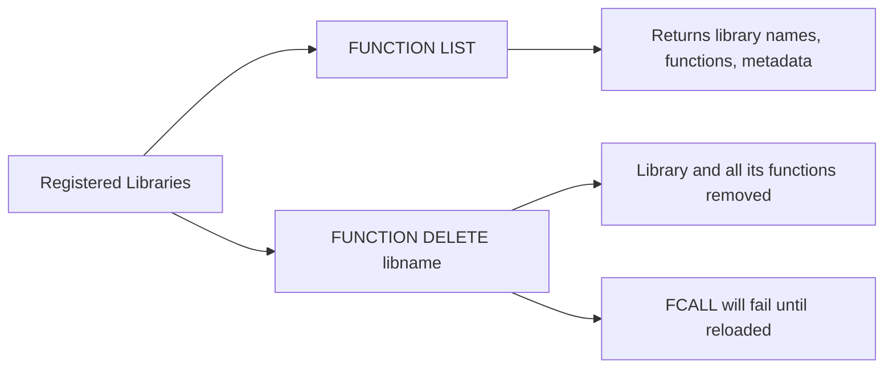

# How to Use FUNCTION LIST and FUNCTION DELETE in Redis

Author: [nawazdhandala](https://www.github.com/nawazdhandala)

Tags: Redis, FUNCTION LIST, FUNCTION DELETE, Redis Function, Library, Redis 7

Description: Learn how to use FUNCTION LIST to inspect registered Redis function libraries and FUNCTION DELETE to remove them, with filtering options and practical management examples.

---

## How FUNCTION LIST and FUNCTION DELETE Work

FUNCTION LIST returns information about all registered function libraries on the Redis server, including library names, the engine used, and the names of all registered functions within each library. An optional WITHCODE flag includes the full source code.

FUNCTION DELETE removes a named function library and all functions it contains. Once deleted, calls to any function in that library will fail until the library is re-registered with FUNCTION LOAD.



## Syntax

```redis
FUNCTION LIST [LIBRARYNAME library-name-pattern] [WITHCODE]

FUNCTION DELETE library-name
```

- `LIBRARYNAME pattern` - filter libraries by name pattern (glob-style)
- `WITHCODE` - include the source code of each library in the output
- `library-name` - exact name of the library to delete

## Examples

### FUNCTION LIST - list all registered libraries

Assuming two libraries are loaded:

```redis
FUNCTION LIST
```

```text
1) 1) "library_name"
   2) "mylib"
   3) "engine"
   4) "LUA"
   5) "functions"
   6) 1) 1) "name"
         2) "greet"
         3) "description"
         4) (nil)
         5) "flags"
         6) (empty array)
2) 1) "library_name"
   2) "sessionlib"
   3) "engine"
   4) "LUA"
   5) "functions"
   6) 1) 1) "name"
         2) "session_set"
         ...
      2) 1) "name"
         2) "session_get"
         ...
```

### FUNCTION LIST WITHCODE - include source code

```redis
FUNCTION LIST WITHCODE
```

```text
1) 1) "library_name"
   2) "mylib"
   3) "engine"
   4) "LUA"
   5) "functions"
   6) ...
   7) "library_code"
   8) "#!lua name=mylib\nredis.register_function(..."
```

### FUNCTION LIST with name filter

Filter by library name pattern:

```redis
FUNCTION LIST LIBRARYNAME session*
```

Returns only libraries whose names match `session*`.

```text
1) 1) "library_name"
   2) "sessionlib"
   3) "engine"
   4) "LUA"
   5) "functions"
   6) ...
```

### FUNCTION LIST - when no libraries are registered

```redis
FUNCTION LIST
```

```text
(empty array)
```

### FUNCTION DELETE - remove a library

```redis
FUNCTION DELETE mylib
```

```text
OK
```

Verify it is gone:

```redis
FUNCTION LIST LIBRARYNAME mylib
```

```text
(empty array)
```

### FUNCTION DELETE - trying to call a deleted function

After deleting a library, calling any of its functions fails:

```redis
FUNCTION DELETE sessionlib
FCALL session_get 1 session:user:42
```

```text
(error) ERR Library not loaded. Please use FUNCTION LOAD.
```

### FUNCTION DELETE - non-existent library

```redis
FUNCTION DELETE nonexistent
```

```text
(error) ERR Library not found
```

## Related Commands

| Command | Purpose |
|---|---|
| FUNCTION LOAD | Register a new library |
| FUNCTION LIST | List registered libraries and their functions |
| FUNCTION DELETE | Remove a library and all its functions |
| FUNCTION FLUSH | Remove all libraries at once |
| FUNCTION DUMP | Export all libraries to binary format |
| FUNCTION RESTORE | Import libraries from binary format |
| FUNCTION STATS | Show runtime statistics |
| FCALL | Execute a function |
| FCALL_RO | Execute a read-only function on a replica |

## Listing Functions with redis-cli

For a quick view of all functions, use the formatted output:

```bash
redis-cli FUNCTION LIST | grep -E "library_name|functions|name"
```

Or use the pretty printer:

```bash
redis-cli --resp3 FUNCTION LIST
```

## Use Cases

**Inventory of deployed functions** - Use FUNCTION LIST to audit what function libraries are registered across your Redis instances, ensuring all nodes have the same libraries.

**Deployment validation** - After deploying a new library version with FUNCTION LOAD REPLACE, use FUNCTION LIST WITHCODE to verify the correct source code is loaded.

**Library cleanup** - Use FUNCTION DELETE to remove obsolete libraries as part of version decommissioning or rolling upgrades.

**Debugging function issues** - Use FUNCTION LIST WITHCODE to inspect the actual code of a function if results are unexpected.

**CI/CD pipeline** - Run FUNCTION LIST after deployment to confirm all expected libraries are registered and contain the expected functions.

## Summary

FUNCTION LIST returns the registry of all Lua function libraries on a Redis server, including their names, functions, and optionally their source code. FUNCTION DELETE removes a named library and all its functions. Use FUNCTION LIST regularly to audit deployed functions, verify deployments, and troubleshoot missing functions. Use FUNCTION DELETE as part of library version management when replacing old libraries. Both commands operate on the same persistent registry that FUNCTION LOAD populates.
