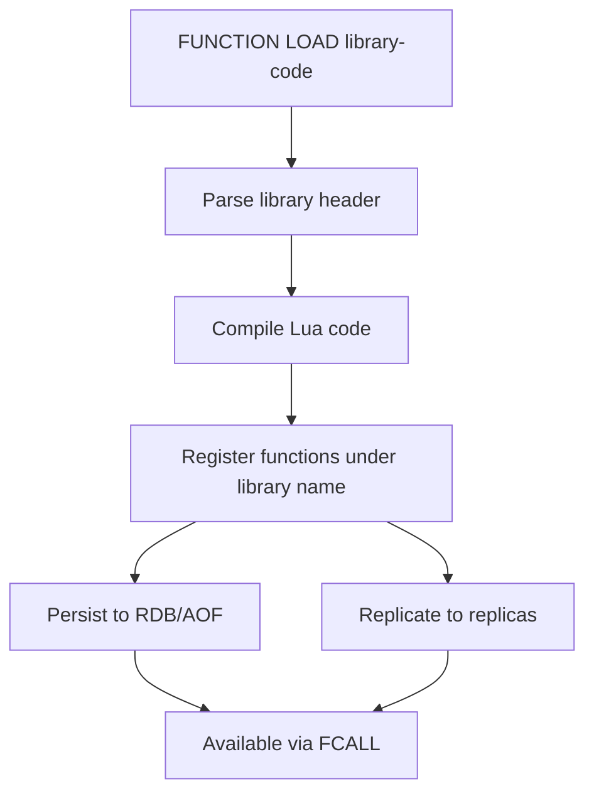

# How to Use FUNCTION LOAD in Redis to Register Functions

Author: [nawazdhandala](https://www.github.com/nawazdhandala)

Tags: Redis, FUNCTION LOAD, Redis Function, Lua, Library, Redis 7

Description: Learn how to use FUNCTION LOAD in Redis 7+ to register Lua function libraries that persist across restarts and are replicated to replicas, replacing ad-hoc EVAL scripts.

---

## How FUNCTION LOAD Works

FUNCTION LOAD registers a function library on the Redis server. A library is a named collection of one or more functions written in Lua (or other supported engines in future releases). Unlike scripts loaded with SCRIPT LOAD, function libraries are:

- Persisted in RDB and AOF snapshots
- Replicated to replicas automatically
- Organized under named libraries
- Available immediately after server restart



## Syntax

```redis
FUNCTION LOAD [REPLACE] function-code
```

- `REPLACE` - replace an existing library with the same name (optional; without it, loading a library that already exists returns an error)
- `function-code` - the full library code, including the shebang header

### Library Header Format

Every library must begin with a shebang comment that declares the engine and library name:

```text
#!lua name=libraryname
```

## Examples

### Load a simple library

```redis
FUNCTION LOAD "#!lua name=greetlib

redis.register_function('greet', function(keys, args)
  return 'Hello, ' .. args[1] .. '!'
end)
"
```

```text
"greetlib"
```

### Call the function

```redis
FCALL greet 0 "Redis"
```

```text
"Hello, Redis!"
```

### Load a library with multiple functions

```redis
FUNCTION LOAD "#!lua name=sessionlib

redis.register_function('session_set', function(keys, args)
  redis.call('SET', keys[1], args[1])
  redis.call('EXPIRE', keys[1], tonumber(args[2]))
  return 1
end)

redis.register_function('session_get', function(keys, args)
  return redis.call('GET', keys[1])
end)

redis.register_function('session_del', function(keys, args)
  return redis.call('DEL', keys[1])
end)
"
```

```text
"sessionlib"
```

### Use the session library

```redis
FCALL session_set 1 session:user:42 "active" 3600
```

```text
(integer) 1
```

```redis
FCALL session_get 1 session:user:42
```

```text
"active"
```

### REPLACE an existing library

To update an existing library, use REPLACE:

```redis
FUNCTION LOAD REPLACE "#!lua name=sessionlib

redis.register_function('session_set', function(keys, args)
  local ttl = tonumber(args[2]) or 1800
  redis.call('SET', keys[1], args[1])
  redis.call('EXPIRE', keys[1], ttl)
  return 1
end)
"
```

```text
"sessionlib"
```

Without REPLACE, loading a library with the same name fails:

```redis
FUNCTION LOAD "#!lua name=sessionlib
redis.register_function('session_set', function(keys, args) return 1 end)
"
```

```text
(error) ERR Library 'sessionlib' already exists
```

### Register a read-only function with flags

```redis
FUNCTION LOAD "#!lua name=rolib

redis.register_function{
  function_name = 'ro_get',
  callback = function(keys, args)
    return redis.call('GET', keys[1])
  end,
  flags = {'no-writes'}
}
"
```

The `no-writes` flag marks this function as read-only, allowing it to be called with FCALL_RO on replicas.

### Library with a rate limiter

```redis
FUNCTION LOAD "#!lua name=ratelimit

redis.register_function('check_rate', function(keys, args)
  local key = keys[1]
  local limit = tonumber(args[1])
  local window = tonumber(args[2])
  local count = redis.call('INCR', key)
  if count == 1 then
    redis.call('EXPIRE', key, window)
  end
  if count > limit then
    return 0
  end
  return 1
end)
"
```

```redis
FCALL check_rate 1 rate:api:user:1 100 60
```

```text
(integer) 1
```

## Function Registration Options

The `redis.register_function` supports two calling styles:

Positional (simple):

```lua
redis.register_function('name', callback)
```

Named (with flags):

```lua
redis.register_function{
  function_name = 'name',
  callback = function(keys, args) ... end,
  flags = {'no-writes'}  -- or 'allow-oom', 'allow-stale', 'no-cluster'
}
```

## Use Cases

**Production scripting** - Replace EVAL scripts with persistent, replicated functions that survive server restarts and are available on all replicas.

**Microservice contracts** - Define a library per service with well-named functions, making the interface clear and versioned.

**Atomic business operations** - Implement inventory check-and-decrement, rate limiting, and session management as named functions.

**Operational safety** - Use REPLACE to deploy updated functions without downtime, and FUNCTION DELETE to remove obsolete libraries.

## Summary

FUNCTION LOAD registers a named Lua library on the Redis server. Libraries persist in RDB/AOF and are replicated to replicas, making them significantly more durable than EVAL's script cache. Each library has a shebang header (`#!lua name=libname`) and registers functions with `redis.register_function`. Use REPLACE to update existing libraries. Functions can be marked read-only with the `no-writes` flag to enable execution on replicas via FCALL_RO.
