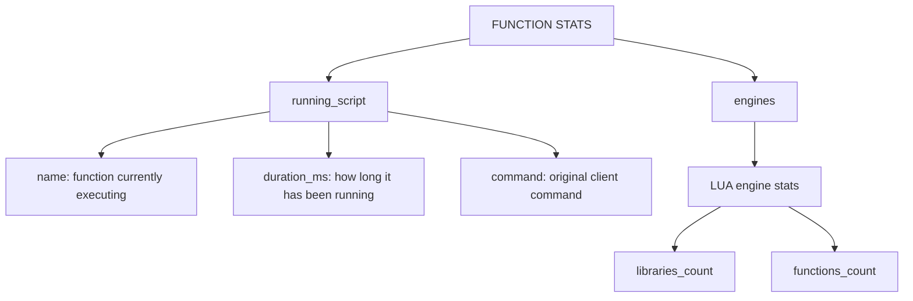
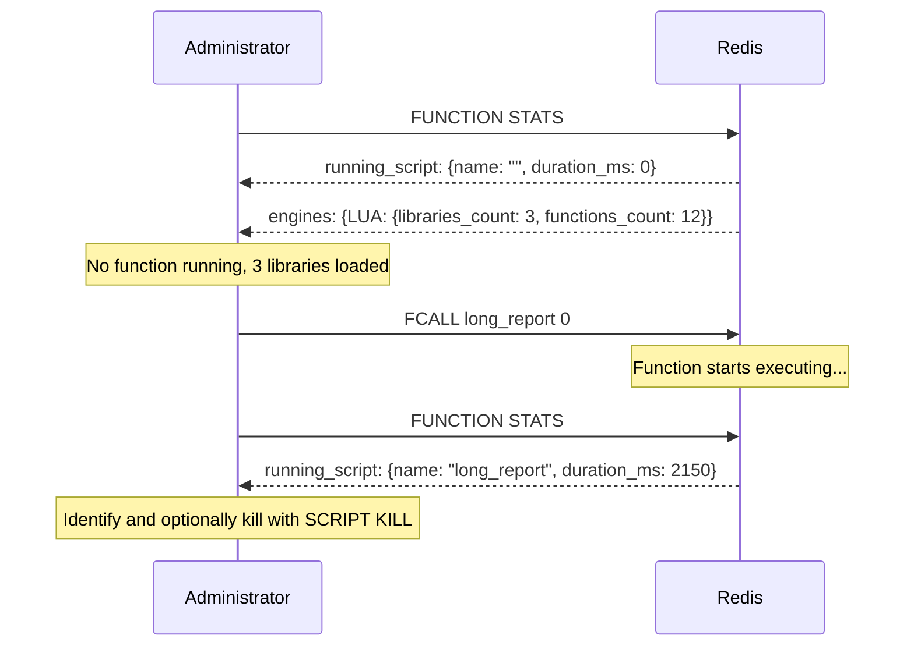

# How to Use FUNCTION STATS in Redis to Monitor Function Execution

Author: [nawazdhandala](https://www.github.com/nawazdhandala)

Tags: Redis, FUNCTION STATS, Function, Monitoring, Administration

Description: Learn how to use FUNCTION STATS in Redis to inspect the currently running function, available engines, and library statistics for operational visibility.

---

## What is FUNCTION STATS

FUNCTION STATS returns a map of information about the Redis Functions subsystem. It shows which function is currently executing (if any), details about the available scripting engines, and summary counts of loaded libraries and functions.

```redis
FUNCTION STATS
```

FUNCTION STATS takes no arguments and returns a nested map structure.



## Output Structure

A typical FUNCTION STATS response looks like this:

```
1) "running_script"
2) 1) "duration_ms"
   2) (integer) 0
   3) "flags"
   4) (empty array)
   5) "name"
   6) ""
   7) "command"
   8) (empty array)
3) "engines"
4) 1) "LUA"
   2) 1) "libraries_count"
      2) (integer) 3
      3) "functions_count"
      4) (integer) 12
```

When a function is actively running, `running_script` contains its details:

```
1) "running_script"
2) 1) "duration_ms"
   2) (integer) 4823
   3) "flags"
   4) 1) "no-writes"
   5) "name"
   6) "compute_report"
   7) "command"
   8) 1) "fcall"
      2) "compute_report"
      3) "1"
      4) "dataset:2024"
```

## Practical Usage

### Check if a function is currently running

```redis
FUNCTION STATS
```

If `running_script` > `name` is an empty string, no function is executing. If it contains a name and a non-zero `duration_ms`, a function is in progress.

### Count loaded libraries and functions

```redis
FUNCTION STATS
-- Check engines > LUA > libraries_count and functions_count
```

This gives a quick health check for the Functions subsystem without listing all libraries.



### Identify a stuck function

When a function runs longer than expected, FUNCTION STATS reveals its name and how long it has been executing:

```redis
FUNCTION STATS
-- running_script > name: "batch_processor"
-- running_script > duration_ms: 15430

-- If the function has not written data, kill it:
SCRIPT KILL
```

## Monitoring Over Time

FUNCTION STATS is lightweight and can be polled from a monitoring agent. A simple shell loop:

```bash
while true; do
  redis-cli FUNCTION STATS | grep -A 5 "running_script"
  sleep 1
done
```

Or integrate with a metrics pipeline:

```bash
redis-cli FUNCTION STATS | awk '/functions_count/{print "redis_functions_count " $2}'
```

## FUNCTION STATS vs FUNCTION LIST

| Command | Purpose | Output |
|---|---|---|
| `FUNCTION STATS` | Runtime state + engine summary | Currently running function, counts |
| `FUNCTION LIST` | Library inventory | All library names, function names, code |

FUNCTION STATS is for operations and monitoring. FUNCTION LIST is for auditing what is deployed.

## Flags in running_script

The `flags` field in `running_script` reflects the flags the function was registered with:

| Flag | Meaning |
|---|---|
| `no-writes` | Function declared it performs no writes |
| `allow-oom` | Function is allowed to run even under OOM conditions |
| `allow-repl` | Function can propagate commands to replicas |

## Summary

FUNCTION STATS provides a real-time snapshot of the Redis Functions subsystem: which function is currently executing, how long it has been running, its flags and original call arguments, and aggregate counts of loaded libraries and functions per engine. Use it to detect long-running or stuck functions, confirm that libraries loaded correctly, and feed library/function counts into your monitoring pipeline.
