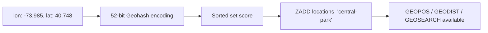

# How to Use GEOADD in Redis to Store Geographic Coordinates

Author: [nawazdhandala](https://www.github.com/nawazdhandala)

Tags: Redis, Geo, GEOADD, Geospatial, Location

Description: Learn how to use GEOADD to store geographic coordinates in a Redis sorted set, the foundation for all Redis geospatial queries.

---

Redis geospatial commands allow you to store locations and run proximity queries with sub-millisecond latency. `GEOADD` is the entry point - it stores longitude/latitude pairs in a sorted set using Geohash encoding, making them queryable by distance, radius, and bounding box.

## How GEOADD Works

`GEOADD` encodes each longitude/latitude pair as a 52-bit Geohash integer and stores it in a Redis sorted set with the hash as the score. This allows Redis to use the sorted set's range capabilities for efficient spatial queries.



## Syntax

```redis
GEOADD key [NX | XX] [CH] longitude latitude member [longitude latitude member ...]
```

- `key` - sorted set name
- `NX` - only add new members, never update existing ones
- `XX` - only update existing members, never add new ones
- `CH` - return count of changed members (added + updated) instead of just added
- `longitude latitude member` - coordinate pair and member name (can repeat)

**Coordinate bounds:** longitude -180 to 180, latitude -85.05 to 85.05

## Examples

### Add a Single Location

```redis
GEOADD restaurants -73.9857 40.7484 "joes-pizza"
```

Returns `1` (one member added).

### Add Multiple Locations at Once

```redis
GEOADD restaurants
  -73.9857 40.7484 "joes-pizza"
  -73.9772 40.7614 "central-diner"
  -74.0059 40.7128 "harbor-grill"
  -73.9442 40.6782 "brooklyn-cafe"
```

### Update an Existing Location

Use `XX` to update coordinates for an existing member:

```redis
GEOADD restaurants XX -73.9860 40.7490 "joes-pizza"
```

### Add Only New Members

Use `NX` to skip members that already exist:

```redis
GEOADD restaurants NX -73.9857 40.7484 "joes-pizza"
```

Returns `0` if `joes-pizza` already exists.

### Count Changes with CH

```redis
GEOADD restaurants CH -73.9857 40.7484 "joes-pizza" -74.0100 40.7200 "new-spot"
```

Returns `2` (one updated, one added).

## Verify Storage with GEOPOS

Confirm coordinates were stored correctly:

```redis
GEOPOS restaurants joes-pizza
```

Output:

```text
1) 1) "-73.98570060729980469"
   2) "40.74840144948154994"
```

Note: There is a small rounding error from Geohash encoding (approximately 0.6mm precision).

## Use Cases

- **Restaurant/store finders** - index all locations for radius search
- **Delivery logistics** - track depot and delivery point coordinates
- **Real-time asset tracking** - update vehicle or device coordinates with `XX`
- **Event location discovery** - store venue coordinates for proximity-based recommendations

## Summary

`GEOADD` is the foundation of Redis geospatial functionality. It stores coordinates efficiently using Geohash encoding in a standard sorted set, making all subsequent `GEODIST`, `GEOPOS`, `GEOSEARCH`, and `GEORADIUS` commands possible. Use `NX`/`XX` flags to safely handle upsert scenarios, and batch multiple coordinates in a single call for efficient bulk loading.
