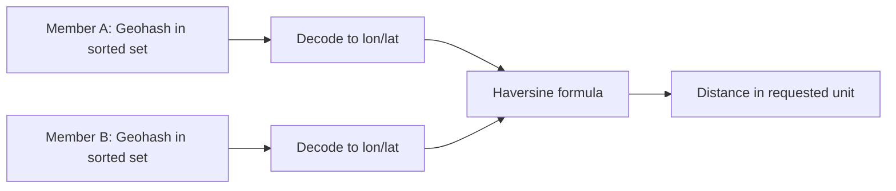

# How to Use GEODIST in Redis to Calculate Distance Between Points

Author: [nawazdhandala](https://www.github.com/nawazdhandala)

Tags: Redis, Geo, GEODIST, Geospatial, Distance

Description: Learn how to use GEODIST to calculate the straight-line distance between two stored members in a Redis geospatial index in any unit.

---

Once locations are stored with `GEOADD`, `GEODIST` gives you the great-circle distance between any two of them. This is useful for calculating travel distances, delivery ranges, or verifying location data.

## How GEODIST Works

`GEODIST` decodes the Geohash values of both members, converts them back to coordinates, and applies the Haversine formula to calculate the great-circle (straight-line) distance on the Earth's surface. It does not account for roads, terrain, or elevation.



## Syntax

```redis
GEODIST key member1 member2 [m | km | ft | mi]
```

- `key` - sorted set with geo data
- `member1`, `member2` - two stored members
- Unit options: `m` (meters, default), `km` (kilometers), `ft` (feet), `mi` (miles)

Returns the distance as a double, or `nil` if either member does not exist.

## Setup

```redis
GEOADD cities -73.9857 40.7484 "new-york"
GEOADD cities -87.6298 41.8781 "chicago"
GEOADD cities -118.2437 34.0522 "los-angeles"
GEOADD cities -0.1276 51.5074 "london"
```

## Examples

### Distance in Kilometers

```redis
GEODIST cities new-york chicago km
```

Output:

```text
"1143.4722"
```

### Distance in Miles

```redis
GEODIST cities new-york los-angeles mi
```

Output:

```text
"2445.8698"
```

### Default Unit (Meters)

```redis
GEODIST cities new-york chicago
```

Output:

```text
"1143472.2000"
```

### Missing Member Returns nil

```redis
GEODIST cities new-york nonexistent-city km
```

Output:

```text
(nil)
```

## Practical Application: Delivery Range Check

Check if a customer is within delivery range of a store:

```redis
GEOADD stores -73.9857 40.7484 "downtown-store"
GEOADD customers -73.9950 40.7580 "customer-home"

GEODIST stores downtown-store customer-home km
# Returns 1.2345 - within 5km delivery range
```

## Limitations

- `GEODIST` measures straight-line distance, not driving or walking distance
- Returns `nil` if either member is absent - handle this in your application
- Precision is limited by Geohash encoding (sub-millimeter accuracy)

## Use Cases

- **Delivery range validation** - confirm a customer is within service radius
- **Distance badges** - show "X km away" labels in search results
- **Logistics optimization** - pre-calculate distances between depots and stops
- **Geofencing checks** - verify if two stored points are within a threshold

## Summary

`GEODIST` provides instant great-circle distance calculations between any two members of a Redis geo index. It supports multiple distance units and returns `nil` gracefully for missing members. For bulk proximity queries - finding all members within a given range - use `GEOSEARCH` instead.
