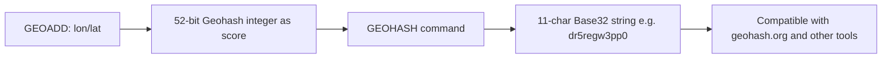

# How to Use GEOHASH in Redis to Get Geohash Strings

Author: [nawazdhandala](https://www.github.com/nawazdhandala)

Tags: Redis, Geo, GEOHASH, Geospatial, Encoding

Description: Learn how to use GEOHASH to retrieve the Base32-encoded Geohash string for stored members in a Redis geospatial index.

---

Redis stores geographic coordinates as Geohash integers internally, but `GEOHASH` returns the human-readable Base32 encoded string format. These 11-character strings are compatible with external Geohash tools and services, and can be used to group nearby locations or generate map tile keys.

## How GEOHASH Works

`GEOHASH` retrieves the 52-bit integer stored in the sorted set and converts it to the standard 11-character Base32 Geohash string. This string represents a rectangular region on Earth's surface - shorter strings represent larger areas, longer strings represent smaller areas.



## Syntax

```redis
GEOHASH key member [member ...]
```

- `key` - sorted set with geo data
- `member` - one or more member names

Returns an array of 11-character Geohash strings. Non-existent members return `nil`.

## Setup

```redis
GEOADD landmarks -73.9857 40.7484 "empire-state"
GEOADD landmarks -73.9654 40.7829 "central-park"
GEOADD landmarks -74.0059 40.7128 "battery-park"
```

## Examples

### Get Geohash for One Member

```redis
GEOHASH landmarks empire-state
```

Output:

```text
1) "dr5regw3pp0"
```

### Get Geohash for Multiple Members

```redis
GEOHASH landmarks empire-state central-park battery-park
```

Output:

```text
1) "dr5regw3pp0"
2) "dr5rx5t5p10"
3) "dr5r3nfcz70"
```

### Non-Existent Member

```redis
GEOHASH landmarks empire-state nonexistent
```

Output:

```text
1) "dr5regw3pp0"
2) (nil)
```

## Understanding Geohash Precision

Geohash strings of different lengths represent areas of different sizes:

| Characters | Area |
|---|---|
| 1 | ~5000 km x 5000 km |
| 4 | ~40 km x 20 km |
| 6 | ~1.2 km x 0.6 km |
| 8 | ~38 m x 19 m |
| 11 | ~3 m x 1.5 m (Redis uses this) |

Nearby locations share a common prefix. The first 6 characters of `dr5regw3pp0` and `dr5rx5t5p10` are different, indicating the locations are more than a few km apart.

## Practical Uses of Geohash Strings

Use the first N characters as a proximity grouping key:

```bash
# Get geohash for a location
hash=$(redis-cli GEOHASH landmarks empire-state)
# Take first 6 chars as neighborhood key
neighborhood=${hash:0:6}
echo "Neighborhood key: $neighborhood"
```

## Use Cases

- **External tool interoperability** - pass Geohash strings to mapping libraries, databases, or APIs that accept standard Geohash format
- **Proximity grouping** - group locations by shared Geohash prefix for clustering
- **Cache key generation** - use Geohash prefix as part of a location-based cache key
- **Map tile indexing** - map Geohash prefixes to tile identifiers

## Summary

`GEOHASH` exposes the underlying Geohash encoding that Redis uses for geospatial storage. The 11-character Base32 strings are standards-compliant and compatible with the broader Geohash ecosystem. Use them when you need to integrate Redis geo data with external systems, generate proximity-based cache keys, or group nearby locations by shared prefix.
