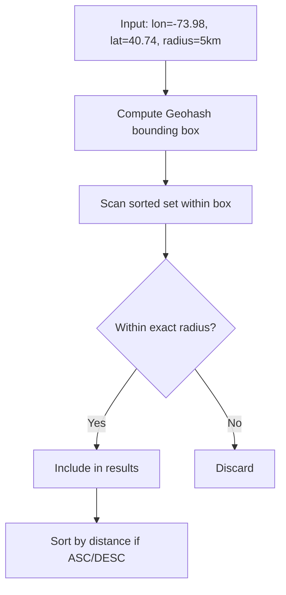

# How to Use GEORADIUS in Redis to Query by Radius

Author: [nawazdhandala](https://www.github.com/nawazdhandala)

Tags: Redis, Geo, GEORADIUS, Geospatial, Location

Description: Learn how to use GEORADIUS to find all Redis geospatial members within a given radius of a longitude/latitude coordinate.

---

`GEORADIUS` searches a Redis geospatial index and returns all members within a specified radius of a given coordinate. It is one of the original Redis proximity query commands and remains widely used despite being superseded by `GEOSEARCH` in Redis 6.2.

> Note: `GEORADIUS` was deprecated in Redis 6.2 in favor of `GEOSEARCH`. It remains available for backward compatibility.

## How GEORADIUS Works

`GEORADIUS` uses a bounding box plus Geohash comparison to efficiently find members within the circular search area. Results can be sorted by distance, limited by count, and optionally include distances and coordinates.



## Syntax

```redis
GEORADIUS key longitude latitude radius m|km|ft|mi [WITHCOORD] [WITHDIST] [COUNT count [ANY]] [ASC|DESC] [STORE key] [STOREDIST key]
```

- `key` - sorted set with geo data
- `longitude latitude` - center point coordinates
- `radius` - search radius
- `m|km|ft|mi` - distance unit
- `WITHCOORD` - include member coordinates in results
- `WITHDIST` - include distance from center in results
- `COUNT count` - limit result count; `ANY` returns first N matches found without full scan
- `ASC|DESC` - sort results by distance
- `STORE key` - store result member names in another sorted set
- `STOREDIST key` - store result with distance as score

## Setup

```redis
GEOADD restaurants -73.9857 40.7484 "joes-pizza"
GEOADD restaurants -73.9772 40.7614 "uptown-diner"
GEOADD restaurants -74.0059 40.7128 "harbor-grill"
GEOADD restaurants -73.9442 40.6782 "brooklyn-cafe"
GEOADD restaurants -74.1000 40.6500 "bayonne-bistro"
```

## Examples

### Basic Radius Search

Find all restaurants within 5 km of Times Square:

```redis
GEORADIUS restaurants -73.9855 40.7580 5 km
```

Output:

```text
1) "joes-pizza"
2) "uptown-diner"
```

### With Distance, Sorted

```redis
GEORADIUS restaurants -73.9855 40.7580 5 km WITHDIST ASC
```

Output:

```text
1) 1) "uptown-diner"
   2) "0.3124"
2) 1) "joes-pizza"
   2) "1.0874"
```

### With Coordinates and Distance

```redis
GEORADIUS restaurants -73.9855 40.7580 5 km WITHCOORD WITHDIST ASC
```

### Limit Results

Return only the 2 nearest matches:

```redis
GEORADIUS restaurants -73.9855 40.7580 50 km WITHDIST ASC COUNT 2
```

### Store Results for Later Use

Save result IDs to another sorted set for caching:

```redis
GEORADIUS restaurants -73.9855 40.7580 5 km ASC STORE nearby-restaurants
```

## Migration to GEOSEARCH

The modern equivalent using `GEOSEARCH`:

```redis
GEOSEARCH restaurants FROMLONLAT -73.9855 40.7580 BYRADIUS 5 km ASC WITHDIST
```

`GEOSEARCH` also supports bounding box queries and does not write to other keys by default (use `GEOSEARCHSTORE` for that).

## Use Cases

- **"Find nearby" features** - restaurants, stores, or services near a user's location
- **Delivery zone checks** - find all delivery partners within range of a new order
- **Event discovery** - surface events near a user's current coordinates
- **Emergency services** - find nearest available resources to an incident location

## Summary

`GEORADIUS` is a powerful proximity query command that combines filtering, sorting, and optional result storage in a single call. While deprecated in favor of `GEOSEARCH`, it remains production-ready and widely supported. For new projects on Redis 6.2+, prefer `GEOSEARCH` for its additional bounding box support and cleaner API.
