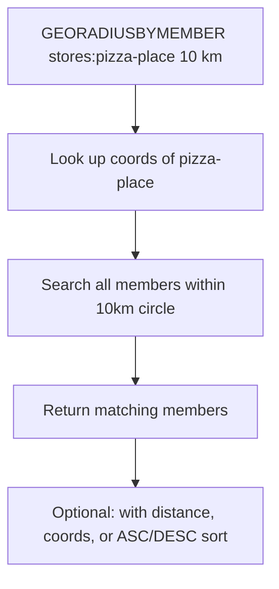

# How to Use GEORADIUSBYMEMBER in Redis for Location Queries

Author: [nawazdhandala](https://www.github.com/nawazdhandala)

Tags: Redis, Geo, GEORADIUSBYMEMBER, Location, Geospatial

Description: Learn how to use GEORADIUSBYMEMBER to find all Redis geo members within a given radius of another stored member, ideal for proximity searches.

---

`GEORADIUSBYMEMBER` finds all members of a Redis geospatial index within a given distance of another stored member. Unlike `GEORADIUS` which requires explicit coordinates, this command uses a member already in the set as the search origin - making it perfect for "find locations near this location" queries.

> Note: `GEORADIUSBYMEMBER` was deprecated in Redis 6.2 in favor of `GEOSEARCH` with the `FROMMEMBER` option. It remains available for compatibility.

## How GEORADIUSBYMEMBER Works

Redis stores geographic coordinates as a sorted set using Geohash encoding. `GEORADIUSBYMEMBER` looks up the coordinates of the named member, then returns all other members within the specified radius.



## Syntax

```redis
GEORADIUSBYMEMBER key member radius m|km|ft|mi [WITHCOORD] [WITHDIST] [COUNT count [ANY]] [ASC|DESC] [STORE key] [STOREDIST key]
```

- `key` - sorted set with geo data
- `member` - center member whose coordinates are used
- `radius` - search radius
- `m|km|ft|mi` - distance unit
- `WITHCOORD` - include coordinates in results
- `WITHDIST` - include distance from center in results
- `COUNT count` - limit result count
- `ASC|DESC` - sort by distance
- `STORE key` - store results in another sorted set

## Setup

First, add some locations with `GEOADD`:

```redis
GEOADD stores -73.9857 40.7484 "central-store"
GEOADD stores -73.9772 40.7614 "uptown-store"
GEOADD stores -74.0059 40.7128 "downtown-store"
GEOADD stores -73.9442 40.6782 "brooklyn-store"
```

## Examples

### Find Stores Near Another Store

```redis
GEORADIUSBYMEMBER stores central-store 5 km ASC
```

Example output:

```text
1) "central-store"
2) "uptown-store"
3) "downtown-store"
```

### With Distance

```redis
GEORADIUSBYMEMBER stores central-store 5 km WITHDIST ASC
```

Example output:

```text
1) 1) "central-store"
   2) "0.0000"
2) 1) "uptown-store"
   2) "2.1837"
3) 1) "downtown-store"
   2) "4.0121"
```

### Limit Results

Return only the 3 nearest stores:

```redis
GEORADIUSBYMEMBER stores central-store 50 km WITHDIST ASC COUNT 3
```

### With Coordinates

```redis
GEORADIUSBYMEMBER stores central-store 5 km WITHCOORD WITHDIST ASC
```

## Use Cases

- **"Stores near this store"** - find redistribution points near a warehouse
- **Competitor proximity** - find competing venues near a specific location in your index
- **Driver assignment** - find available drivers near a pickup point already stored in the set
- **Delivery zone coverage** - check which hubs can cover a given depot's area

## Migration to GEOSEARCH

The preferred modern equivalent is:

```redis
GEOSEARCH stores FROMMEMBER central-store BYRADIUS 5 km ASC WITHDIST
```

## Summary

`GEORADIUSBYMEMBER` simplifies proximity queries by using a stored member as the search origin rather than raw coordinates. It is fully featured with distance output, sorting, and result limiting. For Redis 6.2+, prefer `GEOSEARCH FROMMEMBER` which also supports bounding box queries and is the actively maintained replacement.
