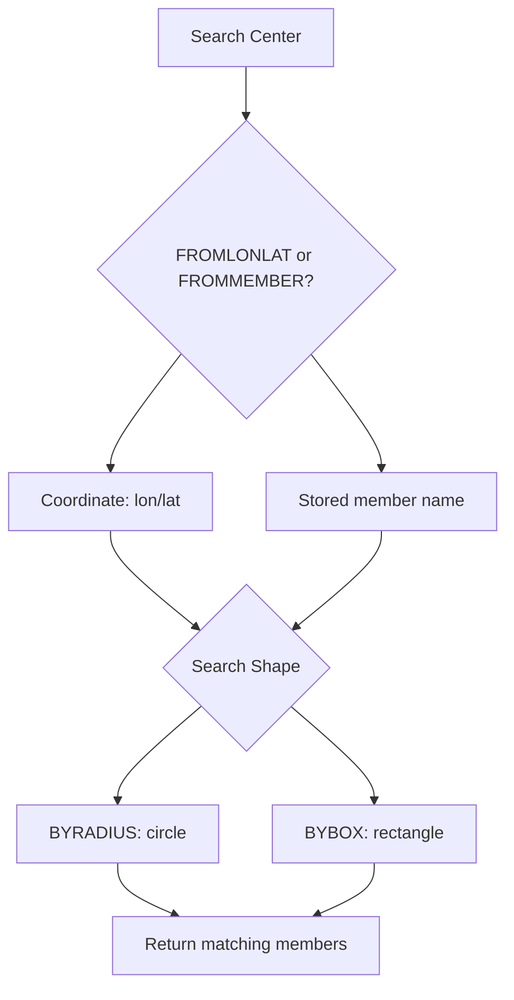

# How to Use GEOSEARCH in Redis for Flexible Geo Queries (Redis 6.2+)

Author: [nawazdhandala](https://www.github.com/nawazdhandala)

Tags: Redis, Geo, GEOSEARCH, Geospatial, Location

Description: Learn how to use GEOSEARCH (Redis 6.2+) to query a geospatial index by radius or bounding box from a coordinate or stored member.

---

Redis 6.2 introduced `GEOSEARCH` as the unified, modern replacement for `GEORADIUS` and `GEORADIUSBYMEMBER`. It supports both circular radius searches and rectangular bounding box searches, and accepts either a raw coordinate or a stored member as the search center.

## How GEOSEARCH Works

`GEOSEARCH` combines the functionality of the older commands into a single flexible interface. You choose your center point (coordinate or member) and your search shape (radius or bounding box), then optionally filter and sort the results.



## Syntax

```redis
GEOSEARCH key FROMMEMBER member | FROMLONLAT longitude latitude BYRADIUS radius m|km|ft|mi | BYBOX width height m|km|ft|mi ASC|DESC [COUNT count [ANY]] [WITHCOORD] [WITHDIST]
```

Key parameters:
- `FROMMEMBER member` - use a stored member as the center
- `FROMLONLAT lon lat` - use explicit coordinates as the center
- `BYRADIUS radius unit` - circular search
- `BYBOX width height unit` - rectangular bounding box search
- `ASC|DESC` - sort by distance from center
- `COUNT count [ANY]` - limit results; `ANY` stops after finding N matches
- `WITHCOORD` - include coordinates in results
- `WITHDIST` - include distance from center in results

## Setup

```redis
GEOADD locations -73.9857 40.7484 "times-square"
GEOADD locations -73.9654 40.7829 "central-park"
GEOADD locations -74.0059 40.7128 "battery-park"
GEOADD locations -73.9442 40.6782 "brooklyn-bridge"
GEOADD locations -73.9851 40.6892 "coney-island"
```

## Examples

### Radius Search from Coordinates

Find all locations within 5 km of a point, sorted by distance:

```redis
GEOSEARCH locations FROMLONLAT -73.9855 40.7580 BYRADIUS 5 km ASC WITHDIST
```

Output:

```text
1) 1) "times-square"
   2) "1.0521"
2) 1) "central-park"
   2) "2.8034"
3) 1) "battery-park"
   2) "4.9821"
```

### Radius Search from Stored Member

Find locations near `times-square` (already in the index):

```redis
GEOSEARCH locations FROMMEMBER times-square BYRADIUS 5 km ASC WITHDIST
```

### Bounding Box Search

Find locations within a 10km wide by 15km tall rectangle centered on a coordinate:

```redis
GEOSEARCH locations FROMLONLAT -73.9855 40.7580 BYBOX 10 15 km ASC
```

### Bounding Box from Stored Member

```redis
GEOSEARCH locations FROMMEMBER central-park BYBOX 20 20 km ASC WITHDIST COUNT 5
```

### With Coordinates and Count

```redis
GEOSEARCH locations FROMLONLAT -73.9855 40.7580 BYRADIUS 10 km ASC COUNT 3 WITHCOORD WITHDIST
```

## GEOSEARCH vs Older Commands

| Feature | GEORADIUS | GEORADIUSBYMEMBER | GEOSEARCH |
|---|---|---|---|
| From coordinates | Yes | No | Yes |
| From stored member | No | Yes | Yes |
| Radius search | Yes | Yes | Yes |
| Bounding box | No | No | Yes |
| Store results | Yes | Yes | Use GEOSEARCHSTORE |
| Redis version | All | All | 6.2+ |

## Use Cases

- **Mobile app nearby search** - find restaurants, ATMs, or points of interest near the user's GPS coordinates
- **Map viewport queries** - use `BYBOX` to return only locations visible in the current map view
- **Fleet management** - find vehicles within a service zone bounding box
- **Geofencing** - efficiently detect which tracked assets are within a defined area

## Summary

`GEOSEARCH` is the modern, unified geo query command for Redis 6.2+. Its support for both radius and bounding box searches, combined with flexible center-point options (coordinate or stored member), makes it the preferred choice for all new geospatial implementations. Use `GEOSEARCHSTORE` when you need to persist the results for caching or further processing.
