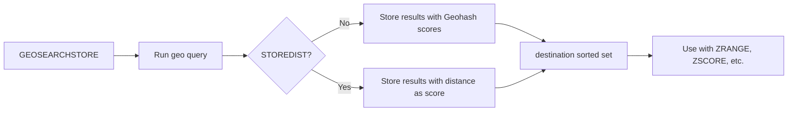

# How to Use GEOSEARCHSTORE in Redis to Store Geo Search Results

Author: [nawazdhandala](https://www.github.com/nawazdhandala)

Tags: Redis, Geo, GEOSEARCHSTORE, Geospatial, Caching

Description: Learn how to use GEOSEARCHSTORE (Redis 6.2+) to run a geospatial query and persist the results into a new sorted set for caching and reuse.

---

`GEOSEARCHSTORE` combines a `GEOSEARCH` query with result persistence. Instead of returning results to the caller, it writes them into a destination sorted set. This is the modern replacement for `GEORADIUS STORE` and `GEORADIUSBYMEMBER STORE`.

## How GEOSEARCHSTORE Works

`GEOSEARCHSTORE` runs the same geo query as `GEOSEARCH` but writes the matching member names (and optionally distances) into a new sorted set. The destination key can be used with `ZRANGE`, `ZSCORE`, or further geo queries.



## Syntax

```redis
GEOSEARCHSTORE destination source FROMMEMBER member | FROMLONLAT longitude latitude BYRADIUS radius m|km|ft|mi | BYBOX width height m|km|ft|mi ASC|DESC [COUNT count [ANY]] [STOREDIST]
```

- `destination` - key to write results into
- `source` - existing geo sorted set to query
- All other parameters match `GEOSEARCH`
- `STOREDIST` - store distance from center as the score instead of Geohash

## Setup

```redis
GEOADD stores -73.9857 40.7484 "manhattan-store"
GEOADD stores -73.9654 40.7829 "uptown-store"
GEOADD stores -74.0059 40.7128 "downtown-store"
GEOADD stores -73.9442 40.6782 "brooklyn-store"
GEOADD stores -74.1000 40.6500 "remote-store"
```

## Examples

### Store Nearby Results for Caching

Store stores within 5 km of a user's location for 60 seconds:

```redis
GEOSEARCHSTORE user:42:nearby-stores stores FROMLONLAT -73.9855 40.7580 BYRADIUS 5 km ASC COUNT 10
EXPIRE user:42:nearby-stores 60
```

Retrieve the cached results:

```redis
ZRANGE user:42:nearby-stores 0 -1
```

### Store with Distance as Score (STOREDIST)

Store results with distance (in km) as the sorted set score:

```redis
GEOSEARCHSTORE user:42:nearby-stores stores FROMLONLAT -73.9855 40.7580 BYRADIUS 5 km ASC STOREDIST
```

Now you can retrieve sorted by distance or check a specific store's distance:

```redis
ZSCORE user:42:nearby-stores manhattan-store
# Returns the distance in km
```

### Bounding Box Store

Store all stores in a map viewport:

```redis
GEOSEARCHSTORE viewport:current stores FROMLONLAT -73.9855 40.7580 BYBOX 20 20 km ASC
```

### From Stored Member

Find stores near another store and cache the result:

```redis
GEOSEARCHSTORE related:manhattan-store stores FROMMEMBER manhattan-store BYRADIUS 10 km ASC COUNT 5
```

## Return Value

`GEOSEARCHSTORE` returns the number of elements written to the destination key.

```text
(integer) 3
```

## GEOSEARCHSTORE vs GEORADIUS STORE

| Feature | GEORADIUS STORE | GEOSEARCHSTORE |
|---|---|---|
| Bounding box support | No | Yes |
| From stored member | No (use GEORADIUSBYMEMBER STORE) | Yes |
| STOREDIST option | Yes | Yes |
| Redis version | All (deprecated 6.2) | 6.2+ |

## Use Cases

- **Result caching** - store proximity results per user with a TTL to avoid repeated geo scans
- **Pre-computed zones** - run nightly batch queries and store the results for fast reads
- **Leaderboards by distance** - use `STOREDIST` to create a sorted list of nearest locations
- **Reusable query snapshots** - store a geo search result for multi-step pipelines

## Summary

`GEOSEARCHSTORE` bridges geo querying and data persistence, enabling you to cache proximity search results as standard sorted sets. Use `STOREDIST` when you want the distance as a sortable score, or omit it to retain Geohash encoding for further geo operations on the destination key. Combine with `EXPIRE` for time-limited caching of location-sensitive query results.
