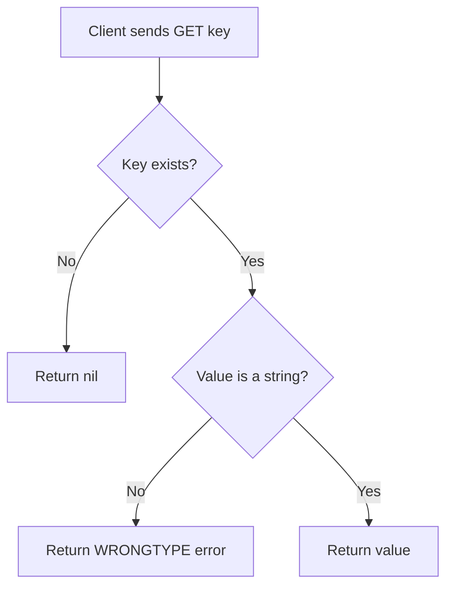

# How to Use the GET Command in Redis to Retrieve Values

Author: [nawazdhandala](https://www.github.com/nawazdhandala)

Tags: Redis, GET, String, Key-Value, Command, Read

Description: Learn how to use the Redis GET command to retrieve string values, handle missing keys, and understand its behavior with non-string types.

---

## How GET Works

`GET` returns the string value stored at a key. If the key does not exist, it returns a nil bulk string. If the key holds a value that is not a string (for example a List or Hash), `GET` returns a WRONGTYPE error because it only operates on string values.



## Syntax

```redis
GET key
```

- `key` - the name of the key whose value you want to retrieve

`GET` takes exactly one argument. For fetching multiple keys in one call, use `MGET`.

## Examples

### Basic retrieval

Store a value and fetch it back.

```redis
SET greeting "Hello, Redis!"
GET greeting
```

```text
"Hello, Redis!"
```

### Handling a missing key

When a key has never been set, `GET` returns nil rather than an error.

```redis
GET nonexistent_key
```

```text
(nil)
```

### Retrieving a numeric string

Redis stores everything as strings. A number set with `SET` is returned as a string.

```redis
SET page_views "42"
GET page_views
```

```text
"42"
```

### GET after a key expires

Once a key's TTL reaches zero, `GET` returns nil just as if the key never existed.

```redis
SET temp_key "temporary" EX 1
```

Wait 1 second, then:

```redis
GET temp_key
```

```text
(nil)
```

### WRONGTYPE error with a hash

Trying to use `GET` on a hash key returns an error.

```redis
HSET user:1 name "Alice"
GET user:1
```

```text
(error) WRONGTYPE Operation against a key holding the wrong kind of value
```

### Using GET in a script (Lua example)

`GET` is commonly called inside Redis Lua scripts for atomic read-modify-write operations.

```redis
EVAL "return redis.call('GET', KEYS[1])" 1 greeting
```

```text
"Hello, Redis!"
```

## Comparison with related commands

| Command | Description |
|---------|-------------|
| `GET key` | Retrieve a single string value |
| `MGET key [key ...]` | Retrieve multiple string values in one call |
| `GETDEL key` | Retrieve value and delete the key atomically |
| `GETEX key [EX/PX/...]` | Retrieve value and optionally update expiry |
| `GETRANGE key start end` | Retrieve a substring of the value |
| `GETSET key value` | (Deprecated) Atomically set and return old value |

## Use Cases

- Reading cached HTML fragments, computed results, or serialized objects stored as JSON strings
- Checking whether a distributed lock token matches before releasing it
- Fetching a session payload by session ID
- Reading configuration values stored in Redis as strings

## Summary

`GET` is Redis's primary read command for string values. It returns the value if the key exists, nil if the key is absent, and an error if the key holds a non-string type. For most caching and key-value storage patterns, `GET` paired with `SET` forms the foundation of Redis usage. When you need more power - expiry updates, atomic deletion, or bulk reads - reach for `GETEX`, `GETDEL`, or `MGET`.
