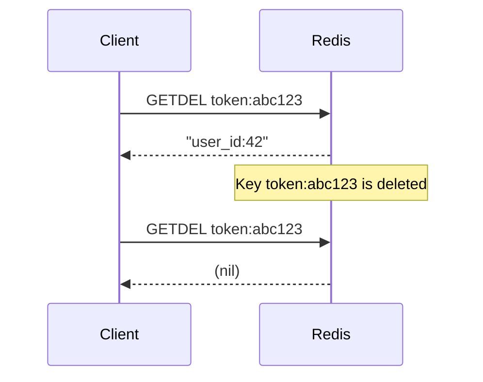
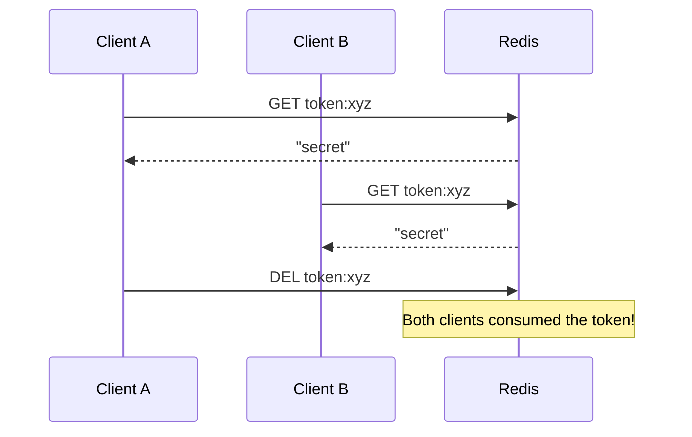
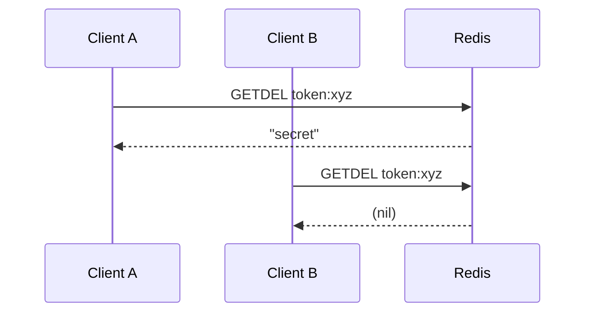

# How to Use GETDEL in Redis to Get and Delete a Key Atomically

Author: [nawazdhandala](https://www.github.com/nawazdhandala)

Tags: Redis, GETDEL, Atomic, String, Command, One-Time Token

Description: Learn how to use the Redis GETDEL command to atomically retrieve a value and delete the key in a single operation, ideal for one-time tokens and pop patterns.

---

## How GETDEL Works

`GETDEL` retrieves the string value stored at a key and then deletes the key - all in a single atomic operation. If the key does not exist, it returns nil without error. Because the read and delete happen atomically, no other client can read the value between the GET and the DELETE.

`GETDEL` was introduced in Redis 6.2. Before that, the common workaround was `GETSET key ""` or a Lua script combining GET and DEL.



## Syntax

```redis
GETDEL key
```

- Returns the value if the key existed, then deletes it
- Returns nil if the key does not exist
- Returns WRONGTYPE error if the value is not a string

## Examples

### Basic get and delete

```redis
SET temp:key "temporary_value"
GETDEL temp:key
GETDEL temp:key
```

```text
OK
"temporary_value"
(nil)
```

The second call returns nil because the key was deleted by the first call.

### One-time password (OTP) validation

Store an OTP, then consume it atomically during verification.

```redis
SET otp:user:42 "847291" EX 300
GETDEL otp:user:42
GETDEL otp:user:42
```

```text
OK
"847291"
(nil)
```

The second `GETDEL` returns nil, preventing replay attacks.

### Email verification token

```redis
SET verify:token:abc123 "user_id:99" EX 86400
GETDEL verify:token:abc123
```

```text
OK
"user_id:99"
```

Once consumed, the token is gone - the link cannot be used again.

### Password reset token

```redis
SET reset:550e8400-e29b-41d4-a716-446655440000 "email:alice@example.com" EX 3600
GETDEL reset:550e8400-e29b-41d4-a716-446655440000
```

```text
OK
"email:alice@example.com"
```

### Queue pop pattern

Pop a single work item from a simple string-based queue key. (For real queues, use `LPOP`/`RPOP` on a List.)

```redis
SET next:job "process_report_42"
GETDEL next:job
```

```text
OK
"process_report_42"
```

### Compare GETDEL vs GET + DEL

Without `GETDEL`, a race condition can occur between the GET and the DEL:



With `GETDEL`, only one client can retrieve the value:



## Use Cases

| Pattern | Description |
|---------|-------------|
| OTP / 2FA codes | Consume verification codes exactly once |
| Email verification tokens | Single-use confirmation links |
| Password reset links | One-time reset tokens |
| CSRF tokens | Consume after validating a form submission |
| Job claim tokens | Assign a job to exactly one worker |
| Idempotency keys | Check and clear in one shot |

## Summary

`GETDEL` elegantly solves the read-then-delete race condition by combining both operations into one atomic command. It returns the value if the key exists and deletes it in the same step, guaranteeing that no two clients can retrieve the same value. It is the ideal tool for one-time tokens, OTPs, email verification, and any pattern where a value should be consumed exactly once.
