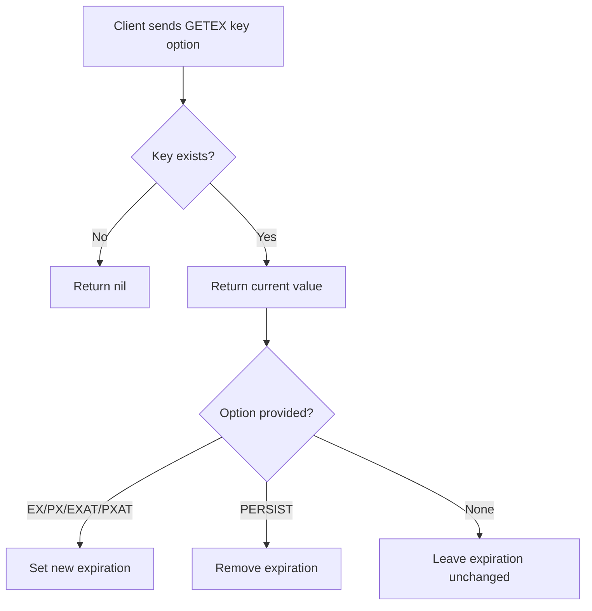
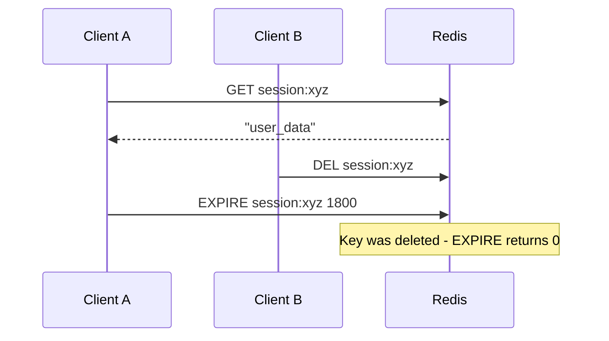

# How to Use GETEX in Redis to Get a Value and Set Expiration

Author: [nawazdhandala](https://www.github.com/nawazdhandala)

Tags: Redis, GETEX, Expiration, TTL, String, Command, Session

Description: Learn how to use the Redis GETEX command to retrieve a value and simultaneously update or remove its expiration in a single atomic operation.

---

## How GETEX Works

`GETEX` retrieves the string value at a key and optionally modifies its expiration in the same atomic operation. It was introduced in Redis 6.2 as a replacement for the common `GET` + `EXPIRE` pattern, eliminating the race condition between the two commands.

You can use `GETEX` to extend a TTL on access (sliding expiration), set an absolute expiry, or even remove an expiry entirely - all in one round-trip.



## Syntax

```redis
GETEX key [EX seconds | PX milliseconds | EXAT unix-time-seconds | PXAT unix-time-milliseconds | PERSIST]
```

- `EX seconds` - set expiry in seconds
- `PX milliseconds` - set expiry in milliseconds
- `EXAT unix-time-seconds` - set expiry as Unix timestamp (seconds)
- `PXAT unix-time-milliseconds` - set expiry as Unix timestamp (milliseconds)
- `PERSIST` - remove any existing expiration (make the key persistent)
- No option - retrieve value without changing expiry (equivalent to `GET`)

Returns the value or nil if the key does not exist.

## Examples

### GETEX without options (equivalent to GET)

Read a value without modifying its TTL.

```redis
SET greeting "Hello" EX 3600
GETEX greeting
TTL greeting
```

```text
OK
"Hello"
(integer) 3599
```

### Sliding expiration (extend TTL on access)

Refresh a session's expiry each time it is read.

```redis
SET session:abc123 "user_data" EX 1800
GETEX session:abc123 EX 1800
TTL session:abc123
```

```text
OK
"user_data"
(integer) 1800
```

The TTL was reset to 1800 seconds at the moment of access.

### Set expiry in milliseconds

```redis
SET short_lived "data" PX 5000
GETEX short_lived PX 10000
PTTL short_lived
```

```text
OK
"data"
(integer) 9999
```

### Set absolute expiry with EXAT

Fetch a value and set it to expire at a specific Unix timestamp.

```redis
SET promo "SAVE20"
GETEX promo EXAT 1751328000
TTL promo
```

```text
OK
"SAVE20"
(integer) <seconds until 2026-07-01>
```

### Remove expiry with PERSIST

Make a key permanent after it was set with a TTL.

```redis
SET temp_config "debug=true" EX 600
TTL temp_config
GETEX temp_config PERSIST
TTL temp_config
```

```text
OK
(integer) 599
"debug=true"
(integer) -1
```

TTL of -1 means the key now has no expiration.

### GET + EXPIRE race condition (why GETEX matters)

Without `GETEX`, two separate commands leave a window for another client to delete the key between them:



`GETEX` eliminates this window by combining both steps atomically.

### Practical session handler

A web server reads a session and resets its TTL on every request.

```redis
SET session:token789 '{"user_id":42,"role":"editor"}' EX 3600
GETEX session:token789 EX 3600
```

```text
OK
"{\"user_id\":42,\"role\":\"editor\"}"
```

## Use Cases

| Option | Use case |
|--------|----------|
| `EX` / `PX` | Sliding session expiration, cache refresh |
| `EXAT` / `PXAT` | Token valid until a fixed point in time |
| `PERSIST` | Promote a temporary key to permanent on first use |
| No option | Read without touching TTL (same as GET) |

## Summary

`GETEX` combines a value read with an expiry update in a single atomic operation, making it ideal for sliding expiration patterns, session management, and any scenario where you want to refresh a TTL when a key is accessed. It eliminates the GET + EXPIRE race condition and reduces network round-trips. Use `PERSIST` to clear an expiry, or omit the option entirely to read without changing the TTL.
