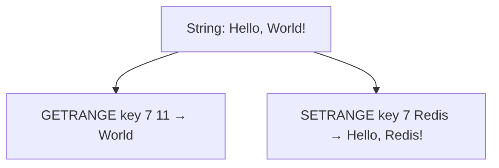

# How to Use GETRANGE and SETRANGE in Redis for Substring Operations

Author: [nawazdhandala](https://www.github.com/nawazdhandala)

Tags: Redis, GETRANGE, SETRANGE, String, Substring, Bit Manipulation, Command

Description: Learn how to use Redis GETRANGE and SETRANGE to read and overwrite substrings of string values, enabling efficient in-place updates without replacing the entire value.

---

## How GETRANGE and SETRANGE Work

`GETRANGE` returns a substring of the string value stored at a key, specified by start and end byte offsets (inclusive). Negative offsets count from the end of the string: -1 is the last byte, -2 is the second-to-last, and so on.

`SETRANGE` overwrites part of a string starting at a given byte offset. If the offset is beyond the current length, Redis zero-pads the string to reach the offset before writing. If the key does not exist, it is created as a zero-length string and then padded.



## Syntax

```redis
GETRANGE key start end
SETRANGE key offset value
```

- `GETRANGE`: `start` and `end` are zero-based byte offsets (inclusive). Negative values count from end.
- `SETRANGE`: `offset` is a zero-based byte offset. Returns the length of the string after modification.

## Examples

### GETRANGE - extract a substring

Store a greeting and extract just the name.

```redis
SET message "Hello, Alice!"
GETRANGE message 7 11
```

```text
"Alice"
```

### GETRANGE with negative offsets

Use -1 to get the last character, or a range to get the last word.

```redis
SET message "Hello, Alice!"
GETRANGE message -6 -2
GETRANGE message -1 -1
```

```text
"Alice"
"!"
```

### GETRANGE on the full string

Using 0 and -1 returns the entire string (equivalent to `GET`).

```redis
GETRANGE message 0 -1
```

```text
"Hello, Alice!"
```

### SETRANGE - overwrite part of a string

Replace "Alice" with "Redis" in place.

```redis
SET message "Hello, Alice!"
SETRANGE message 7 "Redis"
GET message
```

```text
OK
(integer) 13
"Hello, Redis!"
```

The string length stays the same if the replacement is the same length. If the replacement is shorter, only those bytes are overwritten - the remaining bytes keep their original values.

### SETRANGE with a shorter replacement

Overwrite "World" with "Hi" - only the first two bytes of "World" are replaced.

```redis
SET message "Hello, World!"
SETRANGE message 7 "Hi"
GET message
```

```text
OK
(integer) 13
"Hello, Hirld!"
```

### SETRANGE with zero-padding

If the offset is beyond the current string length, Redis zero-pads the gap.

```redis
SET short "Hi"
SETRANGE short 5 "!"
GET short
```

```text
OK
(integer) 6
"Hi\x00\x00\x00!"
```

### Binary record updates

Use `SETRANGE` to update fields in a fixed-width binary record. For example, a 10-byte record where bytes 0-3 are a user ID and bytes 4-7 are a score.

```redis
SET record:1 "\x00\x00\x00\x2a\x00\x00\x00\x64\x00\x00"
SETRANGE record:1 4 "\x00\x00\x00\xc8"
GETRANGE record:1 4 7
```

```text
OK
(integer) 10
"\x00\x00\x00\xc8"
```

### Combining GETRANGE and SETRANGE for in-place edits

Edit a log entry stored in Redis.

```redis
SET log:entry "2026-03-31 ERROR: disk full"
GETRANGE log:entry 11 15
SETRANGE log:entry 11 "WARN "
GET log:entry
```

```text
"ERROR"
(integer) 26
"2026-03-31 WARN : disk full"
```

## Important notes

- Both commands work on byte offsets, not character positions. Multi-byte UTF-8 characters span multiple bytes.
- `GETRANGE` never returns an error for out-of-range offsets - it clamps to the actual string boundaries and returns an empty string if start > end.
- `SETRANGE` can increase the length of the stored string if `offset + len(value) > len(current)`.
- Redis strings are capped at 512 MB.

## Use Cases

- Fixed-width binary record storage and in-place field updates
- Log line manipulation without reading and re-writing the full string
- In-place timestamp or version field updates
- Compact packed-data formats (e.g., bloom filters, bit arrays beyond BITSET resolution)

## Summary

`GETRANGE` and `SETRANGE` give you byte-level read and write access to Redis strings. They are particularly useful for fixed-width binary records, in-place updates, and compact data structures where you want to modify part of a value without a full read-modify-write cycle. For character-oriented use cases remember that byte offsets differ from character positions in multi-byte encodings.
