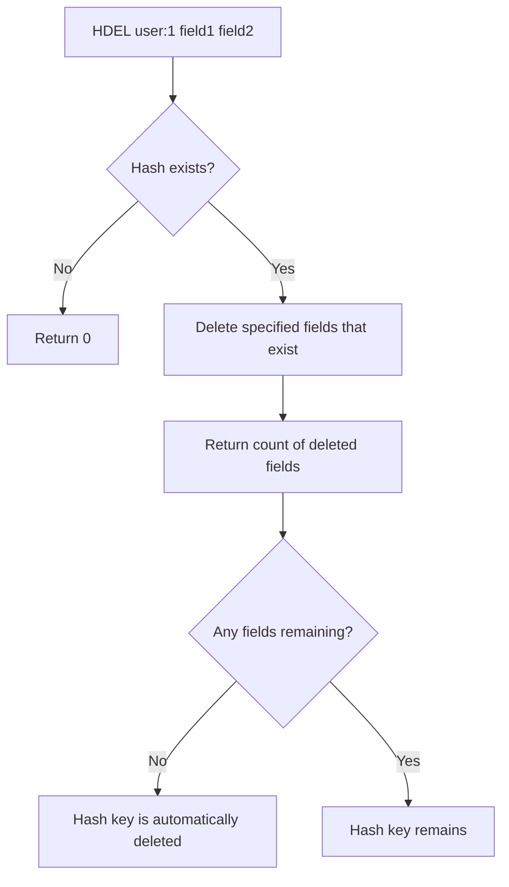

# How to Use HDEL in Redis to Remove Hash Fields

Author: [nawazdhandala](https://www.github.com/nawazdhandala)

Tags: Redis, HDEL, Hash, Delete, Field, Command

Description: Learn how to use the Redis HDEL command to remove one or more fields from a hash, with examples for profile cleanup, cache invalidation, and schema migration.

---

## How HDEL Works

`HDEL` removes one or more fields from a hash stored at a key. It returns the number of fields that were actually deleted (ignoring specified fields that did not exist). If all fields are removed, the hash key itself is automatically deleted by Redis. If the key does not exist at all, the command returns 0.



## Syntax

```redis
HDEL key field [field ...]
```

Returns the number of fields that were removed (0 if none were found or the key did not exist).

## Examples

### Delete a single field

```redis
HSET user:1 name "Alice" email "alice@example.com" role "admin" temp_token "abc123"
HDEL user:1 temp_token
HGETALL user:1
```

```text
(integer) 4
(integer) 1
1) "name"
2) "Alice"
3) "email"
4) "alice@example.com"
5) "role"
6) "admin"
```

### Delete multiple fields at once

```redis
HSET user:1 name "Alice" email "alice@example.com" role "admin" cache "data" debug "true"
HDEL user:1 cache debug
HGETALL user:1
```

```text
(integer) 5
(integer) 2
1) "name"
2) "Alice"
3) "email"
4) "alice@example.com"
5) "role"
6) "admin"
```

### HDEL on non-existent field

Returns 0 for fields that do not exist, without an error.

```redis
HDEL user:1 nonexistent_field
```

```text
(integer) 0
```

### HDEL on non-existent key

Also returns 0.

```redis
HDEL missing_key field1
```

```text
(integer) 0
```

### Mixed: some fields exist, some do not

`HDEL` only counts and removes fields that actually exist.

```redis
HSET user:1 name "Alice" email "alice@example.com"
HDEL user:1 email phone
```

```text
(integer) 2
(integer) 1
```

Only `email` existed, so 1 field was deleted. `phone` was silently ignored.

### Auto-deletion when all fields are removed

When you delete the last remaining field, the hash key is removed automatically.

```redis
HSET temp:hash field1 "value1"
HDEL temp:hash field1
EXISTS temp:hash
```

```text
(integer) 1
(integer) 1
(integer) 0
```

### Removing sensitive data from a profile

After processing, remove sensitive fields from a stored record.

```redis
HSET user:42 name "Bob" email "bob@example.com" password_hash "bcrypt..." reset_token "xyz789" session_temp "abc"
HDEL user:42 password_hash reset_token session_temp
HGETALL user:42
```

```text
(integer) 5
(integer) 3
1) "name"
2) "Bob"
3) "email"
4) "bob@example.com"
```

## Use Cases

- Removing temporary fields (reset tokens, cached fragments) after use
- Schema migration: dropping deprecated fields from stored objects
- Clearing sensitive data (password hashes, tokens) after consumption
- Cache invalidation: remove specific cached sub-fields without deleting the whole hash
- User preferences reset: delete specific settings to restore defaults

## Summary

`HDEL` removes one or more named fields from a Redis hash and returns how many were actually deleted. It silently ignores fields that do not exist and automatically deletes the hash key when the last field is removed. Use it to clean up temporary fields, migrate schemas, or remove sensitive data after processing. For removing all fields at once, use `DEL key` to delete the entire hash.
