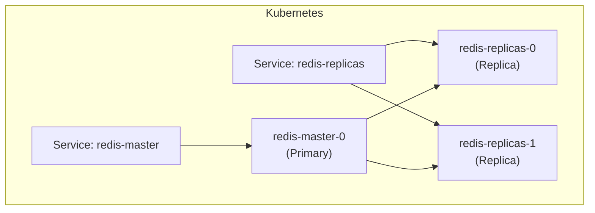

# How to Use Redis Helm Chart for Kubernetes Deployment

Author: [nawazdhandala](https://www.github.com/nawazdhandala)

Tags: Redis, Helm, Kubernetes, Infrastructure, Deployment

Description: Learn how to deploy Redis on Kubernetes using the Bitnami Redis Helm chart, including standalone and replication modes, persistence, and authentication configuration.

---

## Introduction

The Bitnami Redis Helm chart is the most widely used way to deploy Redis on Kubernetes. It supports standalone, replication (primary + replicas), and Sentinel modes, and handles persistent volumes, secrets, ConfigMaps, and services automatically.

## Prerequisites

- Kubernetes cluster (1.19+)
- Helm 3.x installed
- kubectl configured

## Add the Bitnami Repository

```bash
helm repo add bitnami https://charts.bitnami.com/bitnami
helm repo update
```

## Quick Install (Standalone, No Persistence)

```bash
helm install redis bitnami/redis \
  --set architecture=standalone \
  --set auth.enabled=false \
  --set master.persistence.enabled=false
```

## Standalone Redis with Persistence and Auth

```bash
helm install redis bitnami/redis \
  --namespace redis \
  --create-namespace \
  --set architecture=standalone \
  --set auth.password=your_strong_password \
  --set master.persistence.enabled=true \
  --set master.persistence.size=10Gi \
  --set master.resources.requests.memory=256Mi \
  --set master.resources.limits.memory=512Mi
```

## Using a Custom values.yaml

```yaml
# redis-values.yaml
architecture: standalone

auth:
  enabled: true
  password: "your_strong_password"

master:
  persistence:
    enabled: true
    size: 10Gi
    storageClass: "standard"
  resources:
    requests:
      memory: 256Mi
      cpu: 100m
    limits:
      memory: 512Mi
      cpu: 500m
  configuration: |
    maxmemory 400mb
    maxmemory-policy allkeys-lru
    appendonly yes
    appendfsync everysec

metrics:
  enabled: true
  serviceMonitor:
    enabled: true
```

Apply:

```bash
helm install redis bitnami/redis \
  --namespace redis \
  --create-namespace \
  -f redis-values.yaml
```

## Primary + Replica Architecture

```yaml
# redis-replication-values.yaml
architecture: replication

auth:
  enabled: true
  password: "your_strong_password"

master:
  persistence:
    enabled: true
    size: 10Gi

replica:
  replicaCount: 2
  persistence:
    enabled: true
    size: 10Gi
```



## Verify Installation

```bash
kubectl get pods -n redis
# NAME                    READY   STATUS    RESTARTS   AGE
# redis-master-0          1/1     Running   0          2m
# redis-replicas-0        1/1     Running   0          90s
# redis-replicas-1        1/1     Running   0          60s

kubectl get svc -n redis
# NAME              TYPE        CLUSTER-IP      PORT(S)    AGE
# redis-headless    ClusterIP   None            6379/TCP   2m
# redis-master      ClusterIP   10.96.20.100    6379/TCP   2m
# redis-replicas    ClusterIP   10.96.20.101    6379/TCP   2m
```

## Connect to Redis

```bash
# Get the Redis password
export REDIS_PASSWORD=$(kubectl get secret --namespace redis redis -o jsonpath="{.data.redis-password}" | base64 -d)

# Open Redis CLI
kubectl exec -it redis-master-0 -n redis -- redis-cli -a "$REDIS_PASSWORD" PING
# PONG
```

## Upgrade the Chart

```bash
helm upgrade redis bitnami/redis \
  --namespace redis \
  -f redis-values.yaml
```

## Uninstall

```bash
helm uninstall redis --namespace redis
# Note: PVCs are not deleted automatically
kubectl delete pvc -n redis --all
```

## Key Chart Parameters

| Parameter | Description | Default |
|---|---|---|
| `architecture` | `standalone` or `replication` | `replication` |
| `auth.enabled` | Enable password auth | `true` |
| `auth.password` | Redis password | auto-generated |
| `master.persistence.size` | PVC size for primary | `8Gi` |
| `replica.replicaCount` | Number of replicas | `3` |
| `metrics.enabled` | Enable Prometheus metrics exporter | `false` |

## Summary

The Bitnami Redis Helm chart provides a production-ready Redis deployment on Kubernetes with minimal configuration. Use `architecture: standalone` for simple single-instance setups and `architecture: replication` for high availability. Customize with `values.yaml` for persistence, auth, resource limits, and Redis configuration. Enable `metrics.enabled: true` to expose Prometheus metrics via the redis_exporter sidecar.
