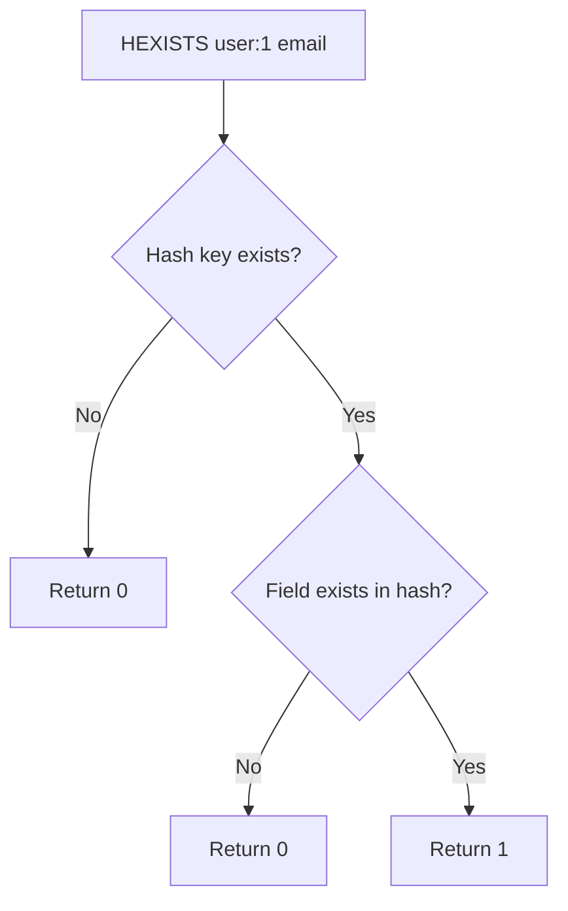

# How to Use HEXISTS in Redis to Check if a Hash Field Exists

Author: [nawazdhandala](https://www.github.com/nawazdhandala)

Tags: Redis, HEXISTS, Hash, Field, Existence, Command

Description: Learn how to use the Redis HEXISTS command to check whether a specific field exists in a hash, enabling conditional logic without reading the field value.

---

## How HEXISTS Works

`HEXISTS` checks whether a specific field exists in a hash stored at a key. It returns 1 if the field exists, or 0 if either the field does not exist or the key itself does not exist. It does not return the value - only a boolean indicator.

This is more efficient than reading the value with `HGET` when you only need to know if a field is present.



## Syntax

```redis
HEXISTS key field
```

Returns:
- `1` - the field exists in the hash
- `0` - the field does not exist, or the key does not exist

## Examples

### Basic existence check

```redis
HSET user:1 name "Alice" email "alice@example.com" role "admin"
HEXISTS user:1 email
HEXISTS user:1 phone
```

```text
(integer) 3
(integer) 1
(integer) 0
```

### Check on a non-existent key

Returns 0, not an error.

```redis
HEXISTS nonexistent_key some_field
```

```text
(integer) 0
```

### Conditional field update

Use `HEXISTS` before conditionally setting a field.

```redis
HSET config:app timeout "30" retries "3"
HEXISTS config:app debug
```

```text
(integer) 2
(integer) 0
```

Because `debug` does not exist, you can safely initialize it:

```redis
HSETNX config:app debug "false"
```

```text
(integer) 1
```

### Check if a token field has been set

Verify that a one-time token field is present before validation.

```redis
HSET user:42 name "Alice" email "alice@example.com"
HSET user:42 reset_token "abc123"
HEXISTS user:42 reset_token
```

```text
(integer) 1
(integer) 1
(integer) 1
```

After consuming the token:

```redis
HDEL user:42 reset_token
HEXISTS user:42 reset_token
```

```text
(integer) 1
(integer) 0
```

### Check onboarding progress

Track which onboarding steps a user has completed by the presence of fields.

```redis
HSET onboarding:user:5 step_welcome "done" step_profile "done"
HEXISTS onboarding:user:5 step_welcome
HEXISTS onboarding:user:5 step_billing
```

```text
(integer) 2
(integer) 1
(integer) 0
```

### HEXISTS vs HGET for existence checks

| Approach | Returns | Use when |
|----------|---------|----------|
| `HEXISTS key field` | 1 or 0 | You only need to know if the field exists |
| `HGET key field` | value or nil | You need the value and can treat nil as absent |

Both are O(1). `HEXISTS` is semantically cleaner when you have no interest in the value.

## Use Cases

- Check if an optional profile field has been filled in
- Verify that a cache entry's sub-field is populated before serving
- Confirm a one-time token field exists before consuming it with HDEL
- Gate access to features based on presence of a "feature_enabled" field
- Validate that all required fields are present in a stored record

## Summary

`HEXISTS` is a clean O(1) boolean check for hash field presence. It returns 1 if the field exists and 0 if it does not (or if the key is missing). Use it when you need conditional logic based on field existence without reading the value. For scenarios where you would use the value if it exists, a `HGET` check against nil is equally valid and saves a round-trip.
