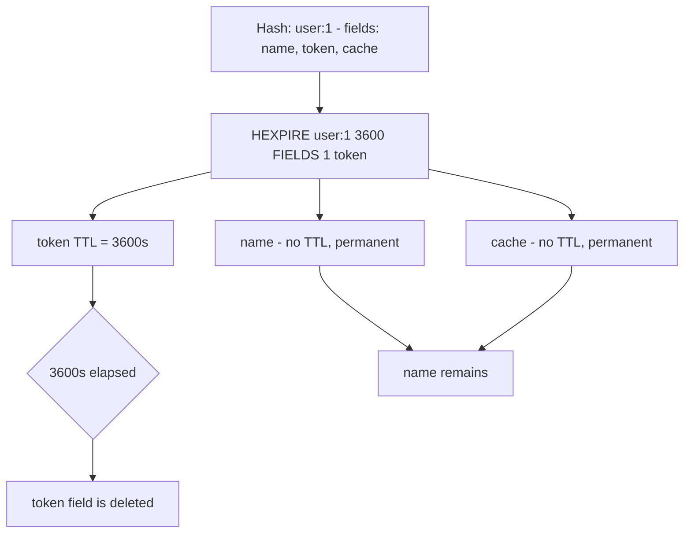

# How to Use HEXPIRE in Redis to Set Per-Field TTL (Redis 7.4+)

Author: [nawazdhandala](https://www.github.com/nawazdhandala)

Tags: Redis, HEXPIRE, Hash, TTL, Expiration, Field, Command

Description: Learn how to use the Redis HEXPIRE command (Redis 7.4+) to set individual expiration times on specific hash fields, enabling fine-grained TTL control within a single hash.

---

## How HEXPIRE Works

Before Redis 7.4, TTLs could only be set at the key level - the entire hash expired together. `HEXPIRE` (Hash Field EXPIRE), introduced in Redis 7.4, lets you set expiration times on individual fields within a hash. When a field's TTL expires, only that field is deleted; the rest of the hash remains intact.

This enables powerful patterns like session data where different fields have different lifetimes, or hash-based caches where individual entries expire independently.



## Syntax

```redis
HEXPIRE key seconds [NX | XX | GT | LT] FIELDS numfields field [field ...]
```

- `seconds` - TTL in seconds from now
- `NX` - set expiry only if the field has NO existing expiry
- `XX` - set expiry only if the field ALREADY has an expiry
- `GT` - set expiry only if the new TTL is GREATER than the current TTL
- `LT` - set expiry only if the new TTL is LESS than the current TTL
- `FIELDS numfields field [field ...]` - the fields to apply the TTL to

Returns an array of integers, one per field:
- `2` - field was updated with the new expiry
- `1` - field was updated (condition met)
- `0` - field does not exist
- `-1` - condition (NX/XX/GT/LT) was not met
- `-2` - field does not exist in the hash

## Examples

### Basic HEXPIRE

Set a 1-hour TTL on the `token` field of a user hash.

```redis
HSET user:1 name "Alice" email "alice@example.com" token "abc123" cache "fragment"
HEXPIRE user:1 3600 FIELDS 1 token
```

```text
(integer) 4
1) (integer) 1
```

### Set TTL on multiple fields at once

Expire both the `token` and `cache` fields in one call.

```redis
HEXPIRE user:1 3600 FIELDS 2 token cache
```

```text
1) (integer) 1
2) (integer) 1
```

### Check field TTL with HTTL

```redis
HSET session:abc user_id "42" data "payload" temp_flag "1"
HEXPIRE session:abc 1800 FIELDS 1 temp_flag
HTTL session:abc FIELDS 1 temp_flag
```

```text
(integer) 3
1) (integer) 1
1) (integer) 1800
```

### Conditional expiry with NX

Only set expiry if the field has no current expiry.

```redis
HSET user:1 token "xyz789"
HEXPIRE user:1 3600 NX FIELDS 1 token
HEXPIRE user:1 7200 NX FIELDS 1 token
HTTL user:1 FIELDS 1 token
```

```text
(integer) 1
1) (integer) 1
1) (integer) -1
1) (integer) 3600
```

The second `HEXPIRE NX` returned -1 (condition not met) because the field already had a TTL.

### Conditional expiry with GT (extend only)

Only extend the TTL if the new value is larger.

```redis
HSET cache:user:42 fragment "<html>..."
HEXPIRE cache:user:42 300 FIELDS 1 fragment
HEXPIRE cache:user:42 600 GT FIELDS 1 fragment
HEXPIRE cache:user:42 100 GT FIELDS 1 fragment
HTTL cache:user:42 FIELDS 1 fragment
```

```text
(integer) 1
1) (integer) 1
1) (integer) 1
1) (integer) -1
1) (integer) 600
```

The third call (100 seconds, less than current 600) returned -1 and was rejected by GT.

### Non-existent field

```redis
HEXPIRE user:1 3600 FIELDS 1 nonexistent_field
```

```text
1) (integer) -2
```

## HEXPIRE vs key-level EXPIRE

| Feature | Key-level EXPIRE | Per-field HEXPIRE |
|---------|-----------------|-------------------|
| Granularity | Entire key | Individual fields |
| Redis version | All versions | 7.4+ |
| Use case | All fields expire together | Fields have independent lifetimes |

## Use Cases

- Session tokens with shorter lifetimes than the rest of the user hash
- Cache fragments within a larger data hash
- Time-limited feature flags stored alongside permanent user data
- Expiring temporary fields (OTPs, verification codes) without deleting the whole hash
- Rate limit counters embedded in a user hash with window-based TTLs

## Summary

`HEXPIRE` (Redis 7.4+) enables per-field TTL control within a hash, a powerful feature that was previously impossible without workarounds. You can expire individual fields while the rest of the hash remains intact, set conditional expiries with NX/XX/GT/LT, and apply expiry to multiple fields in one call. Use `HTTL` to inspect remaining TTLs and `HPERSIST` to remove an expiry from a field.
