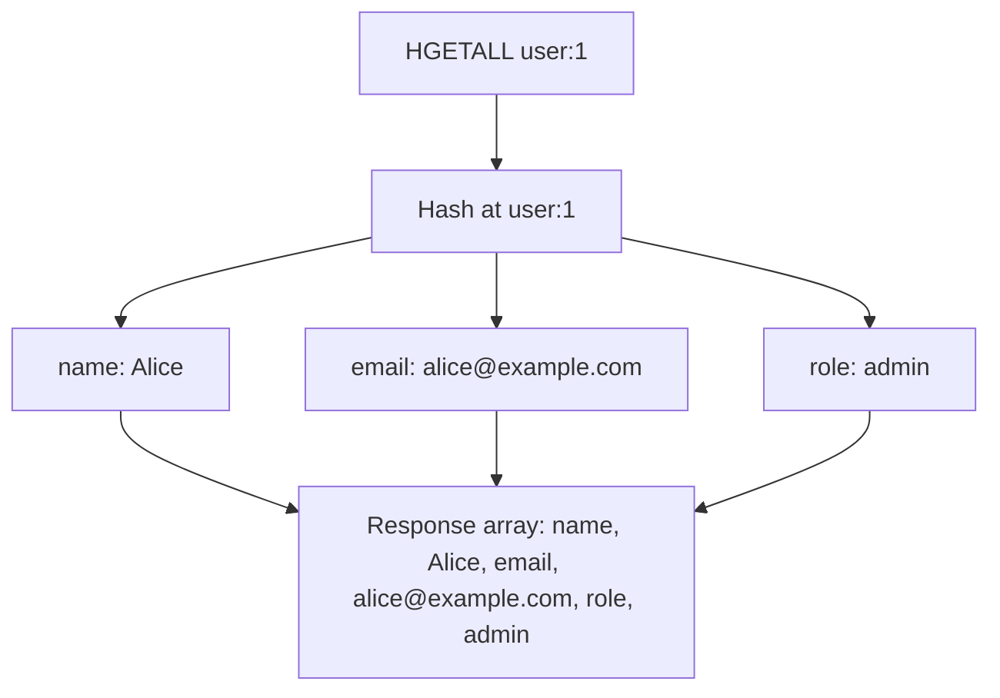
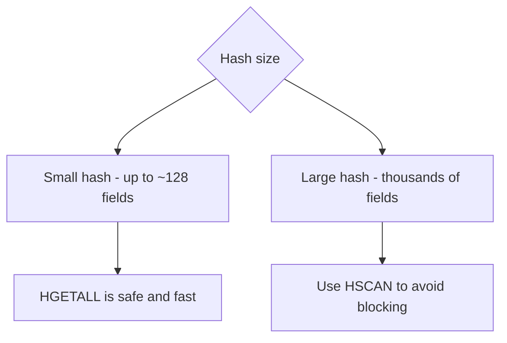

# How to Use HGETALL in Redis to Retrieve All Hash Fields

Author: [nawazdhandala](https://www.github.com/nawazdhandala)

Tags: Redis, HGETALL, Hash, Field, Command, Data Structure

Description: Learn how to use the Redis HGETALL command to retrieve all field-value pairs from a hash in one call, and understand its performance implications for large hashes.

---

## How HGETALL Works

`HGETALL` returns all fields and their values from a hash stored at a key. The result is a flat array alternating between field names and values: `[field1, value1, field2, value2, ...]`. If the key does not exist, it returns an empty array. If the key exists but is not a hash, Redis returns a WRONGTYPE error.



## Syntax

```redis
HGETALL key
```

Returns an array of field-value pairs (flat list), or an empty array if the key does not exist.

## Examples

### Basic HGETALL

```redis
HSET user:1 name "Alice" email "alice@example.com" role "admin" age "30"
HGETALL user:1
```

```text
(integer) 4
1) "name"
2) "Alice"
3) "email"
4) "alice@example.com"
5) "role"
6) "admin"
7) "age"
8) "30"
```

### HGETALL on a non-existent key

Returns an empty list, not an error.

```redis
HGETALL nonexistent_key
```

```text
(empty array)
```

### Product record retrieval

```redis
HSET product:101 name "Laptop" price "999.99" stock "25" brand "TechCo"
HGETALL product:101
```

```text
(integer) 4
1) "name"
2) "Laptop"
3) "price"
4) "999.99"
5) "stock"
6) "25"
7) "brand"
8) "TechCo"
```

### Session data retrieval

```redis
HSET session:xyz user_id "42" role "editor" login_time "1743379200"
HGETALL session:xyz
```

```text
(integer) 3
1) "user_id"
2) "42"
3) "role"
4) "editor"
5) "login_time"
6) "1743379200"
```

### Parsing HGETALL output in application code

Most Redis client libraries convert the flat array into a dictionary/map automatically. In raw Redis CLI output, you need to pair every two elements.

```bash
redis-cli HGETALL user:1
```

```text
name
Alice
email
alice@example.com
role
admin
```

In Python (redis-py), `HGETALL` returns a dict:

```text
{'name': 'Alice', 'email': 'alice@example.com', 'role': 'admin'}
```

## Performance considerations

`HGETALL` is O(N) where N is the number of fields in the hash. For small hashes (typical objects), it is fast and efficient. For hashes with thousands or millions of fields, prefer `HSCAN` to iterate without blocking Redis.



## HGETALL vs alternatives

| Command | Returns | Use when |
|---------|---------|----------|
| `HGETALL key` | All field-value pairs | Small to medium hashes |
| `HKEYS key` | Only field names | You only need the keys |
| `HVALS key` | Only values | You only need the values |
| `HMGET key f1 f2...` | Specific fields | You know which fields you need |
| `HSCAN key cursor` | Paginated results | Large hashes |

## Use Cases

- Loading a full user profile into memory for processing
- Dumping all configuration settings for an application
- Fetching a complete session object for authentication
- Debugging or logging all fields of a hash record
- Hydrating an object model from Redis in one round-trip

## Summary

`HGETALL` retrieves every field-value pair in a hash in a single round-trip. It is the most convenient way to load a complete object from Redis. For small to medium-sized hashes, it is efficient and straightforward. For large hashes, prefer `HSCAN` to avoid blocking Redis with a single O(N) operation. Most Redis client libraries automatically deserialize the flat array response into a native map or dictionary.
