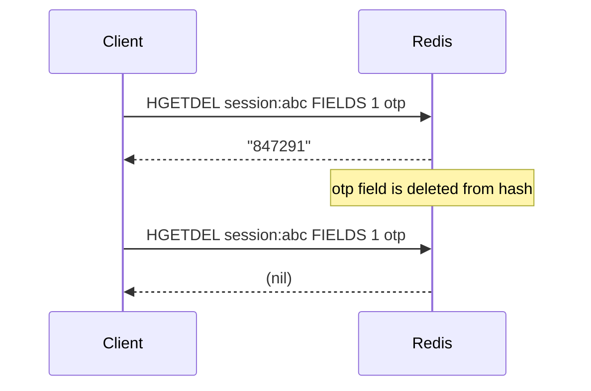
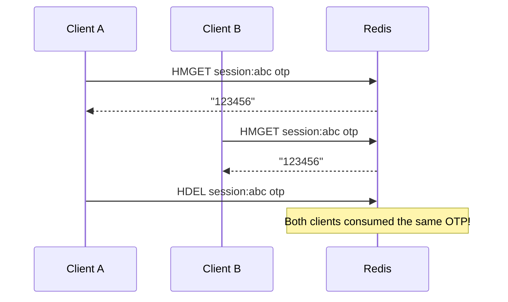

# How to Use HGETDEL in Redis to Get and Delete Hash Fields Atomically

Author: [nawazdhandala](https://www.github.com/nawazdhandala)

Tags: Redis, HGETDEL, Hash, Atomic, Delete, Field, Command

Description: Learn how to use the Redis HGETDEL command to atomically retrieve and delete one or more hash fields in a single operation, ideal for one-time token consumption.

---

## How HGETDEL Works

`HGETDEL` retrieves the values of one or more fields from a hash and then deletes those fields - all in a single atomic operation. If the hash becomes empty after the deletion, the key is automatically removed. Fields that do not exist return nil in the result array.

`HGETDEL` was introduced in Redis 7.4. Before this command existed, the pattern required a Lua script or a pipeline of `HMGET` + `HDEL` (which is not atomic).



## Syntax

```redis
HGETDEL key FIELDS numfields field [field ...]
```

- `FIELDS numfields` - specify the count of fields to follow
- Returns an array of values (nil for non-existent fields)
- Deletes all specified fields that exist

## Examples

### Basic HGETDEL

Get and delete a single field.

```redis
HSET user:42 name "Alice" email "alice@example.com" reset_token "abc123"
HGETDEL user:42 FIELDS 1 reset_token
HEXISTS user:42 reset_token
```

```text
(integer) 3
1) "abc123"
(integer) 0
```

### One-time OTP consumption

Store an OTP alongside user data and consume it atomically.

```redis
HSET user:99 name "Bob" email "bob@example.com" otp "847291"
HGETDEL user:99 FIELDS 1 otp
HGETDEL user:99 FIELDS 1 otp
```

```text
(integer) 3
1) "847291"
1) (nil)
```

The second call returns nil - the OTP can only be consumed once.

### Get and delete multiple fields at once

Consume multiple one-time fields in a single atomic operation.

```redis
HSET session:abc user_id "42" temp_token "xyz789" cache_burst "data" role "admin"
HGETDEL session:abc FIELDS 2 temp_token cache_burst
HGETALL session:abc
```

```text
(integer) 4
1) "xyz789"
2) "data"
1) "user_id"
2) "42"
3) "role"
4) "admin"
```

Both `temp_token` and `cache_burst` were retrieved and deleted; `user_id` and `role` remain.

### Handling non-existent fields

Non-existent fields return nil in the result array; existing fields are still deleted.

```redis
HSET user:1 name "Alice" token "abc"
HGETDEL user:1 FIELDS 3 token nonexistent_field another_missing
```

```text
1) "abc"
2) (nil)
3) (nil)
```

### Auto-deletion of empty hash

When the last field is deleted, the hash key is removed automatically.

```redis
HSET temp:hash only_field "value"
HGETDEL temp:hash FIELDS 1 only_field
EXISTS temp:hash
```

```text
(integer) 1
1) "value"
(integer) 0
```

### HGETDEL vs HMGET + HDEL (why atomicity matters)

Without `HGETDEL`, two separate commands leave a race window:



`HGETDEL` eliminates this window entirely.

## Use Cases

- One-time password (OTP) and 2FA code consumption within a user hash
- Password reset token retrieval and invalidation
- Single-use invite code consumption from a hash of codes
- Consuming a temporary authorization token stored alongside user data
- Popping processed items from a work hash (get result + clean up)

## Summary

`HGETDEL` (Redis 7.4+) atomically retrieves and deletes one or more hash fields in a single operation. It eliminates the race condition inherent in a separate `HMGET` + `HDEL` sequence. Values for non-existent fields are returned as nil, and the hash key is automatically cleaned up if all fields are deleted. It is the hash-field equivalent of the string command `GETDEL`.
